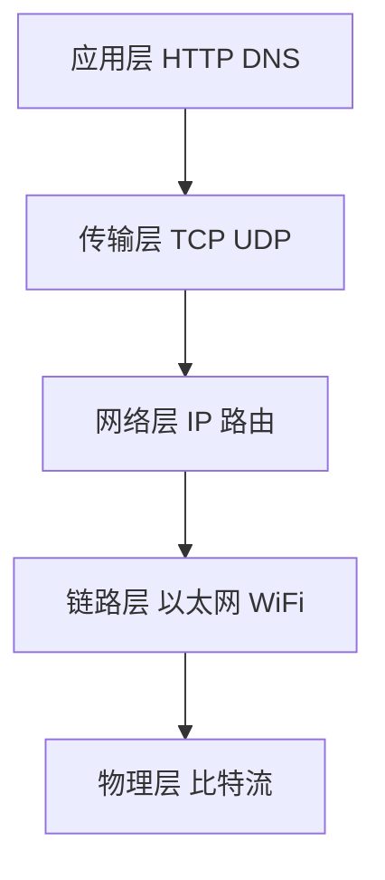
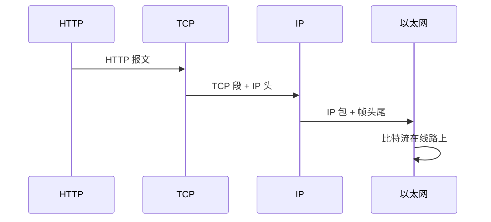
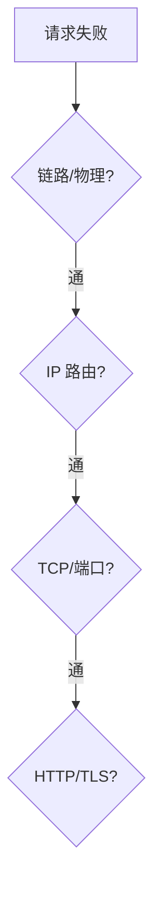
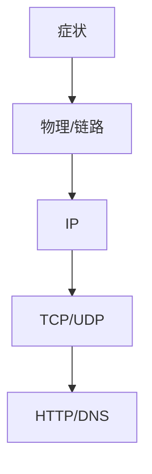

# 分层模型

计算机网络按**层次**组织：每层只依赖下层服务、为上层提供服务。掌握 OSI 与 TCP/IP 对照，读抓包、排障、面试题时才有坐标系，应用层的 CORS 与传输层的 TCP 不要混为一谈。

---

## 为什么分层

没有分层，换一种 WiFi 芯片就要改 HTTP 实现，不现实。分层把「比特怎么传」和「GET /users 什么意思」拆开，各层独立演进。



| 好处 | 说明 |
|------|------|
| **解耦** | 换链路技术不影响 HTTP 语义 |
| **标准化** | 各层独立演进（HTTP/2、QUIC） |
| **排障** | 分层定位：ping 通但 curl 失败 → 上层问题 |

---

## OSI 七层 vs TCP/IP 四层

| OSI | TCP/IP | 协议/设备示例 | 数据单位 |
|-----|--------|---------------|----------|
| 7 应用 | 应用 | HTTP、DNS、WebSocket | 消息 |
| 6 表示 | ↑ | TLS（常归入应用或会话） | |
| 5 会话 | ↑ | | |
| 4 传输 | 传输 | TCP、UDP | 段 segment |
| 3 网络 | 网际 | IP、ICMP | 包 packet |
| 2 数据链路 | 网络接口 | 以太网、ARP | 帧 frame |
| 1 物理 | ↑ | 电缆、光纤、无线电 | 比特 bit |

日常说「四层模型」多指 **TCP/IP**；面试可能问 OSI 七层名称，记「应表会传网数物」或按上表对照即可。

---

## 封装与解封装

发送时**自上而下**加首部；接收时**自下而上**剥首部。每一层只读自己关心的字段。



| 层 | 关键首部字段 |
|----|--------------|
| TCP | 源/目的端口、序号、标志 SYN ACK |
| IP | 源/目的 IP、TTL |
| 以太网 | 源/目的 MAC |

**MTU**（常 1500）：链路层单帧最大 payload；IP 过大则**分片**（IPv4）或路径 MTU 发现失败。

```plaintext
HTTP 报文
  └─ TCP 段（+TCP 头）
       └─ IP 包（+IP 头）
            └─ 以太网帧（+帧头 +FCS）
```

---

## 各层职责一句话

| 层 | 回答的问题 |
|----|------------|
| 应用 | 业务语义是什么（GET /users） |
| 传输 | 哪两个进程通信、可靠吗（端口、TCP） |
| 网络 | 包如何从 A 主机到 B 主机（IP 路由） |
| 链路 | 同一局域网内如何寻址（MAC） |
| 物理 | 电/光信号如何编码 |

---

## 与前端工程的分工

| 主题 | 所在层 | 工程关注点 |
|------|--------|------------|
| TCP 握手 | 传输 | TTFB、连接复用 |
| HTTP 缓存 | 应用 | Cache-Control |
| CORS | 应用 + 浏览器策略 | 预检、凭证 |
| DNS | 应用 | dns-prefetch |
| TLS | 表示/传输之上 | 证书、握手 RTT |

浏览器实现的是**应用层 + 通过 OS socket 调传输层**；CORS 不是 TCP 功能，而是浏览器在应用层之上的安全策略。

---

## 常见排障分层

| 现象 | 先查哪层 |
|------|----------|
| ping 不通 | 网络/链路/物理 |
| ping 通 curl 超时 | 传输（防火墙端口）、应用 |
| HTTPS 证书错 | TLS |
| 200 但 CORS 报错 | 应用 + 浏览器策略 |
| 慢 | DNS、TCP、TLS、HTTP、后端各层都可能 |

抓包工具（Wireshark）从链路层起显示各层解码，自下而上逐层看字段。



---

## 协议数据单元对照

| 层 | PDU 名称 | 典型大小 |
|----|----------|----------|
| 应用 | Message | 变长 |
| 传输 | Segment/Datagram | TCP 头 20B+ |
| 网络 | Packet | IP 头 20B+ |
| 链路 | Frame | MTU 1500 左右 |

## 分层排障口诀

| 现象 | 先测层 |
|------|--------|
| ping 不通 | 网络/链路 |
| ping 通 curl 失败 | 传输/应用 |
| HTTPS 证书错 | TLS（逻辑在 TCP 上） |
| CORS 报错 | 应用策略，非 TCP |



---

## 五元组与端口

```plaintext
(源 IP, 源端口, 目的 IP, 目的端口, 协议)
```

| 范围 | 用途 |
|------|------|
| 0–1023 | 熟知端口 80/443 |
| 49152–65535 | 客户端临时端口 |

同一 IP 上多服务靠**端口**区分；HTTP 默认 80，HTTPS 443。

---

## 封装示例（概念）

```plaintext
GET /index.html HTTP/1.1          ← 应用层
  TCP 段  sport=54321 dport=443   ← 传输层
    IP 包  src=192.168.1.10 dst=93.184.x.x
      以太网帧  MAC 网关 → 下一跳
```

接收端自底向上剥头；每一层只解析自己的首部，payload 交给上层。

---

## 中间盒与分层

NAT、防火墙、负载均衡常工作在 L3/L4；七层 LB 可读 HTTP Host/Cookie 做路由。

| 设备 | 可见信息 |
|------|----------|
| L4 LB | IP、端口 |
| L7 LB | URL、Header |

HTTPS 终止在 LB 时，LB 与后端可能是明文 HTTP — 内网仍需 TLS 时走 mTLS。

---

## 抓包读层

Wireshark 按层展开：**Frame → IP → TCP → HTTP**。排障时先确认哪一层开始异常，例如 TCP 重传多说明链路/拥塞，HTTP 4xx 说明应用语义。

```bash
# tshark 只看 HTTP 状态（示意）
tshark -r cap.pcap -Y "http.response" -T fields -e http.response.code
```

---

## 小结

网络用分层降低复杂度；TCP/IP 四层是实践主模型。数据发送逐层封装，排障从下到上逐层排除。

**易混点**：端口是传输层；IP 是网络层；MAC 是链路层；HTTP 状态码是应用层，别用「网络层 404」这种表述；TLS 逻辑上在 TCP 之上、HTTP 之下；CORS 不是 TCP 协议的一部分。

核对：TCP 段里有没有 IP 地址？HTTPS 加密发生在哪一层（逻辑上）？MTU 属于哪一层概念？404 状态码属于哪一层？
