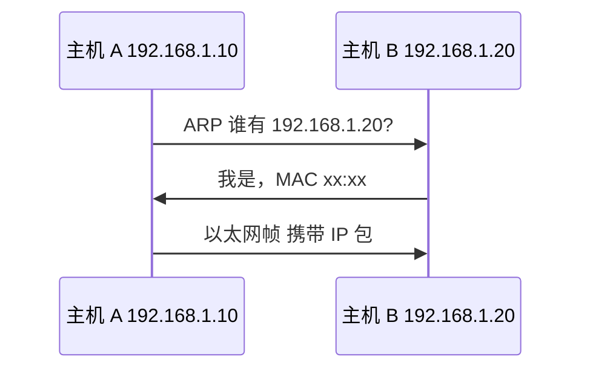
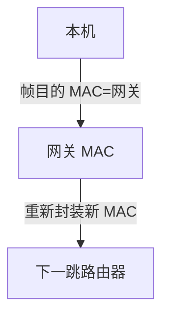

# 物理层与数据链路层

**物理层**传比特；**数据链路层**在同一广播域内用 **MAC 地址** 成帧、检错、可能做流控。IP 包要下到链路层才能离开本机，**ARP** 把「已知 IP、求 MAC」补全。WiFi、以太网、交换机工作在这一带。

---

## 物理层（Layer 1）

物理层关心信号如何在介质上传输，不关心帧结构或 IP 地址。

| 内容 | 说明 |
|------|------|
| 介质 | 双绞线、光纤、无线电 |
| 信号 | 电压、光脉冲、调制 |
| 速率 | bps，与带宽、编码、SNR 有关 |

前端很少直接碰物理层；知道**带宽**与**延迟（RTT）**是不同维度，高带宽仍可能被 RTT 拖慢（小文件多请求、TLS 多次往返）。

| 指标 | 含义 |
|------|------|
| 带宽 | 单位时间传多少比特 |
| 延迟 | 比特从 A 到 B 的时间 |
| 带宽延迟积 BDP | 带宽 × RTT，管道里「在途」数据量 |

---

## 数据链路层（Layer 2）

把网络层 IP 包封装成**帧 frame**，在**同一广播域**内交付：

```plaintext
| 帧头 | IP 包 payload | 帧尾 FCS |
  MAC源 MAC目的 类型
```

| 概念 | 说明 |
|------|------|
| **MAC** | 48 位硬件地址，局域网内标识接口 |
| **MTU** | 最大传输单元，以太网 payload 常 1500 |
| **FCS** | 帧校验，检错 |
| **广播域** | 同一 LAN 内广播帧可达范围 |

**交换机**根据 MAC 表转发；**路由器**连接不同 IP 网段，工作在网络层。

---

## 以太网帧（简化）


类型字段标识上层是 IPv4（0x0800）、IPv6（0x86DD）、ARP（0x0806）等。

| 字段 | 长度 | 作用 |
|------|------|------|
| 目的 MAC | 6B | 下一跳接口 |
| 源 MAC | 6B | 发送方接口 |
| EtherType | 2B | 上层协议 |
| Payload | 46–1500B | 通常是 IP 包 |
| FCS | 4B | CRC 检错 |

---

## ARP 地址解析

同网段发 IP 包前，需知**下一跳 MAC**。若 ARP 表无缓存，广播询问：



| 要点 | 说明 |
|------|------|
| ARP 表 | IP → MAC 缓存，有过期 |
| 跨网段 | 包先发给**默认网关** MAC，网关再路由 |
| ARP 欺骗 | 局域网攻击面，HTTPS 仍靠上层 |

`arp -a` 可看缓存；容器/云环境 MAC 可能是虚拟的。

```bash
arp -a
# 192.168.1.1 at aa:bb:cc:dd:ee:ff [ether] on eth0
```

---

## WiFi 与链路层

WiFi（802.11）仍是链路层技术，上层仍是 IP。移动端弱网、切换 AP 可能导致**链路重连**，TCP 层可能超时重传，表现为页面加载失败需刷新。

| WiFi 特性 | 影响 |
|-----------|------|
| 半双工共享信道 | 延迟抖动 |
| 漫游切换 | 短暂断链，TCP 重传 |
| 2.4G 干扰 | 丢包率上升 |

---

## 与 IP 的关系

```plaintext
应用数据
  → TCP/UDP 段（端口）
    → IP 包（源目 IP，端到端）
      → 以太网帧（源目 MAC，仅一跳）
```

**MAC 在每跳可能变**；**IP 源目**端到端不变（NAT 会改 IP）。



---

## VLAN 与广播域

**VLAN** 在交换机上逻辑划分广播域，不同 VLAN 需三层路由互通：

| 无 VLAN | 有 VLAN |
|---------|---------|
| 大广播域，ARP 泛洪范围大 | 隔离广播，减 ARP 风暴 |
| 安全域难划分 | 按部门/环境分段 |

云 VPC、K8s CNI 底层常有虚拟以太网对（veth）。

---

## 前端可见现象

| 现象 | 链路层相关 |
|------|------------|
| 同机房低延迟 | 短 RTT，少跨路由 |
| VPN 变慢 | 多封装一跳 |
| 本地 `localhost` | 环回，不经物理网卡 |
| Docker 网桥 | 虚拟以太网对 veth |

## 交换机 vs 路由器

| 设备 | 工作层 | 依据 |
|------|--------|------|
| 交换机 | 链路 | MAC 表 |
| 路由器 | 网络 | 路由表 |
| ARP | 链路辅助 | IP→MAC |

同一局域网内通信走交换机；跨网段经默认网关（路由器）。

---

## 环回与 MTU

`127.0.0.1` 数据不经物理网卡；Docker 容器内 `localhost` 仅指容器本身。以太网 **MTU 1500** 指帧 payload 上限，IP 包过大需分片或 PMTUD 发现。

```bash
ping -M do -s 1472 192.168.1.1  # DF=1，测路径 MTU（Linux）
```

---

## CSMA/CD 与全双工交换

经典以太网 **CSMA/CD** 共享介质碰撞检测；现代交换机端口全双工点对点，碰撞域缩小到单链路。WiFi 仍半双工共享信道，延迟抖动更大。

| 介质 | 碰撞域 |
|------|--------|
| 集线器 Hub | 整个网段 |
| 交换机 Switch | 单端口链路 |
| WiFi | 同一 BSS |

---

---

## 交换机与 MAC 学习

交换机维护 **MAC 地址表**：源 MAC → 入端口。未知目的 MAC 则泛洪。

| 设备 | 工作层 | 转发依据 |
|------|--------|----------|
| 集线器 | 物理 | 广播 |
| 交换机 | 链路 | MAC |
| 路由器 | 网络 | IP |

```plaintext
帧: [Dst MAC | Src MAC | EtherType | Payload | FCS]
```

| 集线器 | 物理 | 广播 |
| 交换机 | 链路 | MAC |
| 路由器 | 网络 | IP |

```plaintext
帧: [Dst MAC | Src MAC | EtherType | Payload | FCS]
```

## 小结

链路层用 MAC 在局域网内交付帧；ARP 解析 IP 到 MAC。IP 包逐跳封装成帧，MAC 每跳更新。

**易混点**：MAC 不用于互联网端到端路由；MTU 影响 IP 分片；交换机默认不隔离广播域（需 VLAN）；ARP 工作在链路层边界；访问外网时第一帧目的 MAC 是网关不是目标服务器。

核对：访问外网 IP 时，第一帧的目的 MAC 是目标服务器还是网关？ARP 工作在哪一层？FCS 检错能否纠错？MTU 1500 指的是哪一层 payload？
