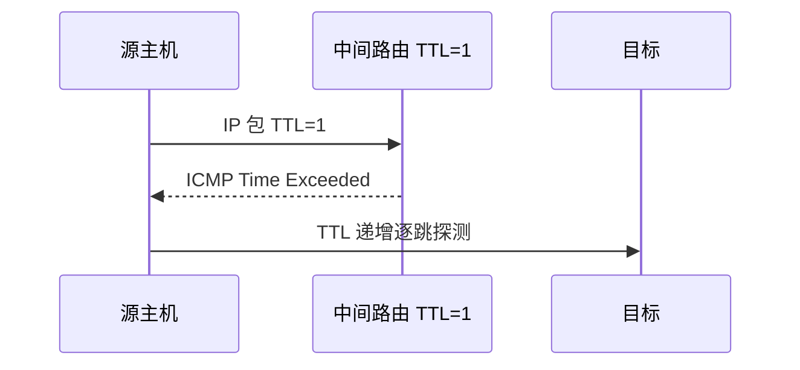

# IP 与路由

**IP（Internet Protocol）** 在网络层实现**主机到主机**的寻址与转发。IPv4 地址紧张靠 **NAT**；路径上靠**路由表**逐跳转发。理解 IP，才能解释 ping、traceroute、内网穿透、以及 K8s Service 网络。

---

## IPv4 地址与子网

地址 32 位，常写四段十进制：`192.168.1.10`。子网掩码或 CIDR 前缀划分网络号与主机号。

| 概念 | 说明 |
|------|------|
| **网络号 + 主机号** | 由子网掩码划分 |
| **CIDR** | `192.168.1.0/24` 表示前 24 位网络 |
| **私有地址** | 10.0.0.0/8、172.16.0.0/12、192.168.0.0/16 |
| **环回** | 127.0.0.0/8 → localhost |

```plaintext
192.168.1.10/24
  网络: 192.168.1.0
  主机: .10
  广播: 192.168.1.255
  可用主机: .1–.254（/24 常见）
```

同一子网内可直接二层交付；跨子网需经路由器。

---

## 路由如何工作

主机查**路由表**：目标 IP 匹配**最长前缀** → 确定下一跳 → 从某网卡发出。


```bash
# Linux / macOS
ip route
route -n
```

| 条目 | 含义 |
|------|------|
| default via x.x.x.x | 默认网关 |
| 192.168.1.0/24 dev eth0 | 直连网段 |

**traceroute** 利用 TTL 递增，看每一跳路由器返回 ICMP Time Exceeded。

```bash
traceroute example.com
# 或 mtr example.com  持续探测
```

---

## NAT 网络地址转换

内网多设备共享一个公网 IP；NAT 改 IP 头（及端口），TCP 头端口可能一并映射。


| 类型 | 说明 |
|------|------|
| SNAT | 出网改源地址 |
| DNAT | 入网改目的（端口转发） |
| 问题 | 破坏端到端，P2P/WebRTC 需 STUN/TURN |

本地 `localhost:3000` 无 NAT；家宽部署 behind NAT 需内网穿透或云服务器。

| NAT 类型 | P2P 影响 |
|----------|----------|
| 全锥形 | 较友好 |
| 对称型 | 打洞难，常需 TURN 中继 |

---

## IPv6 要点

| IPv4 | IPv6 |
|------|------|
| 32 位 | 128 位 |
| NAT 常见 | 端到端寻址理想 |
| 广泛 | 逐步普及，双栈 |

前端：确保 API 与 CDN **双栈**或至少 IPv4 可达；DNS `AAAA` 记录解析到 IPv6。

```plaintext
2001:db8::1/64  — 典型写法，/64 子网常见
```

---

## ICMP

**ping** 用 ICMP Echo Request/Reply 测可达性；**TTL 超时**返回用于 traceroute。

| 工具 | 作用 |
|------|------|
| ping | 连通、RTT |
| traceroute / mtr | 路径、每跳延迟 |

防火墙禁 ICMP 会导致 ping 失败但 TCP 仍通，排障勿只看 ping。



---

## 与前端部署

| 场景 | IP 层 |
|------|-------|
| 负载均衡 | VIP 浮动，后端多 IP |
| CDN | DNS 解析到边缘 IP |
| 容器 Pod IP | 集群内路由（CNI） |
| 安全组 | 云防火墙过滤 IP/端口 |

应用层 Host 头与 TLS SNI 在 IP 之上；同一 IP 可托管多站点（虚拟主机）。

---

## 路由表匹配规则

| 规则 | 说明 |
|------|------|
| 最长前缀匹配 | /24 优先于 /16 |
| 默认路由 0.0.0.0/0 | 无更具体匹配时走网关 |
| 直连路由 | 本机接口所在网段 |

## NAT 与前端

| 场景 | 影响 |
|------|------|
| 家用 NAT | 内网机器无公网 IP |
| WebRTC | 需 STUN/TURN 打洞 |
| 容器网络 | 端口映射、Service IP |

`curl ifconfig.me` 看到的是 NAT 出口公网 IP，不是本机内网地址。

---

## PMTUD 与分片

IPv4 路由器可分片；IPv6 中间路由丢弃过大包并 ICMP 通知源端。**TCP MSS** 协商会参考路径 MTU，避免 IP 分片（丢一片整包作废）。


---

## 子网速算

/24 主机 254 可用；/16 65534。CIDR 聚合路由减少表项。

```plaintext
192.168.1.0/24 → 192.168.1.1–254
```

容器 Pod CIDR 与 Service ClusterIP 规划避免与办公网段冲突。

---

## 子网划分 CIDR

**CIDR** 用前缀长度表示网络：`192.168.1.0/24` 表示前 24 位为网络号。

| 前缀 | 主机数（约） |
|------|-------------|
| /24 | 254 |
| /16 | 65534 |
| /32 | 单主机 |

容器 Pod 网段、VPC 规划都基于 CIDR；与前端直接相关的是本地 `127.0.0.1` 与 Docker bridge 网段。

| /24 | 254 |
| /16 | 65534 |
| /32 | 单主机 |

容器 Pod 网段、VPC 规划都基于 CIDR；与前端直接相关的是本地 `127.0.0.1` 与 Docker bridge 网段。

## 小结

IP 负责寻址与逐跳路由；子网划分与默认网关是内网基础；NAT 共享公网 IP 并带来穿透问题。

**易混点**：IP 地址 ≠ 端口（端口在 TCP）；127.0.0.1 只本机；私有 IP 不可直接在公网路由；NAT 改 IP 头及端口映射表；ping 用 ICMP 不是 TCP。

核对：PC 访问 8.8.8.8，第一跳通常是？NAT 改的是 IP 头还是 TCP 头？traceroute 原理与 TTL 什么关系？私有地址能直接在公网路由吗？
