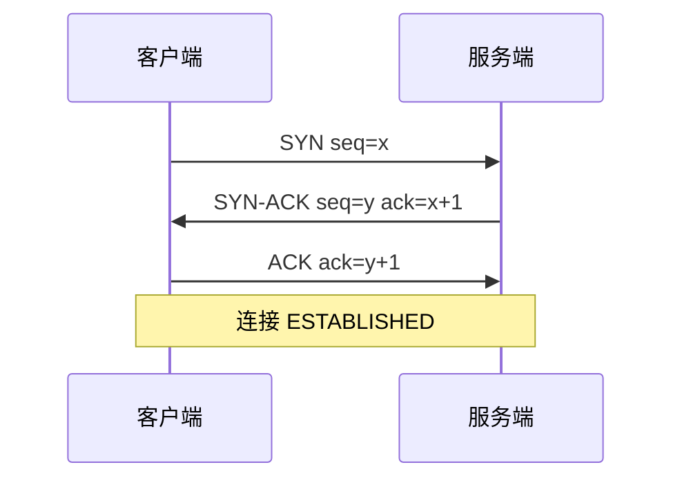
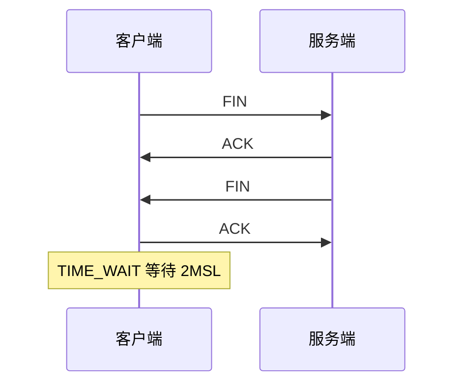
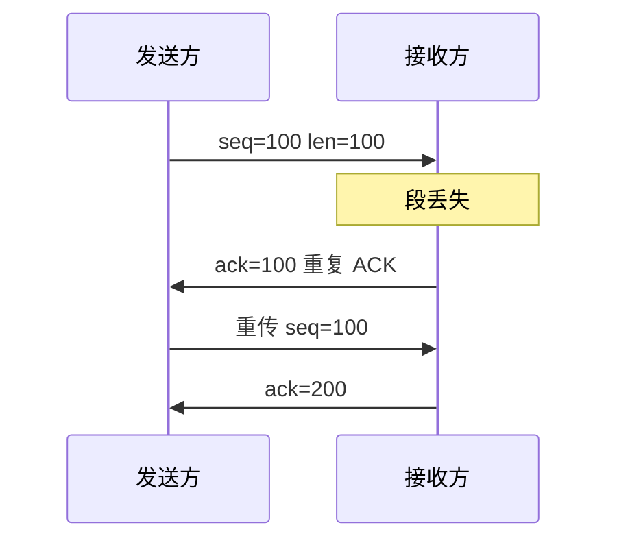
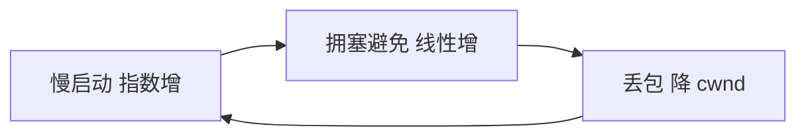

# TCP 详解

**TCP** 在 IP 之上提供**面向连接、可靠、有序、全双工**的字节流。HTTP、WebSocket（部分栈）、数据库连接多跑在 TCP 上。三次握手、滑动窗口、拥塞控制，面试高频，也是理解慢启动、超时重连的基础。

---

## TCP 段结构（关键字段）

TCP 把应用数据切成段，每段带首部：

```plaintext
| 源端口 | 目的端口 | 序号 seq | 确认号 ack | 标志位 | 窗口 | 数据 |
```

| 字段 | 作用 |
|------|------|
| 端口 | 区分同主机多进程（80、443、3000） |
| seq / ack | 字节序号，确认已收到 |
| SYN FIN RST | 建连、关连、复位 |
| 窗口 | 流量控制，告知对端还可发多少 |

---

## 三次握手

双方交换初始序号，确认彼此收发能力：



| 次 | 含义 |
|----|------|
| 1 | 客户端请求建连，选初始 seq |
| 2 | 服务端同意，回自己的 seq，确认客户端 seq+1 |
| 3 | 客户端确认服务端 seq+1 |

**为何三次**：避免历史重复 SYN 误建连；双方都要确认对方 seq 空间。

**SYN 队列满** → 连接超时；DDoS **SYN flood** 针对此阶段。一次握手消耗约 **1 RTT**（TLS 另算）。

---

## 四次挥手

TCP 全双工，关闭需双方各自 FIN + ACK：



主动关闭方经历 **TIME_WAIT**（常 1～4 分钟），高并发短连接客户端可能耗尽端口，**SO_REUSEADDR**、连接池、HTTP keep-alive 缓解。

| 状态 | 谁进入 | 含义 |
|------|--------|------|
| TIME_WAIT | 主动关闭方 | 等 2MSL 防旧包干扰新连接 |
| CLOSE_WAIT | 被动关闭方 | 收到 FIN，等应用 close |

---

## 可靠传输

| 机制 | 说明 |
|------|------|
| **序号/确认** | 按字节编号，丢包重传 |
| **超时重传** | RTT 估算定 timer |
| **快速重传** | 收到 3 个重复 ACK 立即重传 |
| **校验和** | 段损坏丢弃 |

TCP 可靠指最终交付有序字节流，中间可能丢包，靠重传补回。



---

## 流量控制 vs 拥塞控制

| | 流量控制 | 拥塞控制 |
|---|----------|----------|
| 目的 | 防止淹没**接收方**缓冲区 | 防止**网络**过载 |
| 信号 | 接收窗口 rwnd | 拥塞窗口 cwnd、丢包 |

发送方实际发送量受 min(rwnd, cwnd) 约束。

---

## 拥塞控制（概念）



| 阶段 | 行为 |
|------|------|
| 慢启动 | cwnd 小，每 ACK 加倍 |
| 拥塞避免 | 达阈值后线性增 |
| 快重传/快恢复 | 轻度拥塞时不完全退回慢启动 |

**慢启动**导致新连接初始吞吐低，**TLS + 新 TCP** 的首请求 TTFB 常更慢；**连接复用**（HTTP/2、keep-alive）重要。

---

## TCP 状态机（简记）

| 状态 | 含义 |
|------|------|
| LISTEN | 服务端等待 |
| ESTABLISHED | 已连接，传数据 |
| CLOSE_WAIT | 对端 FIN 已收，等应用 close |
| TIME_WAIT | 主动关闭后等待 2MSL |

`ss -tan` 可看状态；大量 **CLOSE_WAIT** 常是应用未关 socket 泄漏。

```bash
ss -tan | awk '{print $1}' | sort | uniq -c | sort -rn
```

---

## 与 HTTP

| HTTP 版本 | TCP 关系 |
|-----------|----------|
| HTTP/1.1 | 默认 keep-alive 复用 TCP |
| HTTP/2 | 单 TCP 多路复用流 |
| HTTP/3 | 不用 TCP，改 QUIC over UDP |

keep-alive 复用的是**同一条 TCP 连接**传多个 HTTP 请求，减少握手 RTT。

```http
Connection: keep-alive
Keep-Alive: timeout=5, max=100
```

---

## Nagle 与延迟

| 选项 | 影响 |
|------|------|
| Nagle 算法 | 小包合并，减开销，增小写延迟 |
| TCP_NODELAY | 关闭 Nagle，交互低延迟 |

实时游戏、SSH 常开 `TCP_NODELAY`；大文件传输可保持 Nagle。

## TCP 与用户体验

| 机制 | 用户可见效果 |
|------|--------------|
| 三次握手 | 首连 RTT 增加 |
| 慢启动 | 大文件开头慢 |
| 重传 | 弱网卡顿 |
| keep-alive | 复连省握手 |

HTTP/2 多路复用仍共享一条 TCP — 队头阻塞在丢包时仍可能发生。

---

## SYN Cookie 与滑动窗口

**SYN Cookie** 在 SYN 队列满时不存半连接，靠 ACK 验证。**滑动窗口**：发送方受 min(rwnd, cwnd) 约束；rwnd=0 时零窗口探测。

```plaintext
已确认 | 已发未确认 | 可发送窗口 | 不可发送
```

---

## 状态机要点

| 状态 | 含义 |
|------|------|
| ESTABLISHED | 连接可用 |
| TIME_WAIT | 主动关闭方等待 2MSL |
| CLOSE_WAIT | 对端 FIN 未 close |

大量 TIME_WAIT — 短连接高频；keep-alive 与连接池复用缓解。

---

## 快速重传与 SACK

收到 **3 个重复 ACK** 触发快速重传，不必等超时。**SACK**（选择性确认）告知非连续已收段，减少不必要的重传。弱网下 RTT 抖动大，重传策略直接影响视频缓冲与 API 超时。

| 信号 | 动作 |
|------|------|
| 超时 | 重传最早未确认段 |
| 3 dup ACK | 快速重传 |
| SACK 块 | 只重传缺失段 |

---

## 小结

TCP 用三次握手建连、序号/ACK/重传保可靠、窗口做流控与拥塞控制。前端性能优化要减少**新连接**与**RTT 往返**。

**易混点**：TCP 可靠 ≠ 链路不丢包；三次握手占 1 RTT，TLS1.3 至少再 1 RTT；TIME_WAIT 在主动关闭方；rwnd 看接收方，cwnd 看网络；CLOSE_WAIT 是应用没 close。

核对：为何 TIME_WAIT 在主动关闭方？HTTP keep-alive 复用的是 TCP 还是 HTTP 层概念？rwnd 与 cwnd 区别？三次握手能否两次完成？
