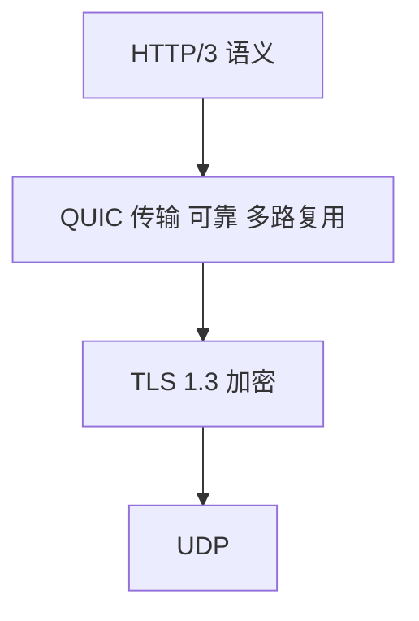
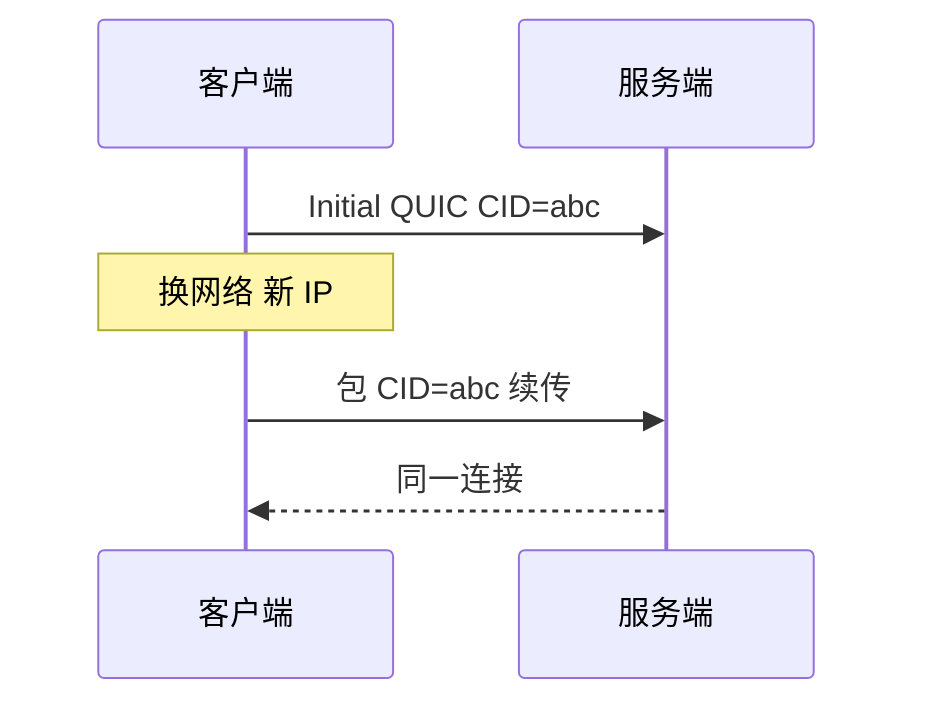
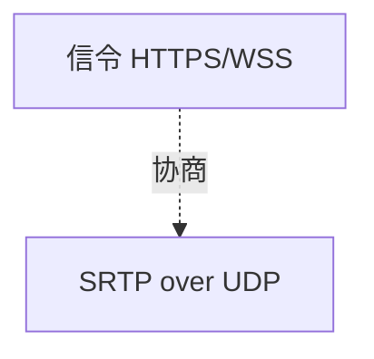

# UDP 与 QUIC 概览

**UDP** 是无连接、尽力而为的传输层协议，不保证可靠与有序，但开销小、无握手延迟。**QUIC** 在 UDP 之上重建可靠传输并内置 TLS，是 HTTP/3 的载体。弄清二者与 TCP 的差异，才能选型 WebRTC、DNS、游戏同步与下一代 Web 传输。

---

## UDP 特点

UDP 首部仅 8 字节，无连接状态机：

```plaintext
| 源端口 2B | 目的端口 2B | 长度 2B | 校验和 2B |  payload |
```

| 特性 | UDP | TCP |
|------|-----|-----|
| 连接 | 无 | 三次握手 |
| 可靠 | 否，可能丢、重复、乱序 | 是 |
| 有序 | 否 | 字节流有序 |
| 拥塞控制 | 无（应用自负） | 有 |
| 头部 | 8 字节 | 20+ 字节 |
| 语义 | **数据报** — 一次 send 一条边界 | 字节流 — 需自己 framing |

**适用**：可容忍丢失、要低延迟、应用层自建可靠性，DNS 查询、QUIC、实时音视频、游戏状态广播。

**不适用**：默认文件传输、普通 HTTP/1.1 与 HTTP/2（仍主要 TCP）。

---

## UDP 在前端的常见触点

| 场景 | 说明 |
|------|------|
| **DNS** | 多数查询 UDP 53；大包或 truncated 转 TCP |
| **WebRTC** | SRTP/ICE 常跑 UDP；NAT 穿透 STUN/TURN |
| **HTTP/3** | QUIC over UDP，443 常被放行 |
| **mDNS / SSDP** | 局域网发现 |

Node `dgram` 模块：

```javascript
import dgram from 'node:dgram';
const sock = dgram.createSocket('udp4');
sock.send(Buffer.from('ping'), 41234, '127.0.0.1');
sock.on('message', (msg, rinfo) => {
  console.log('datagram', msg.toString(), 'from', rinfo.address);
});
```

OS 提供 `connect()` 固定对端过滤回包，UDP 仍无 TCP 式可靠传输。

---

## QUIC 是什么

IETF 标准化的传输协议，**在 UDP 上实现**：



| QUIC 能力 | 相对 TCP+TLS |
|-----------|--------------|
| **0-RTT / 1-RTT 建连** | 合并握手，减少 RTT |
| **连接迁移** | 换 WiFi/4G 可保持 connection id |
| **流级隔离** | 丢包只挡该流，减传输层 HOL |
| **内置 TLS 1.3** | 非可选附加 |
| **拥塞控制** | 用户态实现，可迭代 |

**队头阻塞**：

- TCP：丢一个段，其后段即使到了也要等重传，**传输层 HOL**。
- HTTP/2 over TCP：再加应用层多路复用 HOL。
- QUIC：流之间独立；HTTP/3 按流传资源。

---

## 选型简表

| 需求 | 倾向 |
|------|------|
| 普通 REST、兼容老代理 | TCP + HTTP/1.1 或 /2 |
| 高丢包移动网络、多路复用 | QUIC / HTTP/3 |
| 实时音视频 | UDP + Jitter buffer |
| 必须可靠、有序、简单 | TCP |

CDN 与浏览器支持 HTTP/3 已较广；中间盒 **UDP 443 拦截** 仍是部署注意点。

---

## 与分层模型的关系

UDP/QUIC 属 **传输层**；DNS payload 属 **应用层**。不要把「UDP 不可靠」说成「HTTP 不可靠」，HTTP/3 在 QUIC 上仍是可靠请求/响应。

---

## QUIC 连接与迁移

QUIC 用 **Connection ID** 标识连接，而非仅靠四元组。WiFi 切 4G 时 IP 变了，TCP 连接断；QUIC 可带同一 CID 继续。



**0-RTT resumption**：会话票据允许首包带数据；重放面要求敏感 POST 慎用。

---

## 部署与防火墙

| 障碍 | 应对 |
|------|------|
| UDP 443 被拦 | 回退 TCP HTTP/2 |
| 负载均衡 | 支持 QUIC CID 路由 |
| NAT 超时 | QUIC keepalive |

Chrome、主流 CDN 已支持 HTTP/3；Node 侧可实验 quiche/nghttp3。

```javascript
// 检测浏览器是否支持 HTTP/3（间接）
if (typeof fetch !== 'undefined') {
  // 实际是否走 h3 取决于服务器 Alt-Svc 与网络路径
  fetch('https://example.com', { cache: 'no-store' });
}
```

---

## UDP 校验和与分片

| 话题 | 说明 |
|------|------|
| 校验和 | IPv4 可选，IPv6 UDP 校验和 mandatory |
| IP 分片 | 大 UDP 包可能被 IP 层分片，丢一片全丢 |
| MTU | UDP 应用宜控制单报大小，避免 IP 分片 |

## 选型速查

| 需求 | 倾向 |
|------|------|
| 可靠有序 | TCP 或 QUIC |
| 低延迟可丢 | UDP |
| 多路复用 + 加密 | QUIC(HTTP/3) |
| 实时音视频 | UDP + 应用层 FEC |

WebRTC 数据通道可走 SCTP over UDP；游戏状态同步常 UDP + 自定义序列号。

---

## Alt-Svc 与 WebRTC

```http
Alt-Svc: h3=":443"; ma=86400
```

浏览器缓存后可尝试 HTTP/3。**WebRTC** 媒体面走 UDP + SRTP；信令走 HTTPS/WebSocket，与媒体通道分离。



---

## QUIC 连接迁移

连接 ID 与四元组解耦 — WiFi 切 4G 时 QUIC 可保持连接；TCP 四元组变则断连。

HTTP/3 基于 QUIC，Alt-Svc 头通知客户端升级；DevTools 可显示 h3 协议。

---

## UDP 适用场景

| 场景 | 为何 UDP |
|------|----------|
| DNS 查询 | 短报文、可应用层重试 |
| 实时音视频 | 可丢包换低延迟 |
| 游戏状态 | 旧包过期可丢弃 |
| QUIC | 在 UDP 上实现可靠+加密 |

```javascript
import dgram from 'node:dgram';
const sock = dgram.createSocket('udp4');
sock.send(Buffer.from('ping'), 41234, '127.0.0.1');
```

| DNS 查询 | 短报文、可应用层重试 |
| 实时音视频 | 可丢包换低延迟 |
| 游戏状态 | 旧包过期可丢弃 |
| QUIC | 在 UDP 上实现可靠+加密 |

```javascript
import dgram from 'node:dgram';
const sock = dgram.createSocket('udp4');
sock.send(Buffer.from('ping'), 41234, '127.0.0.1');
```

## 小结

UDP 轻量无连接，以数据报为单位；QUIC 在 UDP 上提供可靠、加密、多流，支撑 HTTP/3。实时场景用 UDP；现代 Web 加速向 QUIC 迁移。

**易混点**：UDP 无连接 ≠ 不能 `connect()`（OS API）；QUIC 可靠 ≠ TCP wire 兼容；HTTP/3 不是 UDP 版明文 HTTP；DNS 大包会 fallback TCP；WebRTC 媒体走 UDP，信令可走 TCP/WebSocket。

核对：DNS 为何常用 UDP？QUIC 如何解决 TCP 的队头阻塞（哪一层）？HTTP/3 是否仍可靠？UDP 443 被拦时浏览器会怎样？
