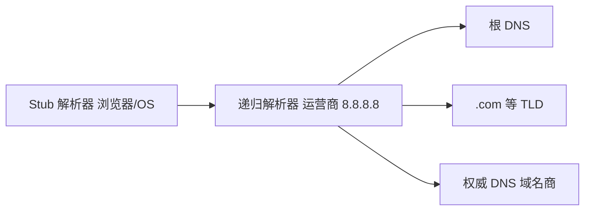
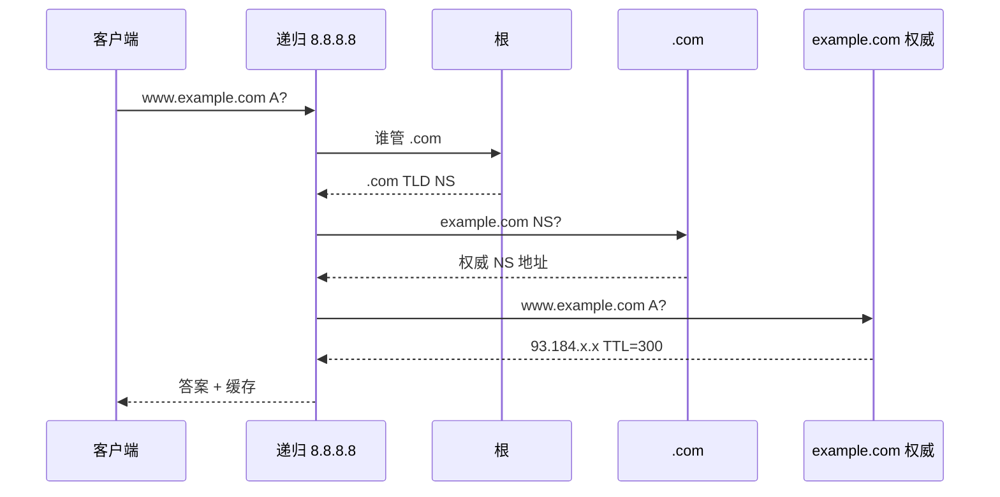

# DNS 原理与解析链

**DNS** 把人类可读的域名解析成 IP（及 MX、TXT 等记录），是几乎每次 `fetch` 之前的隐形一步。递归与迭代、缓存层级、TTL，搞清解析链，才能排「域名改了还不生效」和「首包慢在 DNS」。

---

## 核心角色

DNS 是分布式数据库，查询从客户端逐级找到**权威**答案：



| 角色 | 说明 |
|------|------|
| **Stub resolver** | 本机 `getaddrinfo`、浏览器内部；问上游 |
| **递归 resolver** | 帮客户端查到底，返回最终答案 |
| **权威 DNS** | 域名注册商/自建，存真实记录 |
| **根 / TLD** | 指向下层谁管 `.com`、谁管 `example.com` |

从递归服务器视角：向根/TLD 查询是**迭代**（回复「去问 xxx」）；对终端客户端表现为**递归**（直接给 A 记录）。

---

## 记录类型（常用）

| 类型 | 用途 |
|------|------|
| **A** | IPv4 |
| **AAAA** | IPv6 |
| **CNAME** | 别名 → 另一 hostname |
| **TXT** | 验证、SPF、DKIM |
| **MX** | 邮件 |
| **NS** | 该域权威服务器 |
| **CAA** | 允许哪 CA 发证 |

**CNAME 陷阱**：`www` CNAME 到 CDN 可以；根域 `@` 常不能 CNAME（用 ALIAS/ANAME 或 A 记录）。同一名字不能 CNAME 与 A 并存。

---

## 一次解析过程（简）

查询 `www.example.com` 的 A：



实际可能含 **DNSSEC** 验证、**EDNS Client Subnet** 影响 CDN 选路。

---

## 缓存与 TTL

| 缓存位置 | 说明 |
|----------|------|
| **浏览器** | 短缓存（有上限） |
| **OS** | 系统 resolver 缓存 |
| **递归 DNS** | 按 TTL 缓存 |
| **应用** | Node `dns.lookup` vs `resolve` 行为差异 |

```plaintext
TTL = 300  →  5 分钟内递归可复用旧 IP
```

变更生效：改 A 记录后，旧 TTL 未过期客户端仍连旧 IP，发布前**降 TTL**，切换后再升回。**负缓存**：NXDOMAIN 也有 TTL。

| 操作 | 建议 |
|------|------|
| 计划切 IP | 提前 24–48h 把 TTL 降到 60–300 |
| 切换完成 | 恢复 3600+ |
| 紧急回滚 | 仍受旧 TTL 约束 |

---

## 传输：UDP 与 TCP

- 默认 **UDP 53**；响应过大或 **TC** 截断 → 改 **TCP 53**。
- **DoH / DoT**：加密 DNS，防劫持。
- 页面 DNS 通常跟系统 resolver；DoH 可在浏览器或企业策略配置。

```plaintext
UDP 查询 ≤512B（传统）或 EDNS 更大
响应超 MTU / TC=1 → 客户端 TCP 重查
```

---

## 与前端/Node 的衔接

| 现象 | DNS 层 |
|------|--------|
| `getaddrinfo ENOTFOUND` | 名不存在或 resolver 不可达 |
| 连接慢 200ms+ | dns-prefetch、preconnect |
| 多环境 `hosts` 劫持 | 开发常改本地 hosts |
| SSR 调内网 API | 服务器侧 DNS 与浏览器不同 |

```javascript
import dns from 'node:dns/promises';

await dns.resolve4('example.com');  // DNS 协议问 resolver
// dns.lookup 用 getaddrinfo，可能只查 hosts/缓存
```

```html
<link rel="dns-prefetch" href="//cdn.example.com">
<link rel="preconnect" href="https://api.example.com" crossorigin>
```

HTTP Host/SNI 仍用域名，IP 变了 TLS 证书仍校验 hostname。

---

## dig 与排障

```bash
dig www.example.com A
dig www.example.com A +trace    # 看完整解析链
dig @8.8.8.8 www.example.com    # 指定递归
```

| 输出段 | 含义 |
|--------|------|
| ANSWER | 最终记录 |
| AUTHORITY | 权威 NS |
| ADDITIONAL | 附加 A/AAAA |

---

## 常见故障模式

| 现象 | 可能原因 |
|------|----------|
| 部分地区访问慢 | GeoDNS / CDN 选路 |
| 改记录不生效 | TTL 未过期、多级缓存 |
| 间歇 ENOTFOUND | 递归不稳定、防火墙拦 53 |
| HTTPS 证书对但连不上 | A 记录指错 IP |

## DNS 缓存层级

| 层级 | 位置 | TTL |
|------|------|-----|
| 浏览器 | Chrome cache | 短 |
| OS | 系统 resolver | 中 |
| 递归服务器 | ISP/8.8.8.8 | 按记录 |
| 权威 | 域名商 | 配置 |

改 DNS 后「有时生效有时不」— 多级缓存 + TTL 未过期。

---

## Split DNS 与 DoH

内网与外网同一域名可能解析到不同 IP（Split DNS）。**DoH** 把查询封装在 HTTPS 443，防劫持但与企业审计策略可能冲突。

```javascript
// Node：显式 DNS 查询 vs 系统缓存
import dns from 'node:dns/promises';
await dns.resolve4('api.example.com');
```

---

## 记录类型

| 类型 | 用途 |
|------|------|
| A/AAAA | IPv4/IPv6 |
| CNAME | 别名 |
| MX | 邮件 |
| TXT | SPF、验证 |

前端部署：A 指 CDN，CNAME 到 CDN 域名；`dig +trace` 看完整解析链。

---

## DNS 缓存 TTL

解析结果带 **TTL**（秒）；过期前浏览器/OS 缓存直接返回，减递归查询。

| 层级 | 位置 |
|------|------|
| 浏览器 | Chrome 内置 cache |
| OS | 系统 resolver |
| 路由器 | 部分家用网关 |

改 DNS 记录后「还没生效」常是 TTL 未过期；开发时可 `dig` 看 ANSWER 里的 TTL 字段。

## 小结

DNS 分层：客户端 → 递归 → 根/TLD → 权威；**TTL** 控制缓存寿命。CNAME/A 别混用；变更记录要规划 TTL 窗口。

**易混点**：递归 ≠ 权威；`dig +trace` 看路径 vs `ping` 只说明 ICMP 到 IP；浏览器 DNS 缓存 ≠ HTTP 缓存；`dns.lookup` 与 `dns.resolve` 路径不同；根域 CNAME 常不允许。

核对：`CNAME` 与 `A` 能同时出现在同一名字吗？TTL 设 86400 时改 IP 最长多久可能仍解析到旧值？UDP 53 响应过大时会怎样？
