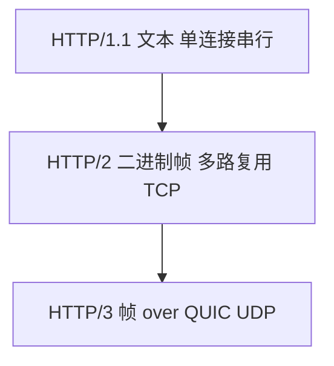

# HTTP 机制

**HTTP** 是应用层请求/响应协议：方法、状态码、首部、正文。本篇讲**协议语义与传输机制**（持久连接、分块、HTTP/2 帧）；浏览器如何存响应、何时发条件请求，属于浏览器策略，此处只保留 304 等协议含义。

---

## 报文结构

HTTP 报文分起始行、首部、空行、正文：

```plaintext
请求:
GET /api/user HTTP/1.1
Host: example.com
Accept: application/json

响应:
HTTP/1.1 200 OK
Content-Type: application/json
Content-Length: 42

{"id":1}
```

| 部分 | 作用 |
|------|------|
| **请求行 / 状态行** | 方法、路径、版本 / 状态码、原因短语 |
| **首部** | 元数据（类型、长度、编码、认证） |
| **正文** | body，可为空 |

---

## 方法与幂等性

| 方法 | 语义 | 幂等 | 典型 |
|------|------|------|------|
| **GET** | 取资源 | 是 | 查询 |
| **HEAD** | 同 GET 无 body | 是 | 探测 |
| **POST** | 提交、创建 | 否 | 表单、下单 |
| **PUT** | 整体替换 | 是 | 更新 |
| **PATCH** | 部分更新 | 视设计 | JSON Patch |
| **DELETE** | 删除 | 是 | 删资源 |

**幂等**：多次相同请求效果如同一次（网络重试相对安全）。**安全**：GET/HEAD 不应改服务器状态，违反则缓存与爬虫会踩坑。

---

## 状态码（精选）

| 码 | 含义 | 前端常见 |
|----|------|----------|
| **200** | OK | 成功 |
| **301/308** | 永久重定向 | SEO、换域名 |
| **302/307** | 临时重定向 | 登录跳转 |
| **304** | 未修改 | 配合 ETag/Last-Modified |
| **400** | 坏请求 | 参数校验 |
| **401** | 未认证 | 缺 token |
| **403** | 禁止 | 有身份无权限 |
| **404** | 不存在 | 路由/API |
| **429** | 限流 | Retry-After |
| **500** | 服务端错 | 排障 |

---

## HTTP/1.1 连接与传输

**持久连接**（默认 keep-alive）：同一 TCP 上串行多个请求，减握手开销。

| 机制 | 说明 |
|------|------|
| **Content-Length** | 固定长度 body |
| **Transfer-Encoding: chunked** | 流式分块，长度未知 |
| **管线化 pipelining** | 多请求不等响应，实践中少用（队头阻塞） |

```javascript
import http from 'node:http';
http.get('http://example.com', (res) => {
  res.on('data', (chunk) => { /* chunked 也是 stream */ });
});
```

---

## HTTP/2 与 HTTP/3



| 版本 | 传输 | 关键 |
|------|------|------|
| **1.1** | TCP | 简单、keep-alive |
| **2** | TCP | 单连接多路复用、HPACK 首部压缩 |
| **3** | QUIC(UDP) | 流级隔离，连接迁移，减 TCP 队头阻塞 |

HTTP/2 仍可能有 **TCP 层队头阻塞**，丢包挡整连接。HTTP/3 在 QUIC 流级别隔离，单流丢包不阻塞其他流。

---

## 内容协商与编码

| 首部 | 作用 |
|------|------|
| `Accept` | 客户端要的 MIME |
| `Accept-Encoding` | gzip、br、zstd |
| `Content-Type` | 正文类型 |
| `Content-Encoding` | 正文压缩方式 |

**br（Brotli）**：静态资源预压缩常见。CDN 按 `Accept-Encoding` 返回不同压缩体。

---

## 条件请求与缓存验证

客户端带验证器，服务器判断资源是否变化：

| 请求首部 | 响应 |
|----------|------|
| `If-None-Match: "abc"` | 匹配则 **304**，无 body |
| `If-Modified-Since` | 未修改则 304 |

```plaintext
GET /app.js HTTP/1.1
If-None-Match: "v3-hash"

HTTP/1.1 304 Not Modified
ETag: "v3-hash"
```

**304** 表示「用本地缓存副本」，不是错误。`ETag` 比时间戳更精确，适合频繁部署的静态资源。

---

## Cache-Control 语义

| 指令 | 含义 |
|------|------|
| `max-age=3600` | 3600 秒内新鲜 |
| `no-cache` | 可存但必须再验证 |
| `no-store` | 不存响应（敏感数据） |
| `private` / `public` | 仅浏览器 / 中间缓存也可存 |
| `immutable` | 内容永不变，省 revalidate |

```http
Cache-Control: public, max-age=31536000, immutable
```

HTML 入口常 `no-cache` 以便发版；带 hash 的 JS/CSS 可长期 immutable。

---

## Cookie 与会话

**Set-Cookie** 让服务器在客户端存键值，后续请求自动带回：

```http
Set-Cookie: session=abc; Path=/; HttpOnly; Secure; SameSite=Lax
Cookie: session=abc
```

| 属性 | 作用 |
|------|------|
| HttpOnly | JS 不可读，减 XSS 窃取 |
| Secure | 仅 HTTPS |
| SameSite | 跨站携带策略 |

Cookie 是 HTTP 状态管理手段，与 JWT 存 localStorage 是不同安全模型。

---

## Range 与断点续传

**Range** 请求只取资源片段：

```http
GET /video.mp4 HTTP/1.1
Range: bytes=0-1048575

HTTP/1.1 206 Partial Content
Content-Range: bytes 0-1048575/5000000
```

大文件下载、视频 seek、CDN 分片都依赖 Range + 206。

---

## 与 TCP/TLS 的关系

```plaintext
应用:  HTTP 语义
       ↓
传输:  TCP 或 QUIC
       ↓
网络:  IP
```

三次握手 + TLS 增加首包延迟。浏览器 **preconnect**、**dns-prefetch** 提前建连是策略层优化，不改变 HTTP 语义。

---

## CORS（应用层策略）

跨域是**浏览器安全策略**，HTTP 协议本身不禁止跨域请求：

- 简单请求直接发；非简单先 **OPTIONS** 预检。
- 服务端 `Access-Control-Allow-Origin` 等首部放行。

Node `curl`、服务端 fetch 无同源限制。

---

## 安全相关首部

| 首部 | 作用 |
|------|------|
| `Strict-Transport-Security` | 强制 HTTPS |
| `Content-Security-Policy` | 限制脚本/资源源 |
| `X-Content-Type-Options: nosniff` | 禁 MIME 嗅探 |

这些不改变 HTTP 方法语义，但影响浏览器如何解释响应。

---

## 小结

HTTP 定义方法、状态码、首部与 body；1.1 靠 keep-alive，/2 多路复用 over TCP，/3 over QUIC。条件请求与 Cache-Control 控制验证与存储策略。

**易混点**：301 vs 302 对缓存与 SEO 不同；HTTP/2 多路复用受流控限制；CORS 仅浏览器 enforce；304 表示资源未变而非错误；no-cache 仍会存，但要 revalidate。

核对：POST 为何非幂等？HTTP/2 相对 1.1 主要解决什么？304 在协议层表示什么？Range 成功时状态码是多少？
