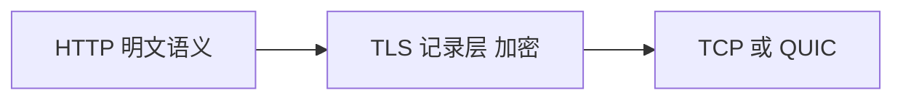
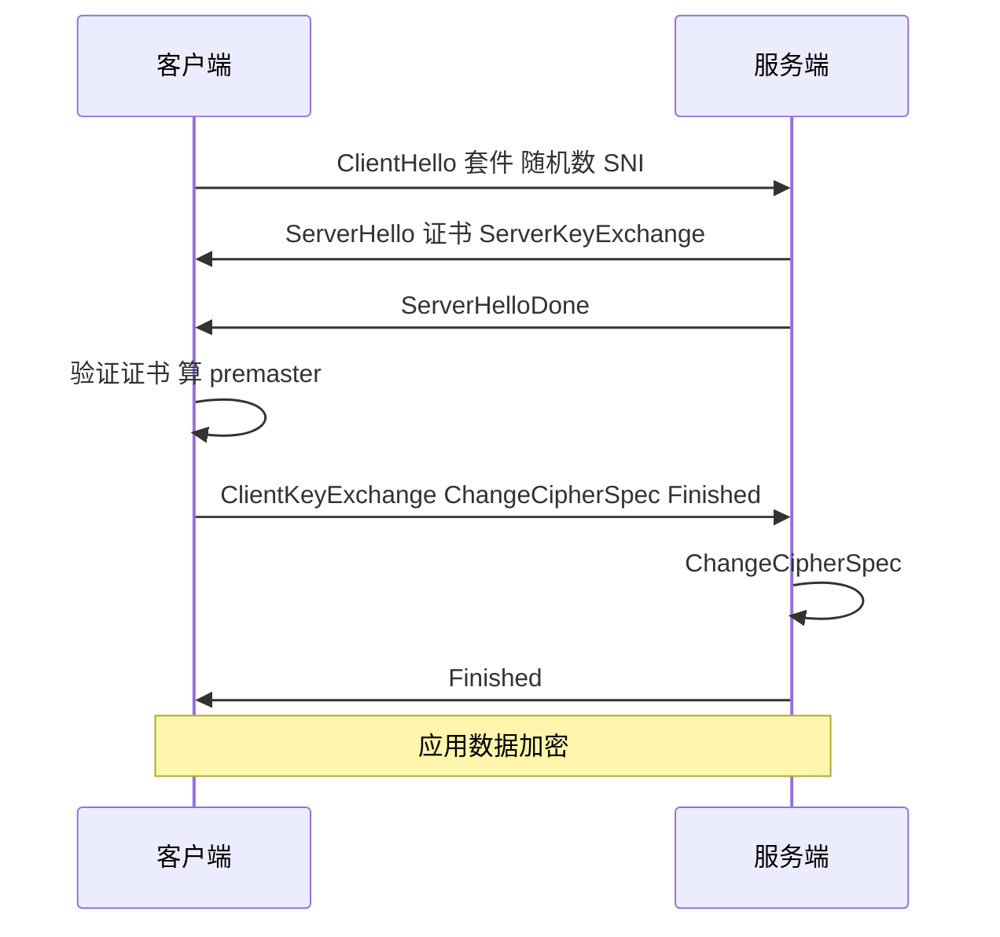
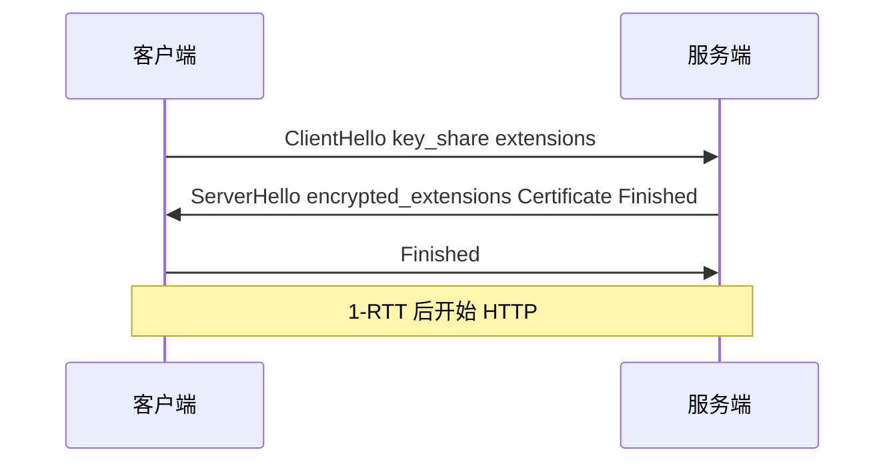
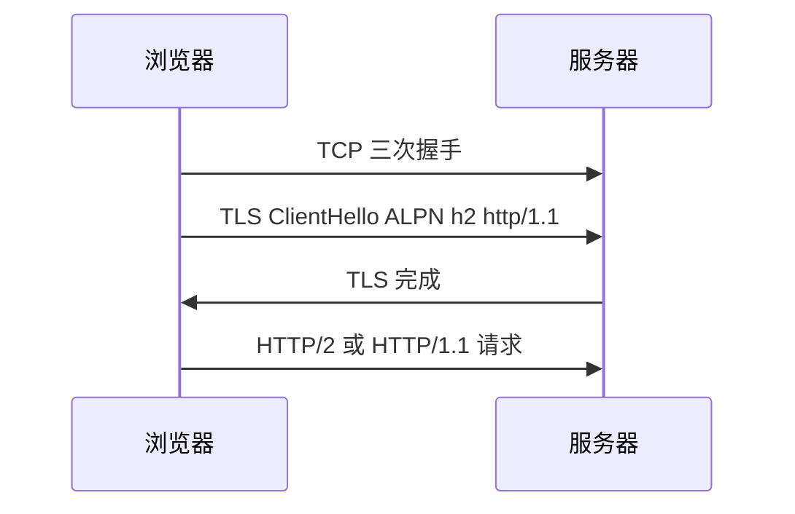

# HTTPS 与 TLS 握手

**HTTPS** = HTTP over **TLS**：在 TCP（或 QUIC）之上加密、认证、保完整性。证书链、TLS 1.3 握手、SNI，前端天天用 `https://`，排障「证书错误」「握手慢」需要协议层坐标。

---

## TLS 提供什么

TLS 在传输层之上建立安全通道，应用数据对中间人不可读（在正确配置下）：

| 目标 | 机制 |
|------|------|
| **机密性** | 对称加密（AES-GCM、ChaCha20） |
| **完整性** | AEAD |
| **身份** | 证书 + 公钥体系（CA） |
| **密钥协商** | ECDHE 等，前向安全 |



---

## 证书与链

| 概念 | 说明 |
|------|------|
| **服务器证书** | 含公钥、域名、CA 签名 |
| **中间 CA** | 链到根 |
| **根 CA** | 预装在系统/浏览器信任库 |
| **SAN** | 多域名一张证 |
| **Let's Encrypt** | 免费 DV，ACME 自动化 |

浏览器校验：链完整、未过期、域名匹配、未被吊销（CRL/OCSP）。

**开发**：`mkcert` 本地信任；生产勿忽略 mixed content（HTTPS 页加载 HTTP 资源被拦）。

```bash
# 查看证书链
openssl s_client -connect example.com:443 -servername example.com </dev/null 2>/dev/null | openssl x509 -noout -dates -subject
```

---

## TLS 1.2 握手（简）



**2-RTT** 量级（再加 TCP 三次握手则更多）。会话复用（Session Ticket）可减后续握手。

---

## TLS 1.3 握手

| 改进 | 说明 |
|------|------|
| **1-RTT 全握手** | 更少往返 |
| **0-RTT** | 早期数据，有重放风险，敏感 POST 慎用 |
| **仅 AEAD 套件** | 去掉弱算法 |
| **ECH** | 加密 ClientHello SNI（部署渐进） |



HTTP/3 把 TLS 1.3 **内置进 QUIC**，不再叠在 TCP 上单独握手。

---

## SNI 与虚拟主机

同一 IP 多站点靠 **SNI**（ClientHello 扩展）告诉服务器要哪张证书：

```plaintext
ClientHello extension: server_name = api.example.com
```

无 SNI 或 SNI 错误 → 证书域名不匹配。CDN 边缘按 SNI 选配置。

| 场景 | 结果 |
|------|------|
| SNI 正确 | 返回匹配证书 |
| SNI 缺失（老客户端） | 可能默认证，域名不匹配 |
| SNI 与 Host 不一致 | 可能握手成功但业务路由错 |

---

## 前端/DevTools 可见点

| 现象 | TLS 层 |
|------|--------|
| `NET::ERR_CERT_*` | 链/过期/域名 |
| Security 面板 | 套件、TLS1.3 |
| **HSTS** | 强制 HTTPS，防降级 |
| 企业代理 | 需信任额外 CA |

```http
Strict-Transport-Security: max-age=31536000; includeSubDomains
```

---

## 与 HTTP 的衔接

- 端口 **443** 默认 HTTPS；TLS 解密后才是 HTTP 报文。
- **ALPN**：握手中协商 `h2` / `http/1.1` / `h3`。
- 生产 WS 用 `wss://`，与 `https://` 共享 TLS 栈。



---

## 握手 RTT 叠加

| 路径 | 典型额外 RTT |
|------|--------------|
| TCP 三次握手 | 1 RTT |
| TLS 1.2 全握手 | +2 RTT |
| TLS 1.3 全握手 | +1 RTT |
| 会话恢复 | 0–1 RTT |

**preconnect** 可提前完成 TCP+TLS，减首请求延迟：

```html
<link rel="preconnect" href="https://api.example.com" crossorigin>
```

---

## 常见证书错误

| 错误 | 常见原因 |
|------|----------|
| ERR_CERT_DATE_INVALID | 过期或未生效 |
| ERR_CERT_AUTHORITY_INVALID | 自签/链不完整 |
| ERR_CERT_COMMON_NAME_INVALID | 域名与 SAN 不匹配 |
| ERR_CERT_REVOKED | 吊销 |

---

## 密码套件与密钥交换

握手协商的 **cipher suite** 决定对称算法、MAC/AEAD 与密钥交换方式：

| 组件 | TLS 1.3 常见 |
|------|--------------|
| 密钥交换 | ECDHE（前向安全） |
| 对称加密 | AES-128-GCM / ChaCha20-Poly1305 |
| 签名 | RSA-PSS / ECDSA |

```plaintext
TLS_AES_128_GCM_SHA256
  128 位 AES-GCM + SHA256 作为 PRF/HKDF 哈希
```

**前向安全（PFS）**：即使日后服务器私钥泄露，历史会话密钥仍不可还原，依赖 ECDHE 临时公钥，而非静态 RSA 密钥交换（TLS 1.3 已移除）。

```bash
# 查看服务端支持的套件
openssl s_client -connect example.com:443 -tls1_3 </dev/null 2>/dev/null | grep Cipher
```

---

## OCSP Stapling 与 mTLS

**OCSP Stapling**：服务端在握手中附带 OCSP 响应，客户端不必额外连 OCSP 服务器。**mTLS** 要求客户端也出示证书，微服务内网常见；浏览器公网站点很少用。

```bash
openssl s_client -connect example.com:443 -status </dev/null 2>/dev/null | grep OCSP
```

---

## 证书链验证

浏览器信任库 → 中间 CA → 站点证书；缺中间证书 Android 老设备可能失败。

HSTS 强制 HTTPS；`preload` 列表进浏览器内置 — 首次访问也 HTTPS。

---

## 证书固定（Certificate Pinning）

移动端 App 可把**预期公钥 hash** 写死在客户端，防止 rogue CA 签发假证。浏览器 Web 平台**不支持**通用 pinning API（曾实验的 HPKP 已废弃），Web 依赖 CA 体系 + HSTS + CT 日志。

| 场景 | 策略 |
|------|------|
| 浏览器站点 | CA 信任链 + HSTS |
| 原生 App | SPKI pin + 备份 pin |
| 内网 mTLS | 自建 CA 分发根证 |

混合内容（HTTPS 页加载 HTTP 脚本）会被浏览器拦截或降级，DevTools Console 会报 mixed content，与 TLS 握手无关但同属安全面。

## 小结

HTTPS 用 TLS 加密 HTTP；证书链证明身份。TLS 1.3 缩短握手；SNI 支持同 IP 多域。

**易混点**：TLS 与 SSL 口语混用但 SSL 已废弃；自签证书只是不受信；0-RTT 有重放面；TLS 不加密 DNS 查询；HSTS 是 HTTP 头不是 TLS 字段。

核对：TLS 1.3 相对 1.2 握手 RTT 为何更少？SNI 解决什么问题？证书过期会先表现为什么错误？HTTPS 首包慢可能叠几段 RTT？
