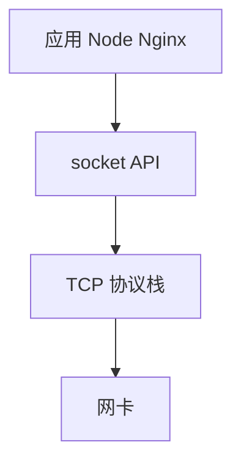
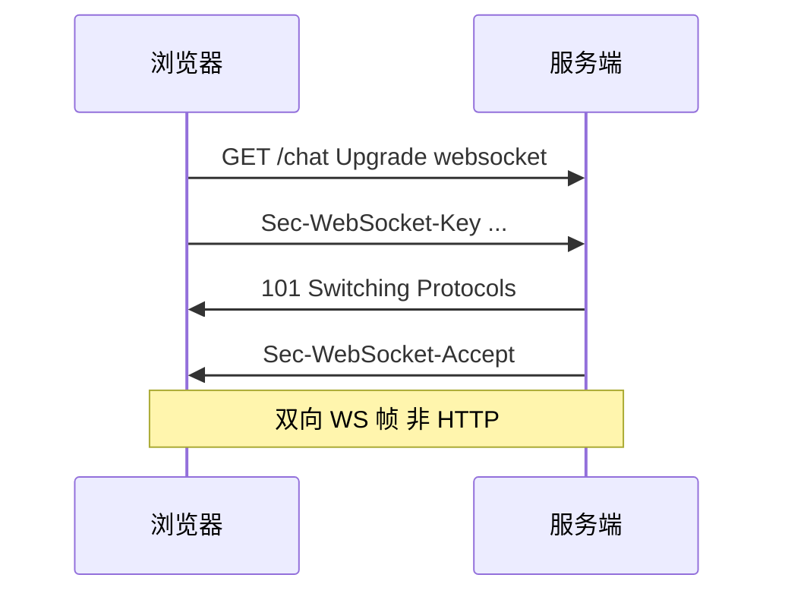
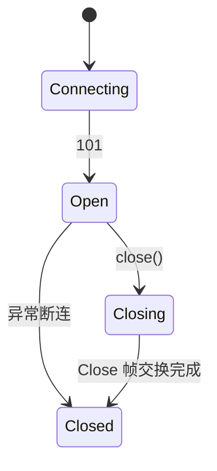

# Socket 与 WebSocket

**Socket** 是 OS 对网络连接的抽象（fd + 五元组）；**WebSocket** 是在 HTTP 升级之上的**全双工**应用协议。Node 实时推送、DevTools 抓 WS 帧、与 TCP 的关系，都在这一层对齐。

---

## Socket 是什么

连接由五元组唯一标识：

```plaintext
{ 协议 TCP/UDP, 本地 IP:端口, 远程 IP:端口 }
```

| 概念 | 说明 |
|------|------|
| **fd** | 文件描述符；一切皆文件 |
| **listen** | 服务端 bind + listen 等 connect |
| **accept** | 每 accept 一个新已连接 socket |
| **read/write** | 字节流收发 |



三次握手完成后，两端各有一个 **connected socket**；listen socket 与 connected socket 是不同 fd。

---

## Node 中的 TCP Socket

```javascript
import net from 'node:net';

const server = net.createServer((socket) => {
  socket.write('hello\n');
  socket.on('data', (buf) => { /* 字节流，无消息边界 */ });
});
server.listen(3000);
```

**字节流**：一次 `write` 可能对端多次 `data`，需自己 **framing**（长度前缀、换行、JSON Lines）。

**UDP** 用 `dgram`，一次 `message` 事件对应一个 datagram。

---

## WebSocket 协议

在 **HTTP Upgrade** 之后切换为 WS 帧：



| 特点 | 说明 |
|------|------|
| **全双工** | 服务端可主动 push |
| **轻帧头** | 比反复 HTTP 请求省 |
| **同源策略** | 浏览器仍受 Origin 检查 |
| **wss://** | TLS 上的 WS |

```javascript
const ws = new WebSocket('wss://example.com/chat');
ws.onopen = () => ws.send(JSON.stringify({ type: 'join' }));
ws.onmessage = (e) => console.log(e.data);
```

`Sec-WebSocket-Accept` 由 key + 固定 GUID 做 SHA-1 + Base64，防误升级。

---

## WebSocket vs 其他

| 方案 | 适用 |
|------|------|
| **轮询** | 简单、延迟高 |
| **长轮询** | 兼容老环境 |
| **SSE** | 服务端→客户端单向 |
| **WebSocket** | 双向实时 |

| | **SSE** | **WebSocket** |
|---|---------|---------------|
| 方向 | 单向 | 双向 |
| 协议 | 普通 HTTP | Upgrade |
| 自动重连 | EventSource 内置 | 需自己实现 |
| 二进制 | 不便 | 支持 |

---

## 扩展与心跳

| 机制 | 作用 |
|------|------|
| **Ping/Pong** | 保活、探测死连接 |
| **子协议** | `Sec-WebSocket-Protocol` |
| **压缩** | permessage-deflate |
| **反向代理** | Nginx 需 Upgrade 头与 read_timeout |

跨实例广播常配合 Redis pub/sub 或 sticky session。

---

## 与 OS I/O 模型

Node `ws` 底层：`net.Socket` + epoll/kqueue。单线程可持大量**空闲** WS；广播风暴仍受 CPU 与带宽限。

| 瓶颈 | 表现 |
|------|------|
| 代理 idle timeout | 无数据断连 |
| 单线程 broadcast | CPU 100% |
| 大包 JSON | 序列化 + 发送缓冲 |

---

## Socket API 对照

| API | 语义 |
|-----|------|
| TCP socket | 字节流，需粘包处理 |
| UDP socket | 报文边界 |
| WebSocket | 全双工帧，浏览器同源策略 |

Node `net.createServer` 与浏览器 WebSocket 客户端共享 TCP 语义，应用层帧格式不同。
## 粘包处理

TCP 字节流无消息边界 — 需长度前缀或分隔符协议。

```javascript
// 长度头 4 字节 Big Endian
function frame(payload) {
  const buf = Buffer.alloc(4 + payload.length);
  buf.writeUInt32BE(payload.length, 0);
  payload.copy(buf, 4);
  return buf;
}
```

---

## 半连接队列与 SYN 洪水

`listen(backlog)` 与 `tcp_max_syn_backlog` 限制等待 `accept` 的连接数。SYN 洪水占满队列则合法 `connect` 失败。

| 防御 | 说明 |
|------|------|
| SYN cookie | 不存半连接状态 |
| 限速 | 防火墙 rate limit |

Node 高并发网关压测出现 `ECONNRESET` 时，除应用逻辑外查系统 `ss -ltn` 的 Recv-Q。

---

## WebSocket 关闭码与状态机

连接关闭走 **Close Frame**，含 2 字节状态码 + 可选原因（UTF-8，≤123 字节）：

| 码 | 含义 |
|----|------|
| 1000 | 正常关闭 |
| 1001 | 端点离开（页导航） |
| 1006 | 异常关闭（无 Close 帧，DevTools 常见） |
| 1008 | 策略违规 |
| 1011 | 服务端内部错误 |

```javascript
ws.onclose = (ev) => {
  console.log(ev.code, ev.reason, ev.wasClean);
  // 1006 多为代理 idle timeout 或网络中断 — 配合心跳与指数退避重连
};
```



**Nginx 代理**：除 `Upgrade` / `Connection` 外，`proxy_read_timeout` 默认 60s，长连接无业务帧会被 RST，心跳 Ping 间隔应小于代理超时。

---

## 例题：Node 简易 WS 广播

```javascript
import { WebSocketServer } from 'ws';
const wss = new WebSocketServer({ port: 8080 });
const clients = new Set();

wss.on('connection', (ws) => {
  clients.add(ws);
  ws.on('message', (data) => {
    for (const c of clients) if (c.readyState === 1) c.send(data);
  });
  ws.on('close', () => clients.delete(ws));
});
```

`readyState`：0 CONNECTING、1 OPEN、2 CLOSING、3 CLOSED — 广播前检查避免向已关闭 fd 写。

## 小结

Socket 是内核连接抽象；TCP 提供可靠字节流。WebSocket 经 HTTP 101 升级，实现全双工；生产用 **wss** + 心跳 + 代理超时配置。

**易混点**：WebSocket ≠ Socket.io（后者是库）；WS 有帧但 JS API 常已是整条 string；TCP 无内置消息边界；accept 返回新 connected socket。

核对：为何 WS 要先走 HTTP Upgrade？SSE 能否服务端发二进制？accept 返回的是什么？
