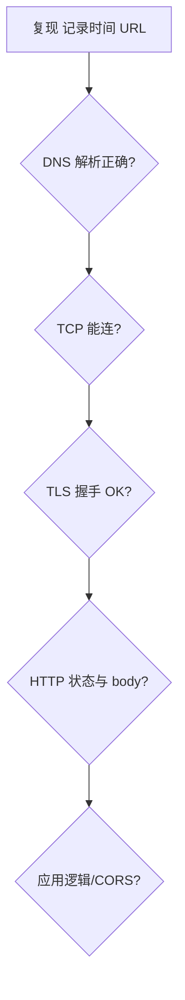

# 抓包与网络排障

分层模型 + 抓包工具，把「页面白屏 / 接口超时 / 偶发 502」定位到 **DNS、TCP、TLS、HTTP** 哪一段。方法论比记命令重要，先复现、再缩小范围、对照协议字段。

---

## 排障思维

自上而下逐层排除，避免在应用层改代码而根因其实在 DNS：



| 层次 | 工具线索 |
|------|----------|
| **DNS** | `dig` / `nslookup` |
| **网络可达** | `ping` `traceroute` `mtr` |
| **端口** | `curl -v` `nc` |
| **TLS** | `openssl s_client` |
| **HTTP** | DevTools Network、`curl` |
| **全栈** | Wireshark、tcpdump |

**易混点**：`ping` 通只说明 ICMP 到主机，**不代表 443 端口开**；`curl 200` 可能是 CDN 错误页。

---

## 浏览器 DevTools Network

| 列/面板 | 看什么 |
|---------|--------|
| **Timing** | DNS、TCP、SSL、TTFB、Content Download |
| **Headers** | 请求/响应头、HTTP 版本 |
| **Security** | 证书、TLS 版本 |
| **Initiator** | 谁发起的 fetch |

**TTFB 高**：用 Timing 拆分 DNS、TLS、排队、服务端。**stalled**：连接池、代理、Service Worker。

`Preserve log`、`Disable cache`（仅 DevTools 打开时）便于调试。

---

## curl 快速探针

```bash
curl -v -o /dev/null -s -w '%{time_namelookup} %{time_connect} %{time_appconnect} %{time_starttransfer}\n' \
  https://example.com/api

curl --http2 -I https://example.com

curl -X POST https://api.example.com/v1 -H 'Content-Type: application/json' -d '{"a":1}'
```

| 计时字段 | 含义 |
|----------|------|
| time_namelookup | DNS |
| time_connect | TCP 连上 |
| time_appconnect | TLS 握手完成 |
| time_starttransfer | 首字节 TTFB |

---

## Wireshark / tcpdump

```bash
sudo tcpdump -i any port 443 -c 100 -w capture.pcap
```

**HTTPS 默认看不到 HTTP 明文**，本地调试可配 SSLKEYLOGFILE + Wireshark 解密密钥；或分析 TLS Alert、证书问题。

**过滤器**：`tcp.port == 443`、`dns.qry.name contains "example"`。

---

## 常见问题对照

| 症状 | 可能层 |
|------|--------|
| `ERR_NAME_NOT_RESOLVED` | DNS |
| `ERR_CONNECTION_REFUSED` | 无 listen / 防火墙 |
| `ERR_CONNECTION_TIMED_OUT` | 路由、安全组 |
| `ERR_CERT_*` | TLS 证书 |
| **CORS error** | 浏览器策略，curl 可能 200 |
| **502/504** | 网关/上游超时 |
| **WebSocket 断** | 代理 idle timeout |

TCP **重传**多 → 丢包/拥塞；**RST** → 端口关或拒绝。

---

## 生产与权限

- 生产抓包涉及隐私与合规，最小范围、短时、脱敏。
- 容器/K8s：`kubectl exec` + tcpdump，或 Service Mesh 可观测性。
- 分布式：**Trace ID** 跨 hop 比单点 pcap 更实用。

Linux 常用命令：`ss -tan`、`lsof -i :443`、`journalctl` 查服务日志，与 pcap 互补。

---

## 排障记录模板

```plaintext
现象：
复现步骤：
环境（网络/VPN/浏览器）：
dig / curl -v 结果摘要：
DevTools Timing 截图要点：
已排除层：
下一步：
```

---

## 常用命令

| 命令 | 看什么 |
|------|--------|
| `curl -v` | DNS/TCP/TLS/HTTP 阶段 |
| `ping` | ICMP 可达 |
| `traceroute` | 路径跳数 |
| Wireshark | 全栈 hex |

```bash
curl -w '@curl-format.txt' -o /dev/null -s https://example.com
```
## TLS 解密

Wireshark 配置 (Pre)-Master-Secret 日志可解 HTTPS — 仅调试环境，勿泄露密钥。

```bash
curl -o /dev/null -w 'dns:%{time_namelookup} tcp:%{time_connect} tls:%{time_appconnect} total:%{time_total}
' https://example.com
```

---

## 分层排障清单

| 现象 | 先查 |
|------|------|
| 域名打不开 | `dig` / `nslookup` |
| 能 ping 不能访问端口 | 防火墙、服务是否 listen |
| HTTPS 报错 | 证书链、SNI、系统时间 |
| 慢 | RTT、TLS 握手、TTFB |

```bash
curl -w "@curl-format.txt" -o /dev/null -s https://example.com
# time_namelookup time_connect time_appconnect time_starttransfer
```

前端「Network 面板全红」时，区分 DNS、TCP、TLS、HTTP 哪一段耗时最长。

---

## HTTP/2 与 HTTP/3 排障要点

| 版本 | 抓包可见 | 常见坑 |
|------|----------|--------|
| HTTP/2 | ALPN `h2`、多路复用帧 | 单 TCP 丢包队头阻塞 |
| HTTP/3 | QUIC over UDP 443 | 防火墙拦 UDP、NAT 映射超时 |

```bash
curl -v --http2 https://example.com 2>&1 | grep -i 'HTTP/2'
```

DevTools Protocol 层显示 `h2` 时，Timing 里 **Queueing** 高可能是同域连接复用排队，与 HTTP/1.1 的 6 连接限制不同，但仍受服务端 SETTINGS 与流控影响。

---

## 本地 MITM 调试（仅开发）

Charles / mitmproxy 在本地装根 CA，代理解密 HTTPS 便于改包。生产环境禁止；团队共享抓包文件须脱敏 Cookie/Token。

```plaintext
浏览器 → 127.0.0.1:8888 代理 → 目标服务器
         ↑ 安装 Charles 根证到「受信任根」
```

**SSLKEYLOGFILE**（Chrome/Firefox 环境变量）把会话密钥写入文件，Wireshark「Edit → Preferences → TLS」导入后可解 HTTPS，适合本机调试，密钥文件等同明文密码。

---

## tcpdump 快速上手

```bash
# 抓 443 流量写文件
sudo tcpdump -i any port 443 -w capture.pcap

# 只看 SYN 握手
sudo tcpdump -i any 'tcp[tcpflags] & tcp-syn != 0'
```

| 工具 | 适用 |
|------|------|
| DevTools | 浏览器 HTTP/WebSocket |
| curl -v | 命令行复现 |
| tcpdump/Wireshark | 全栈、丢包、重传 |

生产排障先在测试环境复现，再对照线上抓包；勿在生产随意开 SSLKEYLOGFILE。

---

## curl 计时字段对照

| 字段 | 含义 |
|------|------|
| time_namelookup | DNS |
| time_connect | TCP 完成 |
| time_appconnect | TLS 完成 |
| time_starttransfer | 首字节 TTFB |
| time_total | 总耗时 |

DevTools 里 Stalled 高而 TTFB 正常时，优先查浏览器连接池与 HTTP/2 优先级，而非 DNS。

---

## 小结

排障自上而下：复现 → DNS → TCP 端口 → TLS → HTTP → 应用。DevTools Timing 与 `curl -v` 覆盖多数前端问题；Wireshark 深入丢包与握手细节。

**易混点**：浏览器 failed 不等于服务端没收到；Disable cache 只影响当前调试会话；HTTPS 无明文除非配密钥日志；CORS 在 curl 里不会出现。

核对：`time_appconnect` 代表什么？ping 通但 curl 443 失败下一步查什么？
