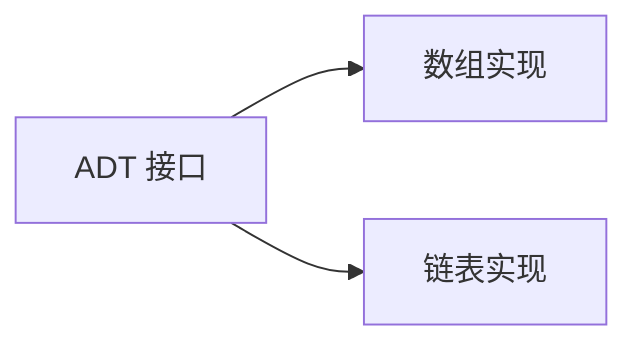
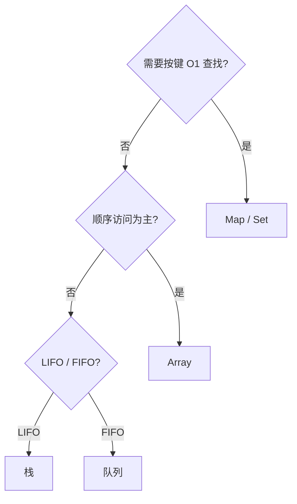

# 复杂度与抽象数据类型

前端选 `Array` 还是 `Map`、栈还是队列，是在**接口**与**实现代价**之间权衡。**抽象数据类型（ADT）** 定义「能做什么」，**数据结构** 定义「怎么存」；**时间/空间复杂度** 衡量实现是否撑得住数据规模。

---

## ADT 与实现分离

同一 ADT 可有多种底层实现；面试与工程问的是：在预期规模下，各操作均摊/最坏代价是否可接受。



| ADT | 典型操作 | 前端场景 |
|-----|----------|----------|
| **栈 Stack** | push / pop / peek | 路由历史、括号匹配、撤销栈 |
| **队列 Queue** | enqueue / dequeue | 任务队列、BFS、消息缓冲 |
| **表 Map** | get / set / delete | 缓存、索引、去重 |
| **集合 Set** | add / has / delete | 权限集合、已访问节点 |

---

## 大 O 速览（实现层）

| 记号 | 含义 | 例 |
|------|------|-----|
| O(1) | 常数 | 数组下标、哈希均摊查找 |
| O(log n) | 对数 | 平衡树、二分 |
| O(n) | 线性 | 遍历、链表查找 |
| O(n log n) | 线性对数 | 高效比较排序 |
| O(n²) | 平方 | 朴素双重循环 |

**均摊** vs **最坏**：动态数组 `push` 均摊 O(1)，扩容瞬间 O(n)；哈希极端冲突可退化 O(n)。

```javascript
const byIndex = arr[i];           // O(1)
const byKey = map.get(key);       // O(1) 均摊
const inList = list.find(x => x.id === id); // O(n)
```

---

## 空间复杂度

除元素本身，前端还需关注：对象头、指针、稀疏结构、GC 压力。

| 结构 | 空间特点 |
|------|----------|
| 紧凑数组 | 连续、Cache 友好 |
| 链表节点 | 每节点额外指针 |
| 哈希表 | 桶 + 负载因子预留 |
| 树 | 子指针 + 平衡信息 |

100 万元素用「数组索引 + 对象池」往往比 100 万独立小对象更省堆与 GC 扫描。

---

## 均摊分析直觉

**动态数组扩容**：容量翻倍时，n 次 push 总拷贝 O(n)，单次均摊 O(1)。

**哈希 rehash**：负载超阈值整体重建，均摊仍可控。

```plaintext
均摊 = 总代价 / 操作次数
  例：n 次 push 含一次 O(n) 扩容 → 均摊 O(1)
```

---

## 前端选型原则



1. **读多写少、顺序遍历** → `Array`
2. **键值查找、去重** → `Map` / `Set`
3. **中间频繁插入删除** → 链表或专用结构（`Array.splice` 是 O(n)）
4. **Top-K / 定时** → 堆

---

## 与语言内置类型的关系

JavaScript `Array` 是动态数组；`Map`/`Set` 是引擎哈希实现。手写链表/栈多用于理解原理或极特殊场景（WASM 侧无 GC 结构）。

| 内置类型 | 底层直觉 |
|----------|----------|
| Array | 动态数组，尾插均摊 O(1) |
| Map/Set | 哈希表 |
| Object | 哈希 + 原型链 |

---

## 最坏 vs 平均在业务中的含义

| 场景 | 应关注 |
|------|--------|
| 实时 UI | 最坏延迟（防 hitch） |
| 批处理 | 平均吞吐 |
| 安全敏感 | 哈希 HashDoS 最坏 |

LeetCode 写复杂度默认**最坏**；工程文档应说明数据规模与均摊条件。

---

## ADT 与 JS 内置

| ADT | JS 实现 | 均摊注意 |
|-----|---------|----------|
| 栈 | Array push/pop | O(1) |
| 队列 | Array shift 差 | 用双端或链表 |
| 映射 | Map/Object | 哈希均摊 |
| 集合 | Set | 去重 O(1) 均摊 |
## 均摊分析

动态数组倍增扩容：单次 insert 均摊 O(1)；哈希表 rehash 均摊 O(1)。

平摊 ≠ 最坏 — 面试说明「偶尔 O(n) rehash，均摊仍 O(1)」。

---

## 平摊 vs 最坏

| 说法 | 含义 |
|------|------|
| 最坏 O(n) | 单次操作上限 |
| 均摊 O(1) | n 次操作总代价 O(n) |

动态数组 push、哈希 insert 常用均摊分析 — 面试要说清「偶尔贵，长期均摊便宜」。

## 递归复杂度直觉

单分支递归 T(n)=T(n-1)+O(1) → O(n)；双分支 T(n)=2T(n-1) → O(2ⁿ)。写递归先画递归树层数。

| 递归形态 | 典型阶 |
|----------|--------|
| 单链减一 | O(n) |
| 二分减半 | O(log n) |
| 斐波那契裸递归 | O(2ⁿ) |

---

## 例题：用栈校验 HTML 标签

```javascript
function isBalanced(tags) {
  const stack = [];
  const open = new Set(['div', 'span', 'p']);
  for (const t of tags) {
    if (open.has(t)) stack.push(t);
    else if (stack.pop() !== t.slice(1)) return false; // '/div' → 'div'
  }
  return stack.length === 0;
}
```

模板引擎与 JSX 编译前的括号匹配同属 **LIFO** 栈；BFS 层序打印组件树用队列。

| 操作序列 | 应用 ADT |
|----------|----------|
| 撤销/重做 | 双栈 |
| 任务 FIFO | 队列 |
| 路由栈 | 栈 |

---

## 大 O 口算练习

| 代码 | 阶 |
|------|-----|
| `for i in n: for j in n` | O(n²) |
| `while n>1: n/=2` | O(log n) |
| `mergeSort` | O(n log n) |
| `fib(n)` 裸递归 | O(2ⁿ) |

写循环时先数**嵌套层数**与**规模缩减比例**，再对照主定理（分治）或直接乘积（循环）。

---

## 选型决策表

| 需求 | 首选 |
|------|------|
| 尾部增删 | 动态数组 |
| 头尾增删 | 双端队列 |
| 键值查找 | Map |
| 去重 | Set |

n < 100 时 O(n²) 常可接受；n > 10⁵ 时须 O(n log n) 或 O(n)。

## 小结

ADT 描述能力，数据结构决定复杂度；前端优先引擎内置类型，再按规模与操作 mix 选手写或专用库。

**易混点**：大 O 省略常数；「平均」≠「最坏」；`Array.includes` 是 O(n)；Object 键只有 string/Symbol。

核对：`Array.splice` 中间插入复杂度？`Map` 与对象字面量在键类型、迭代顺序上差异？
