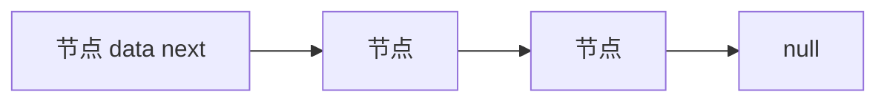
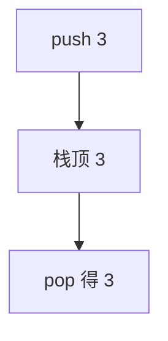
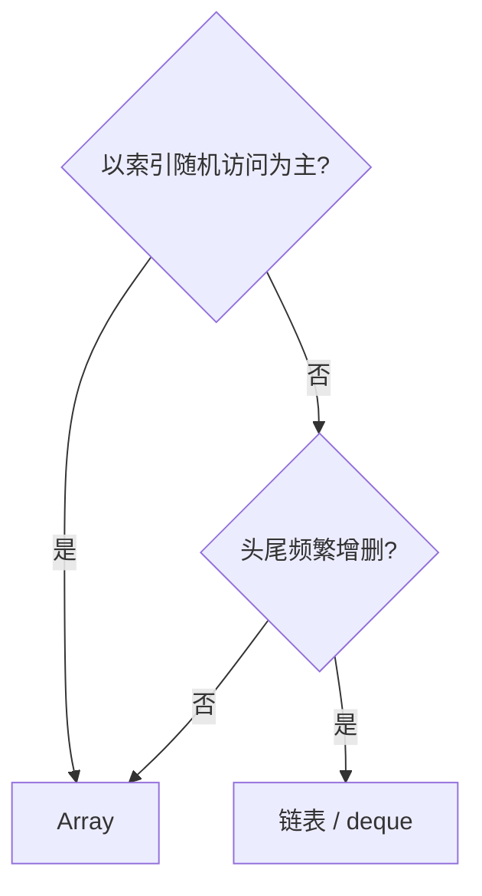

# 数组、链表、栈与队列

这四类结构覆盖前端大部分「线性数据」需求：**数组**随机访问、**链表**灵活插入、**栈**后进先出、**队列**先进先出。路由栈、任务队列、DOM DFS，底层都是它们的变体。

---

## 数组（动态数组）

| 操作 | 复杂度 | 说明 |
|------|--------|------|
| 按下标读/写 | O(1) | 连续内存 |
| 尾部 push/pop | O(1) 均摊 | 扩容时 O(n) |
| 头部 shift/unshift | O(n) | 整体挪动 |
| splice 中间插删 | O(n) | 移动后续元素 |
| 查找 | O(n) | indexOf / find |

```javascript
const stack = [];
stack.push(1); stack.push(2);
stack.pop(); // 2

// 队列优化：头指针，避免 O(n) shift
const q = [1, 2, 3];
let head = 0;
const dequeue = () => q[head++];
```

**Cache 局部性**：数组顺序遍历通常比链表快，虽都是 O(n)，连续地址利于预取。

---

## 链表



| 操作 | 数组 | 单向链表 |
|------|------|----------|
| 随机访问 | O(1) | O(n) |
| 头插 | O(n) | O(1) |
| 已知节点后插删 | O(n) | O(1) |

JS 无内置链表；`class Node { val; next }` 用于 LeetCode 或 LRU 双向链。**双向链表**：头尾 O(1) 删除。

---

## 栈（Stack）

LIFO：最后入栈者先出。



| 场景 | 用法 |
|------|------|
| 括号/标签匹配 | HTML/JSX 嵌套 |
| DFS | 显式栈防递归溢出 |
| 调用栈 | 引擎实现递归 |
| 浏览器历史 | 后退栈 |

```javascript
function isBalanced(s) {
  const st = [];
  const pair = { ')': '(', ']': '[', '}': '{' };
  for (const c of s) {
    if ('([{'.includes(c)) st.push(c);
    else if (st.pop() !== pair[c]) return false;
  }
  return st.length === 0;
}
```

---

## 队列（Queue）

FIFO：先进先出。

| 变体 | 行为 | 场景 |
|------|------|------|
| 普通队列 | 一端入一端出 | BFS、宏任务 |
| 双端 deque | 两端可入出 | 滑动窗口极值 |
| 优先队列 | 按优先级出 | 定时器（堆实现） |

```javascript
function bfs(start) {
  const q = [start], seen = new Set([start]);
  while (q.length) {
    const node = q.shift(); // 大队列用头指针
    for (const nb of node.neighbors)
      if (!seen.has(nb)) { seen.add(nb); q.push(nb); }
  }
}
```

Event Loop：宏任务队列、微任务队列是队列语义；微任务优先于 `setTimeout`。

---

## 数组 vs 链表选型



前端默认 **Array**；LRU、Piece Table 等场景手写链表。

---

## 工程实践

| 需求 | 推荐 |
|------|------|
| 大队列 dequeue | 头指针 + 周期性 compact |
| 栈深度大 | 显式栈替代递归 |
| Immutable 更新 | 拷贝数组 O(n)，考虑持久化结构库 |

---

## 前端选型

| 操作热点 | 结构 |
|----------|------|
| 随机读 | 数组 |
| 头尾插入删 | 双端队列/deque |
| 中间频繁插删 | 链表或平衡树 |
| LRU | Map + 双向链表 |
## JS 陷阱

`arr.shift()` 是 O(n) — 大队列用循环数组或专门 deque 库。

双端队列维护 head/tail 索引 modulo capacity，均摊 O(1) 两端操作。

---

## 栈与括号匹配

栈 **LIFO**，适合嵌套结构校验：

```javascript
function isValid(s) {
  const st = [], pair = { ')': '(', ']': '[', '}': '{' };
  for (const c of s) {
    if ('([{'.includes(c)) st.push(c);
    else if (st.pop() !== pair[c]) return false;
  }
  return st.length === 0;
}
```

编译器、路由嵌套、DOM 深度遍历都用到栈；递归隐式使用调用栈。

---

## 循环队列实现

用数组 + head/tail 指针，取模实现环形，避免 shift 的 O(n)：

```javascript
class RingQueue {
  constructor(cap) { this.a = Array(cap); this.h = this.t = this.n = 0; this.cap = cap; }
  push(x) {
    if (this.n === this.cap) throw new Error('full');
    this.a[this.t] = x; this.t = (this.t + 1) % this.cap; this.n++;
  }
  pop() {
    if (!this.n) throw new Error('empty');
    const x = this.a[this.h]; this.h = (this.h + 1) % this.cap; this.n--;
    return x;
  }
}
```

BFS 层序、消息队列、限流窗口常用队列；JS 大队列勿用 `Array.shift()`。

| 结构 | 头删 | 尾增 |
|------|------|------|
| Array shift | O(n) | O(1) amortized |
| 链表 | O(1) | O(1) |
| RingQueue | O(1) | O(1) |

链表实现队列在频繁头删场景优于原生 Array。

---

## 选型决策表（前端）

| 需求 | 结构 |
|------|------|
| 下标随机访问 | 数组 |
| 头尾队列 BFS | 数组 + 头指针 或 链表 |
| 撤销栈 | 栈（数组 push/pop） |
| 括号匹配 | 栈 |
| 大列表中间频繁插删 | 链表或平衡树（少用原生数组 splice） |

---

## 小结

数组善随机访问与遍历，链表善已知节点 O(1) 插删；栈管 LIFO，队列管 FIFO。

**易混点**：`Array.shift()` 是 O(n)；深图 DFS 用显式栈防栈溢出；BFS 用队列而非栈；微任务队列优先于宏任务。

核对：100 万次 `unshift` 与头指针方案谁更合适？BFS 为何用队列？循环队列 full/empty 如何区分？
