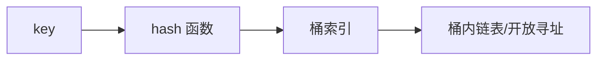
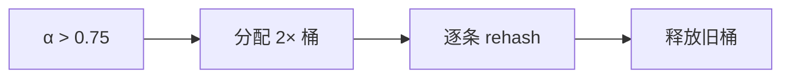

# 哈希表

**O(1) 均摊** 键值查找是哈希表的承诺。对象缓存、路由表、去重、`Map` memo，前端大量「按 key 拿 value」依赖哈希或类似结构。

---

## 基本原理

哈希把 key 映射到桶索引；冲突时链地址或开放寻址；负载因子超阈值则 rehash 扩容。



| 策略 | 优点 | 缺点 |
|------|------|------|
| 链地址 | 删除简单 | 指针开销 |
| 开放寻址 | 缓存紧凑 | 聚集 |

---

## 复杂度

| 操作 | 平均 | 最坏 |
|------|------|------|
| 查找/插入/删除 | O(1) | O(n) 全冲突 |
| 遍历 | O(n) | O(n) |

最坏出现在恶意 hash 或弱哈希；服务端需注意 HashDoS。

---

## JavaScript：Object vs Map vs Set

```javascript
const map = new Map();
map.set({ uid: 1 }, 'session');  // 对象 key 引用相等
const set = new Set([1, 2, 2]);  // size === 2
```

| | Object | Map | Set |
|---|--------|-----|-----|
| 键类型 | string/Symbol 为主 | **任意** | 存 value |
| 顺序 | 整数键特殊 | **插入顺序** | 插入顺序 |
| 大小 | Object.keys | `.size` | `.size` |
| 原型 | 有默认键 | **无** | **无** |

**WeakMap / WeakSet**：键须为对象，弱引用不阻止 GC，适合 DOM 元数据。

```javascript
const cache = new WeakMap();
cache.set(el, data); // el 移除后 entry 可 GC
```

---

## 前端典型用法

| 场景 | 结构 |
|------|------|
| id → 实体 | `Map<id, item>` |
| 已访问节点 | `Set` |
| 计数 | `Map<key, number>` |
| memo | `Map` 缓存参数 key |
| React list | stable key，非下标 |

```javascript
function twoSum(nums, target) {
  const seen = new Map();
  for (let i = 0; i < nums.length; i++) {
    const need = target - nums[i];
    if (seen.has(need)) return [seen.get(need), i];
    seen.set(nums[i], i);
  }
}
```

---

## 与数组对比

需要 **顺序 + 下标** → Array；**键值 O(1)** → Map；**成员检测** → Set（大集合优于 `includes`）。

---

## 哈希函数与负载因子

好的哈希函数让 key 在桶间**近似均匀分布**；字符串 key 常经引擎内部算法映射到 32/64 位整数再取模。

| 参数 | 典型值 | 含义 |
|------|--------|------|
| 负载因子 α | 0.75 | 元素数/桶数；超阈值 rehash |
| 桶数 | 2 的幂 | 取模可优化为位与 |
| rehash | 2× 桶 | 均摊 O(1) 仍成立 |

**开放寻址**线性探测在 α 高时出现**聚集**；二次探测或双重哈希缓解。V8 `Map` 实现细节不公开，但语义保证均摊 O(1)。

---

## 工程陷阱

| 陷阱 | 后果 | 规避 |
|------|------|------|
| 对象作 key 每次 new | 永远 miss | 复用引用或改 string id |
| `JSON.stringify` 做 key | 属性顺序敏感 | 排序键或用手写序列化 |
| 大 Map 频繁迭代 | O(n) 扫描 | 维护 size 或增量索引 |
| 原型污染 Object | 意外键 | `Map` 或 `Object.create(null)` |

服务端 Node 若用用户输入作 hash map key，需防 **HashDoS**，使用带随机种子的哈希或限流。

---

## 冲突策略

| 策略 | 特点 |
|------|------|
| 链地址 | 实现简单，指针不友好 |
| 开放寻址 | 缓存友好，聚簇 |
| 再哈希 | 扩容时 rehash |

JS `Map` 在 V8 为哈希表 + 有序链表，键可为任意类型。
## 负载因子

负载因子 α = n/m；开放寻址 α 高则聚簇严重，常 rehash 保持 α < 0.7。

V8 小对象属性用 hidden class + 快属性；超阈值转字典模式 — 性能下降。

---

## 键相等语义

| 类型 | Map 键相等 |
|------|------------|
| 原始值 | 值相等 |
| 对象 | 引用相等 |

同一对象引用作键才命中；`{id:1}` 与 `{id:1}` 是两个不同键。

## Object.create(null) 何时用

```javascript
const dict = Object.create(null);
dict.foo = 1; // 无原型链干扰
```

动态键多、对象键 → 仍优先 `Map`。

## 一致性哈希（扩展）

分布式缓存分片：节点增减时只迁移部分 key。CDN 边缘选择与 Redis Cluster slot 都用到类似思想。

| 普通哈希 | 一致性哈希 |
|----------|------------|
| 节点变 → 几乎全部迁移 | 只迁相邻 slot |

---

## Object.create(null) 与 Map

无原型字典适合纯 string 键、要 JSON 序列化：

```javascript
const dict = Object.create(null);
dict.__proto__; // undefined
```

| 需求 | 选型 |
|------|------|
| 任意键、频繁增删 | Map |
| 纯 string、JSON | Object.create(null) |
| DOM 元数据 | WeakMap |

---

## 布隆过滤器

位数组 + 多哈希：回答「一定不存在」或「可能存在」，无 false negative。

| | 哈希表 | Bloom |
|---|--------|-------|
| 空间 | O(n) | 更省 |
| 精确 | 是 | 有 false positive |

缓存穿透防护、爬虫 URL 去重前置过滤。

---

## rehash 过程示意

负载因子 α = n/m 超过阈值（常 0.75）时，分配 2m 个桶，**所有**条目重新 hash，单次 O(n)，均摊到 n 次 insert 仍 O(1)。



V8 `Map` 在 size 过大时可能转 dictionary mode，属性访问从 inline cache 退化到哈希查找，大对象映射需提前规划结构。

---

## HashDoS 防护

攻击者构造大量碰撞 key，使哈希退化为链表 O(n)：

| 层 | 措施 |
|----|------|
| 语言/runtime | 随机 hash seed（V8、Python 3.3+） |
| 应用 | 限流、勿用用户输入直接作 Object 键 |
| 框架 | 表单字段数上限 |

Node 接收 query/body 解析大对象时，注意 DoS 与内存峰值。

## 小结

哈希用 hash + 冲突解决实现均摊常数查找；`Map`/`Set` 首选，`WeakMap` 适合不拖累 GC 的对象元数据。

**易混点**：对象作 key 是引用相等；Object 键转 string；JSON.stringify 做 key 注意顺序；Set 去重优于 filter+includes 的 O(n²)。

核对：`Map` 与 `Object.create(null)` 各适合什么？负载因子升高为何 rehash？
