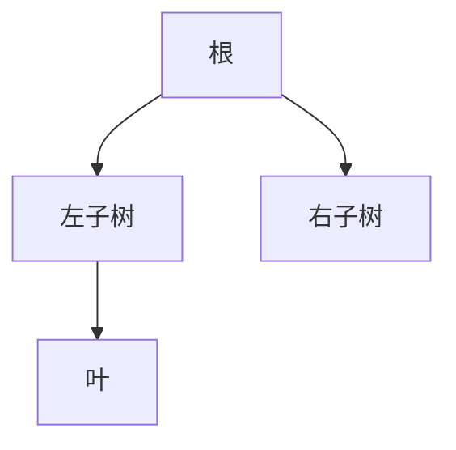

# 二叉树与 BST

树形数据建模层级：DOM、菜单、组织架构、表达式 AST。**二叉树**每节点最多两子；**BST** 中序有序，支持 O(log n) 查找，前提树大致平衡。

---

## 二叉树术语



| 术语 | 含义 |
|------|------|
| 深度 | 根到该节点边数 |
| 高度 | 树的最大深度 |
| 完全二叉树 | 堆、数组存树常用 |
| 叶节点 | 无子女 |

**存储**：指针 `left`/`right` 或数组下标（完全树：`2i+1`, `2i+2`）。

---

## 遍历

| 序 | 顺序 | 用途 |
|----|------|------|
| 前序 | 根-左-右 | 复制树 |
| **中序** | 左-根-右 | **BST 得有序序列** |
| 后序 | 左-右-根 | 删树 |
| 层序 | BFS | 按层打印 |

```javascript
function inorderIter(root) {
  const st = [], res = [];
  let cur = root;
  while (cur || st.length) {
    while (cur) { st.push(cur); cur = cur.left; }
    cur = st.pop();
    res.push(cur.val);
    cur = cur.right;
  }
  return res;
}
```

递归遍历空间 O(h)；链状树 h=n 可能栈溢出，迭代或显式栈更安全。

---

## BST 性质

左子树 < 根 < 右子树（常见无重复定义）。

| 操作 | 平均 | 最坏（退链） |
|------|------|------------|
| 查找/插入/删除 | O(log n) | O(n) |

```javascript
function isValidBST(node, lo = -Infinity, hi = Infinity) {
  if (!node) return true;
  if (node.val <= lo || node.val >= hi) return false;
  return isValidBST(node.left, lo, node.val)
      && isValidBST(node.right, node.val, hi);
}
```

**删除双子节点**：用中序后继（右子树最小）或前驱替换，再删后继节点。

---

## 与前端的关系

| 场景 | 联系 |
|------|------|
| DOM 树 | 多叉；DFS 对应深度优先 |
| Virtual DOM | diff 按树比较 |
| 表达式 | 运算符树 |
| DB 索引 | BST 思想延伸到 B+ 树 |

```javascript
// DOM DFS（概念）
function walk(node, visit) {
  visit(node);
  for (const child of node.children) walk(child, visit);
}
```

---

## BST 操作要点

| 操作 | 步骤 |
|------|------|
| 查找 | 比根小走左，大走右 |
| 插入 | 落到空位 |
| 删叶 | 直接删 |
| 删单子 | 子顶替 |
| 删双子 | 后继替换 |

---

## 平衡的重要性

有序插入 1,2,3…n 得右链，高度 n，操作退 O(n)。平衡树或随机化 BST 把高度压 O(log n)。

---

## 遍历应用

| 遍历 | 用途 |
|------|------|
| 前序 | 复制树、前缀表达式 |
| 中序 | BST 有序输出 |
| 后序 | 删树、后缀表达式 |
| 层序 | 最短层、BFS |

DOM 是树；React Fiber 也是树形结构，遍历策略影响调度。
## 平衡检查

AVL 平衡因子 ∈ {−1,0,1}；红黑树黑高一致 — 插入最多 O(log n) 旋转。

面试手写：BST 删除三种情况 — 叶、单子、双子（中序后继替换）。

---

## BST 操作复杂度

| 操作 | 平均 | 最坏 |
|------|------|------|
| 查找 | O(log n) | O(n) |
| 插入 | O(log n) | O(n) |
| 删除 | O(log n) | O(n) |

删除三类：无子、单子、双子（中序后继替换）。

```javascript
function search(root, val) {
  if (!root || root.val === val) return root;
  return val < root.val ? search(root.left, val) : search(root.right, val);
}
```

---

## 例题：BST 第 K 小元素

中序遍历第 K 个即为答案；迭代 + 栈 O(h) 空间：

```javascript
function kthSmallest(root, k) {
  const st = [];
  let cur = root;
  while (cur || st.length) {
    while (cur) { st.push(cur); cur = cur.left; }
    cur = st.pop();
    if (--k === 0) return cur.val;
    cur = cur.right;
  }
}
```

| 方法 | 时间 | 空间 |
|------|------|------|
| 中序 + 数组 | O(n) | O(n) |
| 中序 + 栈 | O(h+k) | O(h) |
| 平衡 BST + 子树 size | O(log n) | O(h) |

---

## 验证 BST 要带界

只比较父节点不够；递归传递 `(min, max)` 开区间：

```javascript
function isValidBST(root, lo = -Infinity, hi = Infinity) {
  if (!root) return true;
  if (root.val <= lo || root.val >= hi) return false;
  return isValidBST(root.left, lo, root.val)
      && isValidBST(root.right, root.val, hi);
}
```

React/Vue 虚拟 DOM diff 是树算法；理解 BST 有助于读「有序集合」类面试题。

---

## 完全二叉树与堆

下标从 0 起：parent `(i-1)>>1`，left `2i+1`，right `2i+2`。堆排序与优先队列基于完全二叉树数组存储。

| 性质 | 完全二叉树 |
|------|------------|
| 高度 | O(log n) |
| 存储 | 数组无指针 |

## 小结

二叉树用递归/栈遍历；BST 中序有序、查找 logarithmic，未平衡时退化为链。DOM 与 AST 是前端直接应用。

**易混点**：BST ≠ 堆；中序迭代用栈；高度最坏 O(n) 最好 O(log n)；验证 BST 要带上下界不能只比父节点。

核对：删两子 BST 节点为何用中序后继？完全二叉树 parent(i) 公式？验证 BST 为何要 (min,max) 界？
