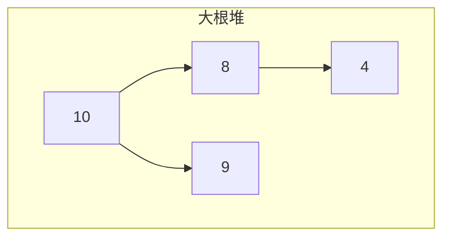

# 堆与优先队列

**堆**是完全二叉树，满足堆序：大根堆父 ≥ 子，小根堆父 ≤ 子。**优先队列**按优先级出队，定时器、Top-K、Dijkstra 松弛边，堆是 O(log n) 插入/删顶的标准实现。

---

## 结构

用数组存完全二叉树，堆序保证堆顶是极值。



数组下标：`parent(i)=(i-1)//2`，`left=2i+1`，`right=2i+2`。

| 操作 | 复杂度 |
|------|--------|
| 查最值 | O(1) |
| 插入 | O(log n) 上浮 |
| 删堆顶 | O(log n) 下沉 |
| 建堆 | O(n) |

---

## 与 BST 对比

| | 堆 | BST |
|---|-----|-----|
| 最值 | O(1) 堆顶 | O(log n) 走极左/右 |
| 有序遍历 | **否** | 中序有序 |
| 任意查找 | O(n) | O(log n) |

随时取 max/min 用堆；有序范围查询用 BST 或平衡树。

---

## 优先队列 API

```javascript
class MinHeap {
  #a = [];
  push(val) { this.#a.push(val); this.#bubbleUp(this.#a.length - 1); }
  pop() {
    if (this.#a.length === 1) return this.#a.pop();
    const top = this.#a[0];
    this.#a[0] = this.#a.pop();
    this.#bubbleDown(0);
    return top;
  }
  peek() { return this.#a[0]; }
  size() { return this.#a.length; }
}
```

---

## 经典应用

| 问题 | 思路 |
|------|------|
| Top-K 最大 | 维护大小 K 的**小根堆** |
| 合并 K 有序链表 | 堆存各链表头 |
| 任务调度 | 按 deadline 出队 |
| 中位数流 | 大根堆 + 小根堆对顶 |

```javascript
function topK(nums, k) {
  const h = new MinHeap();
  for (const x of nums) {
    h.push(x);
    if (h.size() > k) h.pop();
  }
  return h.toArray?.() ?? [];
}
```

Top-K **最大**用小根堆：堆顶是 K 个里最小的，新来的更大才替换。

---

## 前端场景

| 场景 | 说明 |
|------|------|
| requestIdleCallback | 按 deadline 近似优先队列 |
| 慢接口 Top-N | 堆维护 |
| 动画事件 | 按 timestamp 小根堆 |

---

## 建堆与堆排序

heapify 自 `n//2-1` 向下 sift：O(n)。堆排序 O(n log n) 不稳定，业务多用 `Array.sort`（Timsort）。

| 步骤 | 删堆顶 |
|------|--------|
| 1 | 堆顶与末尾交换 |
| 2 | 长度减一 |
| 3 | 从根下沉 |

---

## 堆操作复杂度

| 操作 | 二叉堆 |
|------|--------|
| insert | O(log n) |
| peek min | O(1) |
| delete-min | O(log n) |
| heapify 数组 | O(n) |

任务调度、合并 K 路有序流、Dijkstra 都依赖堆或等价结构。
## 数组存堆

下标 i 的父 (i-1)>>1，左 2i+1，右 2i+2。原地 heapify 建堆 O(n)。

定时器最小堆：`setTimeout` 内部按到期时间组织 — 概念类似。

---

## JS 堆实现

无内置堆 — 用数组 + 下标公式，或 `priority-queue` 库。

定时器按到期时间组织 — 概念上是最小堆；删除定时器需定位节点。

## 堆排序

原地 heapify 后反复 swap 堆顶与末尾 — O(n log n)，不稳定。快排平均更快，堆排序保证最坏 O(n log n)。

## 定时器与堆

浏览器/Node 定时器内部按到期时间组织 — 概念类似最小堆；大量 `setTimeout` 时引擎需高效增删。

---

## 堆的数组表示

下标 i 的节点：父 `(i-1)>>1`，左子 `2i+1`，右子 `2i+2`。

```javascript
function siftDown(a, i, n) {
  while (true) {
    let largest = i, l = 2 * i + 1, r = l + 1;
    if (l < n && a[l] > a[largest]) largest = l;
    if (r < n && a[r] > a[largest]) largest = r;
    if (largest === i) break;
    [a[i], a[largest]] = [a[largest], a[i]];
    i = largest;
  }
}
```

Floyd **buildHeap** 从最后一个非叶节点向下 sift，O(n) 建堆。

---

## Top-K 与堆

求第 K 大：维护大小 K 的**小根堆**，超过 K 个元素时 pop 最小。

| 方法 | 复杂度 |
|------|--------|
| 全排序 | O(n log n) |
| 堆 Top-K | O(n log K) |

K 远小于 n 时堆更省；K 接近 n 时直接排序更简单。

---

## insert 与 extract 步骤

**insert**：新元素放数组末尾，向上 siftUp 与父比较。

**extract-max**（大根堆）：根与末尾交换，heapSize，，对根 siftDown。

```javascript
function siftUp(a, i) {
  while (i > 0) {
    const p = (i - 1) >> 1;
    if (a[p] >= a[i]) break;
    [a[p], a[i]] = [a[i], a[p]];
    i = p;
  }
}
```

| 操作 | 复杂度 |
|------|--------|
| insert | O(log n) |
| extract | O(log n) |
| peek | O(1) |

---

## 合并 K 个有序流

小根堆存每路当前最小元素；每次 pop 后把该路下一个 push 进堆 — O(N log K)。

React Scheduler、浏览器定时器、消息队列优先级消费都用到「按优先级取下一个」的堆语义。

---

## 堆 vs 平衡 BST

| 操作 | 堆 | BST |
|------|-----|-----|
| 取最值 | O(1) | O(log n) |
| 任意查找 | 不支持 | O(log n) |
| 建堆 | O(n) | O(n log n) |

Top-K、定时器、Dijkstra 优先队列 — 堆足够。

---

## 小结

堆 O(1) 取极值、O(log n) 增删；Top-K 与调度高频。

**易混点**：Top-K 最大用小根堆；删堆顶后末尾放根再下沉；堆不等于排序数组。

核对：Top-K 最大为何用小根堆？删堆顶步骤？
