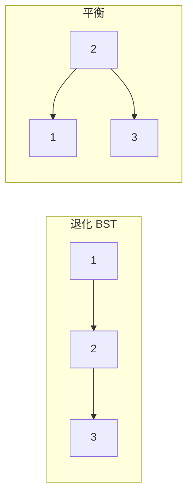
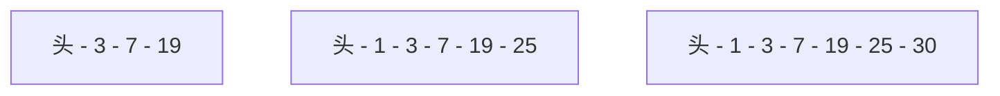
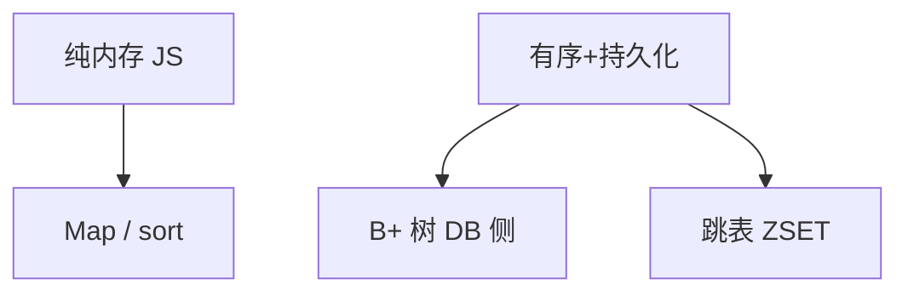
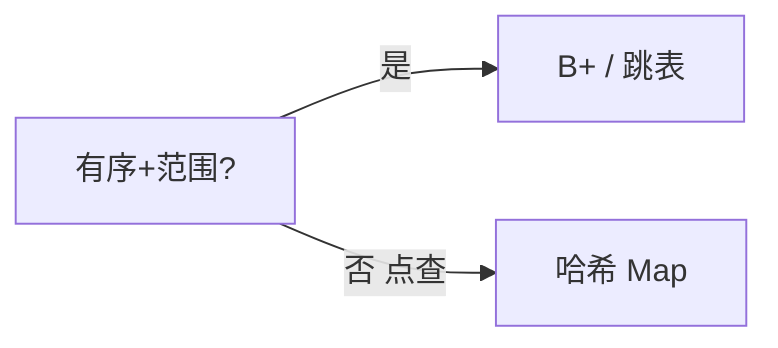

# 平衡树与跳表

普通 BST 有序插入会退化成链，查找变 O(n)。**平衡树**用旋转或颜色规则把高度压在 O(log n)；**跳表**用多层概率链表，期望 O(log n)，Redis ZSET、数据库 B+ 树索引是工程常见形态。

---

## 为何需要平衡



| 结构 | 查找 | 说明 |
|------|------|------|
| 普通 BST | O(n) 最坏 | 有序插入即链 |
| AVL | O(log n) | 严格平衡 |
| **红黑树** | O(log n) | 工程常用 |
| 跳表 | O(log n) 期望 | 实现短 |
| B+ 树 | O(log n) | 磁盘索引 |

---

## 红黑树（概念）

根黑、红子必黑、黑高相同，插入/删除后旋转+变色恢复。

| 运行时 | 用途 |
|--------|------|
| C++ map / Java TreeMap | 有序 map |
| Linux 部分 interval tree | 区间 |

前端一般不手写；IndexedDB 索引对用户透明，语义类似有序 scan。

---

## 跳表（Skip List）

多层链表：上层快车道，插入随机层高（p≈0.5）。



**Redis ZSET**：跳表按 score 有序 + 哈希 O(1) 按 member 查 rank。

查找从顶层开始，同层向右，不够则下沉，期望 O(log n)。

---

## B+ 树（概念）

数据只在叶节点，叶链表串联，适合范围查询与磁盘块对齐。

| 特点 | 说明 |
|------|------|
| 扇出大 | 树高低 |
| 叶链表 | BETWEEN 顺序扫 |
| 非叶 | 只做索引 |

ORM explain 可见 B+ 树命中；SQLite WASM 场景相关。

---

## 选型直觉



浏览器内：Map 哈希；需排序用 sort 或 interval tree 等库。

---

## AVL vs 红黑（简）

| | AVL | 红黑 |
|---|-----|------|
| 平衡严格度 | 更严 | 较松 |
| 旋转次数 | 查找更快，插入旋转多 | 插入常更快 |
| 工程 | 数据库内存索引 | 标准库 map |

---

## 跳表期望层数

每层晋升概率 p=1/2，期望层数 O(log n)；空间 O(n)。

LevelDB/RocksDB 用跳表做 memtable；前端工程直接实现较少，理解复杂度即可。

---

## 前端为何少见手写平衡树

数组 + 排序、Map、数据库索引已封装。理解 O(log n) 即可 — 面试答插入删除与查找的权衡。

## 跳表插入

随机层高 k，从顶层找前驱，逐层插入 — 期望 O(log n)。与红黑树相比代码短，Redis 选用跳表 + 哈希双结构。

---

## 旋转直觉（红黑树）

插入破坏黑高规则时，通过 **左旋/右旋** + 变色恢复：

```plaintext
右旋:  父           原右子
      /   \   →    /   \
     A    父       A    ...
```

不必背六种 case；理解「局部调整、高度 O(log n)」即可。

---

## 范围查询

有序结构支持 `lower_bound` / `upper_bound`：

| 结构 | 范围 scan |
|------|-----------|
| B+ 树 | 叶链表 O(k) |
| 跳表 | 同层向右再下沉 |
| JS Map | 无序，需 sort 后 scan |

数据库 `WHERE id BETWEEN` 走 B+ 树叶链表；Redis `ZRANGEBYSCORE` 走跳表。

---

## B 树与 B+ 树对比

| | B 树 | B+ 树 |
|---|------|-------|
| 数据存储 | 非叶节点也可存 key | **仅叶节点存数据** |
| 叶链接 | 无 | **双向链表** |
| 范围查询 | 需中序遍历 | 沿叶链表 O(k) |
| 典型 | 部分文件系统 | MySQL InnoDB、PostgreSQL |

磁盘块大小固定（如 16KB），扇出大则树高低，I/O 次数少。

---

## 跳表查找过程

查找 key=19：从最高层头节点出发，同层向右直到下一跳 > 19，再下沉一层重复。

```plaintext
L2: head ──────────→ 19
L1: head ──→ 7 ──→ 19
L0: head → 1 → 3 → 7 → 19 → 25
```

期望比较次数 O(log n)；最坏若随机层高全为 0 则退化为链表 O(n)，概率极低。

---

## IndexedDB 与有序访问

浏览器 **IndexedDB** 索引对用户透明，底层由引擎实现 B+ 树或类似结构：

| API | 语义 |
|-----|------|
| `get(key)` | 点查 O(log n) |
| `openCursor(range)` | 范围 scan |
| `index.getAll(query)` | 索引序批量读 |

前端不手写平衡树，但理解 O(log n) 有助于解释大数据量 cursor 为何仍比全表 `getAll` 可控。

---

## 手写平衡树的代价

| 因素 | 说明 |
|------|------|
| 旋转 case | 红黑插入/删除 多种分支 |
| 并发 | 需锁或无锁技巧 |
| 测试 | 随机 fuzz 验证不变量 |

工程选型：**Map + 需要排序时 `[...map.values()].sort()`** 或 **数据库侧索引**，除非 WASM/游戏引擎等特殊场景。

---

## 面试常问对比

| 问题 | 答法要点 |
|------|----------|
| 为何 DB 用 B+ 不用哈希 | 范围查询、有序 scan |
| 跳表 vs 红黑树 | 实现短、期望 O(log n)；Redis 双结构 |
| 前端要不要手写 | 一般不需要，用 Map/DB 索引 |



跳表期望查找 **O(log n)**；层高期望 **O(log n)** 层，与 n 的关系：期望最大层 ≈ log_{1/p} n，p=1/2 时常数因子 2。

---

## 总结对比

| 结构 | 有序 | 范围查询 | 前端手写 |
|------|------|----------|----------|
| 红黑树 | ✓ | ✓ | 否 |
| B+ 树 | ✓ | ✓ 叶链 | 否（DB） |
| 跳表 | ✓ | ✓ | 极少 |

## 小结

平衡树与跳表维持 O(log n) 有序映射；红黑树内存平衡，B+ 树磁盘索引，跳表在 Redis 等场景常见。

**易混点**：B 树 vs B+ 叶是否存数据；跳表是期望而非严格最坏；前端很少手写平衡树；AVL 比红黑更严但插入旋转更多。

核对：数据库索引为何多用 B+？Redis ZSET 为何哈希+跳表？跳表期望层高与 n 的关系？跳表期望查找复杂度是多少？
