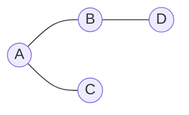

# 图

**图**由顶点与边组成，建模依赖、社交、路由、模块引用。**BFS** 求无权最短步数，**DFS** 做连通、环检测、拓扑，打包分析、权限传播、工作流校验都用图遍历思想。

---

## 表示法



| 表示 | 空间 | 查边 | 遍历邻接 |
|------|------|------|----------|
| **邻接表** | O(V+E) | O(deg) | 高效 |
| 邻接矩阵 | O(V²) | O(1) | 扫行 |

```javascript
const graph = { A: ['B', 'C'], B: ['A', 'D'], C: ['A'], D: ['B'] };
// 有向+权重: Map<node, Array<{to, w}>>
```

模块依赖图、状态机常用邻接表或 `Map`。

---

## BFS（广度优先）

队列 + visited；**无权图**第一次到达即最短边数。

```javascript
function bfs(start, graph) {
  const q = [start], dist = new Map([[start, 0]]);
  while (q.length) {
    const u = q.shift();
    for (const v of graph[u] ?? []) {
      if (!dist.has(v)) {
        dist.set(v, dist.get(u) + 1);
        q.push(v);
      }
    }
  }
  return dist;
}
```

层序打印、二分图染色、无权最短路。

---

## DFS（深度优先）

栈或递归；环检测、连通分量、拓扑（后序逆序）。

```javascript
function hasCycle(graph) {
  const state = new Map(); // 0 未访 1 栈中 2 完成
  function visit(u) {
    state.set(u, 1);
    for (const v of graph[u] ?? []) {
      if (state.get(v) === 1) return true;
      if (!state.get(v) && visit(v)) return true;
    }
    state.set(u, 2);
    return false;
  }
  return Object.keys(graph).some(k => !state.get(k) && visit(k));
}
```

判环需三色标记，不能只用 visited。

---

## 有向图与拓扑

**拓扑排序**：DAG 上线性序，u→v 则 u 在 v 前，任务依赖、构建顺序、CSS @import。

Kahn（入度 BFS）或 DFS 后序。带权最短路用 Dijkstra，不能对带权边裸 BFS。

---

## 前端相关

| 场景 | 算法 |
|------|------|
| Webpack/Vite 模块图 | 拓扑 + 环报错 |
| 包版本冲突 | 依赖图环检测 |
| 路由权限 | DAG |
| 组件依赖 | 拓扑序 build |

```plaintext
循环依赖 A → B → A
  打包工具报错或运行时 undefined
```

---

## BFS vs DFS

| | BFS | DFS |
|---|-----|-----|
| 结构 | 队列 | 栈/递归 |
| 无权最短 | ✓ | ✗ |
| 内存 | 可能整层 | 路径深度 |
| 拓扑 | Kahn | 后序 |

---

## 连通分量

无向图 DFS/BFS 多次启动，每次标记一个连通块。社交网络「好友圈」、孤立模块检测。

---

## 图在前端

| 场景 | 算法 |
|------|------|
| 依赖拓扑 | Kahn / DFS 三色 |
| 最短路径 | BFS / Dijkstra |
| 连通分量 | 并查集 |
| 模块循环依赖 | 拓扑失败即有环 |
## 邻接表 vs 矩阵

稀疏图用邻接表 O(V+E)；稠密图矩阵 O(1) 查边。Webpack 模块图是 DAG — 拓扑序即构建顺序。

---

## BFS 与 DFS 模板

```javascript
function bfs(g, start) {
  const q = [start], seen = new Set([start]);
  while (q.length) {
    const u = q.shift();
    for (const v of g.get(u) || []) {
      if (!seen.has(v)) { seen.add(v); q.push(v); }
    }
  }
}
```

| | BFS | DFS |
|---|-----|-----|
| 结构 | 队列 | 栈/递归 |
| 最短路（无权） | ✓ | ✗ |
| 拓扑 | 需 indegree | 后序 |

---

## Dijkstra 单源最短路（非负权）

带权边不能用裸 BFS；用小根堆维护 `(dist, node)`：

```javascript
function dijkstra(graph, start) {
  const dist = new Map([[start, 0]]);
  const h = new MinHeap(); // 按 dist 排序的 (d, u)
  h.push([0, start]);
  while (h.size()) {
    const [d, u] = h.pop();
    if (d > (dist.get(u) ?? Infinity)) continue;
    for (const { to, w } of graph.get(u) ?? []) {
      const nd = d + w;
      if (nd < (dist.get(to) ?? Infinity)) {
        dist.set(to, nd);
        h.push([nd, to]);
      }
    }
  }
  return dist;
}
```

地图导航、CDN 路由选路（抽象为图）都用 Dijkstra 或其变体；负权边需 Bellman-Ford。

---

## 并查集与连通分量

```javascript
class UF {
  constructor(n) { this.p = [...Array(n).keys()]; }
  find(x) { return this.p[x] === x ? x : (this.p[x] = this.find(this.p[x])); }
  union(a, b) { this.p[this.find(a)] = this.find(b); }
}
```

动态连通性、省份数量、最小生成树 Kruskal 前置结构。

| 算法 | 适用 |
|------|------|
| BFS | 无权最短路 |
| Dijkstra | 非负权 |
| UF | 动态连通 |

## 小结

邻接表存稀疏图；BFS 无权最短路，DFS 环测与拓扑。打包依赖是前端最直接图场景。

**易混点**：树是无环连通图；BFS 不能用于带权最短路；拓扑有环则无完整序；有向环用三色 DFS。

核对：循环依赖 webpack 如何报？拓扑有环会怎样？邻接矩阵何时合适？
