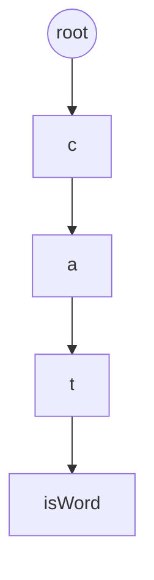
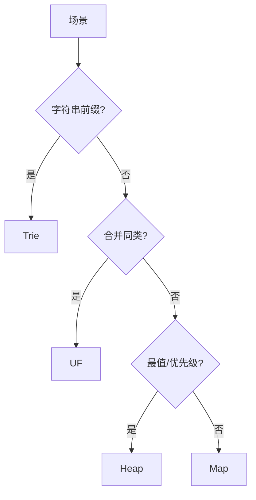

# Trie、并查集与前端选型

**Trie** 按字符路径组织字符串，前缀匹配效率高。**并查集**维护动态连通性。加上线性结构选型表，构成前端数据结构决策的完整拼图。

---

## Trie 前缀树



| 操作 | 复杂度 |
|------|--------|
| 插入/查前缀 | O(L) 串长 |

```javascript
class Trie {
  root = { children: new Map(), isEnd: false };
  insert(word) {
    let node = this.root;
    for (const ch of word) {
      if (!node.children.has(ch)) node.children.set(ch, { children: new Map(), isEnd: false });
      node = node.children.get(ch);
    }
    node.isEnd = true;
  }
  startsWith(prefix) {
    let node = this.root;
    for (const ch of prefix) {
      if (!node.children.has(ch)) return false;
      node = node.children.get(ch);
    }
    return true;
  }
}
```

| 场景 | Trie |
|------|------|
| 搜索建议 / 命令面板 | startsWith |
| 路由前缀 | radix 或 Trie |
| 敏感词 | 多模式可升级 AC 自动机 |

小字母集可用长度 26 数组；Unicode 用 `Map` 子节点。

---

## 并查集 Union-Find

路径压缩 + 按秩合并，均摊接近 O(α(n))。

```javascript
class UF {
  constructor(n) {
    this.parent = Array.from({ length: n }, (_, i) => i);
    this.rank = Array(n).fill(0);
  }
  find(x) {
    if (this.parent[x] !== x) this.parent[x] = this.find(this.parent[x]);
    return this.parent[x];
  }
  union(a, b) {
    let ra = this.find(a), rb = this.find(b);
    if (ra === rb) return false;
    if (this.rank[ra] < this.rank[rb]) [ra, rb] = [rb, ra];
    this.parent[rb] = ra;
    if (this.rank[ra] === this.rank[rb]) this.rank[ra]++;
    return true;
  }
}
```

连通分量、Kruskal、像素连通域、等价类合并。

---

## 前端选型总表

| 需求 | 推荐 | 避免 |
|------|------|------|
| 下标、遍历 | `Array` | 频繁 shift |
| 键值 O(1) | `Map` | 大对象当 map |
| 去重 | `Set` | filter 去重 O(n²) |
| 前缀 | **Trie** | 全表扫描 |
| 动态连通 | **UF** | 反复 BFS |
| Top-K | **堆** | 全排序 |



---

## Radix Tree 与 Trie

Radix Tree 压缩单链节点，省空间；路由表、URL 前缀匹配常用。前端命令面板小规模直接 Trie + Map 即可。

---

## 并查集 vs BFS

| 规模 | 推荐 |
|------|------|
| 多次 union/find | UF |
| 单次连通查询 | BFS/DFS 一次 |

UF 在线合并；BFS 适合静态图一次遍历。

---

## Trie 与自动补全

| 结构 | 场景 |
|------|------|
| Trie | 前缀搜索、输入法 |
| 并查集 | 连通性、最小生成树 |
| 哈希 | 精确键查找 |

路由前缀匹配、IDE 补全常用 Trie；权限分组合并用并查集。
## 并查集路径压缩

`find` 时把节点挂到根 — 均摊接近 O(α(n))，α 反 Ackermann，实际常数极小。

LeetCode「省份数量」「冗余连接」经典并查集。

---

## 前缀树压缩

路径压缩合并单分支节点 — 省内存，路由 FIB 常用。IDE 补全按前缀查 Trie，配合频次 top-k。

## 并查集模板

```javascript
class DSU {
  constructor(n) { this.p = Array.from({ length: n }, (_, i) => i); }
  find(x) { return this.p[x] === x ? x : (this.p[x] = this.find(this.p[x])); }
  union(a, b) { this.p[this.find(a)] = this.find(b); }
}
```

路径压缩 + 按秩合并 — 近乎常数均摊。

---

## Trie 前缀匹配

自动补全、敏感词过滤、路由最长前缀匹配：

```javascript
class TrieNode { constructor() { this.next = new Map(); this.end = false; } }
// insert: 沿字符走 next
// searchPrefix: 沿 prefix 走，存在即可
```

| 结构 | 前缀查询 |
|------|----------|
| Trie | O(L) L=前缀长 |
| 哈希 | 需枚举 key |

---

## 自动补全：Trie + 频次排序

前缀命中后收集子树所有 `isEnd` 词，按点击频次或编辑距离排序：

```javascript
function suggest(trie, prefix, limit = 5) {
  let node = trie.root;
  for (const ch of prefix) {
    if (!node.children.has(ch)) return [];
    node = node.children.get(ch);
  }
  const out = [];
  (function dfs(n, path) {
    if (n.isEnd) out.push({ word: path, freq: n.freq ?? 0 });
    for (const [ch, child] of n.children) dfs(child, path + ch);
  })(node, prefix);
  return out.sort((a, b) => b.freq - a.freq).slice(0, limit);
}
```

搜索框 debounce 300ms 后再查 Trie，避免每键全树 DFS；结果集大时用 **优先队列** 只保留 Top-N。

## 小结

Trie 服务前缀；并查集服务动态连通；日常 Array/Map/Set 为主，Trie/UF/堆在特定子问题登场。

**易混点**：Trie 空间可能大；UF 需路径压缩；前缀匹配 ≠ 正则全匹配；搜索框瓶颈常在网络与 debounce 而非 Trie 本身。

核对：搜索框 Trie + debounce 瓶颈在哪？UF 与 BFS 连通各适合什么规模？Trie 与 HashMap 前缀扫描谁更合适？
