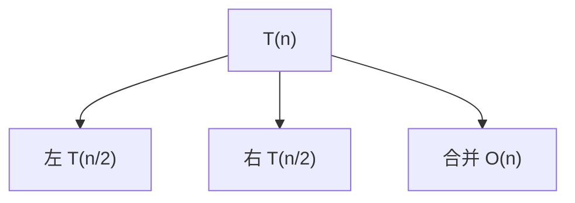

# 大 O 与主定理

**大 O** 描述规模 n 增长时时间/空间的上界趋势，忽略常数和低阶项。**主定理**快速求解分治递归 T(n)=aT(n/b)+f(n)，分析二分、归并、快排时，把递归代码翻译成可接受性判断的标准工具。

---

## 大 O 定义（直觉）

f(n)=O(g(n))：存在 c、n₀，n>n₀ 时 f(n)≤c·g(n)。

| 常见阶 | 名 | n=10⁶ 直觉 |
|--------|-----|------------|
| O(1) | 常数 | 瞬间 |
| O(log n) | 对数 | ~20 步 |
| O(n) | 线性 | 百万 |
| O(n log n) | 线性对数 | ~两千万次操作 |
| O(n²) | 平方 | 通常不可接受 |

```javascript
for (const x of arr) sum += x;           // O(n)
for (let i = 0; i < n; i++)
  for (let j = 0; j < n; j++) { }        // O(n²)
while (n > 1) n = Math.floor(n / 2);    // O(log n)
```

**最坏 / 平均 / 均摊**：快排最坏 O(n²)，随机平均 O(n log n)；动态数组 push 均摊 O(1)。

---

## 空间复杂度

看**辅助空间**与**递归栈**。DFS 深度 O(h)，链表型树 h=n 可能栈溢出，改显式栈。

| 算法 | 时间 | 额外空间 |
|------|------|----------|
| 二分迭代 | O(log n) | O(1) |
| 归并 | O(n log n) | O(n) |
| 快排原地 | 平均 O(n log n) | O(log n) 栈 |

---

## 主定理（Master Theorem）

T(n) = a T(n/b) + f(n)：a 个子问题规模 n/b，合并代价 f(n)。

| 情况 | 条件 | 结果 |
|------|------|------|
| 1 | f(n) 比 n^log_b a 小 | T(n)=Θ(n^log_b a) |
| 2 | 同阶差 log^k | T(n)=Θ(n^log_b a log^(k+1) n) |
| 3 | f(n) 更大且正则 | T(n)=Θ(f(n)) |

**归并**：a=2,b=2,f=Θ(n) → **Θ(n log n)**。**二分**：a=1,b=2,f=O(1) → **O(log n)**。



手算：先算 log_b a，再比较 f(n) 与 n^log_b a 的阶。

---

## 前端如何用它

| 场景 | 分析 |
|------|------|
| 列表全量 map | O(n) DOM |
| 嵌套 filter+map | 是否 O(n²) |
| 虚拟列表 | O(可见窗口) |
| JSON 深拷贝 | O(节点数) |
| Diff | O(n)~O(n²) 视算法 |

常数陷阱：O(n) 虚拟滚动常比 O(n log n) 全量排序更省毫秒，大 O 是渐近。

---

## 常见阶的比较与 Ω、Θ

大 O 是上界；**Ω** 是下界；**Θ** 当上下界同阶时为紧确界。面试写复杂度时说明**最坏**还是**均摊**。

| 递推式 | 结果 |
|--------|------|
| T(n)=2T(n/2)+n | Θ(n log n) 归并 |
| T(n)=T(n/2)+1 | Θ(log n) 二分 |
| T(n)=T(n-1)+n | Θ(n²) 非主定理形 |

主定理不适用时：代入法、递归树、或猜+归纳。

---

## 与数据结构衔接

数组尾插均摊 O(1)、哈希均摊 O(1)、平衡树 O(log n)，选型时把 operation mix 与 n 的量级一起估。

---

## 递归树手算

快排平均 T(n)=T(n/2)+T(n/2)+O(n)：每层合并代价总和约 n，深度 log n → **O(n log n)**。最坏 pivot 总是最小 → 深度 n → **O(n²)**。

```plaintext
        n
      /   \
    n/2   n/2   + O(n) 合并
```

斐波那契裸递归 T(n)=T(n-1)+T(n-2)+O(1) 不在主定理形式内，展开得 **O(φⁿ)**，必须记忆化降到 O(n)。

---

## 主定理例题

| 递推 | log_b a | f(n) | 结果 |
|------|---------|------|------|
| 2T(n/2)+n | 1 | n | Θ(n log n) case2 |
| T(n/2)+O(1) | 0 | 1 | Θ(log n) case1 |
| T(n/2)+n | 0 | n | Θ(n) case3 |
| 4T(n/2)+n | 2 | n | Θ(n²) case1 |

二分查找：a=1,b=2,f=O(1) → case1 → **O(log n)**。归并：a=2,b=2,f=Θ(n) → case2 → **Θ(n log n)**。

---

## 多项式阶与常数

O(2n)=O(n)；O(n²+n log n)=O(n²)。写复杂度时说明 n 指什么：数组长度、节点数、还是请求数。

| n 量级 | 可接受阶（交互） | 可接受阶（离线） |
|--------|------------------|------------------|
| 10³ | O(n log n) | O(n²) 可能尚可 |
| 10⁵ | O(n log n) | O(n log n) |
| 10⁶+ | O(n) 或 O(log n) | O(n log n) |

虚拟列表把 DOM 从 O(n) 降到 O(窗口)，常数因子常比渐近阶更决定首屏毫秒。

---

## 口算练习

| 代码形态 | 阶 |
|----------|-----|
| 单层循环 n | O(n) |
| 二分 while | O(log n) |
| 双重循环 n² | O(n²) |
| 分半 + 线性合并 | O(n log n) |

面试写 `T(n)=2T(n/2)+n` 应立刻答 `Θ(n log n)`。
## 递推不属于主定理

T(n)=T(n-1)+O(n) → 展开得 O(n²)；T(n)=2T(n-1) → O(2ⁿ)。

斐波那契必须记忆化或矩阵快速幂 — 识别递推形状比死记公式重要。

---

## Case 3 正则条件

主定理 case 3 要求 `a f(n/b) ≤ c f(n)` 对某 c<1 — 否则不能直接用 case 3。

T(n)=2T(n/2)+n log n 得 Θ(n log² n) — 用递归树手算，别生套公式。

## 对数阶识别

循环 `i *= 2` 或 `i = n/2` 递减 → O(log n)。嵌套 log 层 → O(log² n) 等，用递归树验证。

---

## 渐近符号

| 符号 | 含义 |
|------|------|
| O | 上界 |
| Ω | 下界 |
| Θ | 紧确界 |

`3n² + 5n log n` → **Θ(n²)**。面试写复杂度说明 n 指什么：数组长度、节点数、请求数。

---

## 非主定理递推

| T(n) | 结果 |
|------|------|
| T(n)=T(n-1)+O(n) | O(n²) |
| T(n)=2T(n-1) | O(2ⁿ) |
| T(n)=T(n/2)+O(1) | O(log n) |

斐波那契裸递归 O(2ⁿ)，记忆化 O(n) — 识别形状比死记公式重要。

---

## 例题：归并排序递推手算

```plaintext
T(n) = 2T(n/2) + Θ(n)
log₂2 = 1 → n^1 与 f(n)=n 同阶 → Case 2 → Θ(n log n)
```

```javascript
function mergeSort(arr) {
  if (arr.length <= 1) return arr;
  const m = arr.length >> 1;
  return merge(mergeSort(arr.slice(0, m)), mergeSort(arr.slice(m)));
}
function merge(a, b) {
  const out = [];
  let i = 0, j = 0;
  while (i < a.length && j < b.length) out.push(a[i] <= b[j] ? a[i++] : b[j++]);
  return out.concat(a.slice(i), b.slice(j));
}
```

前端 `Array.sort` 用 Timsort（归并+插入混合），部分有序数据接近 O(n)。

## 小结

大 O 刻画增长上界；主定理处理 aT(n/b)+f(n) 型分治。写循环与递归前先估阶。

**易混点**：O(2n)=O(n)；n=10⁴ 时 n² 与 n log n 可差两个数量级；主定理 case 3 需正则条件；递归 T(n)=T(n-1)+1 不是主定理形。

核对：归并 T(n)=2T(n/2)+n 得什么？二分递归式属哪 case？Θ 与 O 区别？T(n)=T(n-1)+n 为何不能用主定理？
