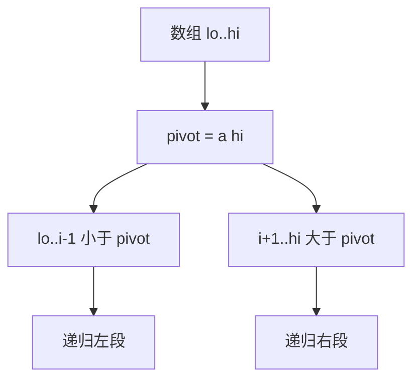
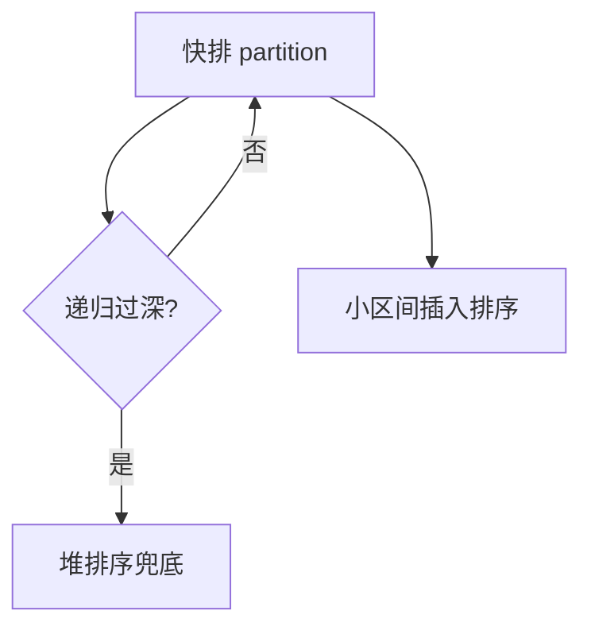

# 排序算法对比

排序把元素按全序关系排成非降（或非增）序列。比较排序有 **Ω(n log n)** 下界；计数、基数等在值域受限时可线性。浏览器里 `Array.sort` 用 **Timsort** — 理解各算法的时间、空间、稳定性，才能写对 comparator，并解释表格多列排序为何有时「第二列乱了」。

---

## 比较排序概览

基于元素两两比较决定顺序；信息论下界要求至少 Ω(n log n) 次比较。

| 算法 | 平均 | 最坏 | 额外空间 | 稳定 |
|------|------|------|----------|------|
| 冒泡 | O(n²) | O(n²) | O(1) | ✓ |
| 插入 | O(n²) | O(n²) | O(1) | ✓ |
| 选择 | O(n²) | O(n²) | O(1) | ✗ |
| 快排 | O(n log n) | O(n²) | O(log n) 栈 | ✗ |
| 归并 | O(n log n) | O(n log n) | O(n) | ✓ |
| 堆排序 | O(n log n) | O(n log n) | O(1) | ✗ |
| **Timsort** | O(n log n) | O(n log n) | O(n) | ✓ |

**稳定**：相等元素排序后**相对顺序不变**。多关键字排序时，若先按次要键排、再按主要键排，**只有稳定排序**才能保证次要键在主要键相同时仍有序。

---

## 快排：partition 思想

选 pivot，一趟 partition 把数组分成「≤ pivot」和「≥ pivot」，再递归两侧。

```javascript
function partition(a, lo, hi) {
  const pivot = a[hi];
  let i = lo;
  for (let j = lo; j < hi; j++) {
    if (a[j] < pivot) {
      [a[i], a[j]] = [a[j], a[i]];
      i++;
    }
  }
  [a[i], a[hi]] = [a[hi], a[i]];
  return i;
}
```



| 要点 | 说明 |
|------|------|
| 最坏 O(n²) | 已有序且 pivot 总是最小/最大 |
| 缓解 | 随机 pivot、三数取中 |
| 不稳定 | partition 交换可能跨过相等元素 |
| 原地 | 除递归栈外 O(1) |

工程里快照常数小，是通用库的内核之一；需要稳定界时用归并。

---

## 三路快排与重复元素

大量相等 key 时，二路 partition 会递归过深。**三路快排**分成 `< pivot`、`== pivot`、`> pivot` 三段，中间段不再递归。

```javascript
function quickSort3Way(a, lo, hi) {
  if (lo >= hi) return;
  const v = a[lo];
  let lt = lo, gt = hi, i = lo + 1;
  while (i <= gt) {
    if (a[i] < v) [a[lt++], a[i++]] = [a[i], a[lt]];
    else if (a[i] > v) [a[i], a[gt--]] = [a[gt], a[i]];
    else i++;
  }
  quickSort3Way(a, lo, lt - 1);
  quickSort3Way(a, gt + 1, hi);
}
```

荷兰国旗问题、大量重复枚举值排序，三路划分把复杂度从 O(n²) 拉回 O(n log n) 量级。

---

## 归并：分治 + merge

劈半递归排序，再 **merge** 两个有序段。最坏恒 Θ(n log n)，稳定。

```javascript
function merge(a, b) {
  const out = [];
  let i = 0, j = 0;
  while (i < a.length && j < b.length)
    out.push(a[i] <= b[j] ? a[i++] : b[j++]);
  return out.concat(a.slice(i), b.slice(j));
}
```

| 对比 | 快排 | 归并 |
|------|------|------|
| 最坏 | O(n²) | O(n log n) |
| 空间 | O(log n) | O(n) |
| 稳定 | 否 | 是 |
| 外排序 | 不适合 | 适合大文件 k 路归并 |

---

## 堆排序简述

建大根堆，反复 swap 堆顶与末尾并下沉 — O(n log n) 最坏，**原地** O(1) 额外空间，**不稳定**。Top-K 问题常用 **大小为 K 的堆**，O(n log K)，不必全排序。

---

## 内省排序 Introsort

C++ `std::sort` 常用 **Introsort**：快排为主，递归深度过大时切堆排序，小区间切插入排序。



保证最坏 O(n log n)，又保留快排平均常数小的优点。

---

## JavaScript `Array.sort`

```javascript
[10, 2, 1].sort();           // [1, 10, 2] — 默认转 string!
[10, 2, 1].sort((a, b) => a - b);

users.sort((a, b) =>
  a.dept.localeCompare(b.dept) || a.age - b.age
);
```

| 注意 | 说明 |
|------|------|
| 原地修改 | 先 `[...arr].sort()` 若需保留原数组 |
| comparator | `(a,b)=>a-b` 升序；返回 0 表示相等 |
| 多键 | 链式 `||` 或显式比较函数 |
| 稀疏数组 | 空槽行为依规范，勿依赖 |

**Timsort**（V8 等）：扫描已有**升序/降序 run**，过小 run 用插入排序补到 minrun，再栈式归并。对**部分有序**数据接近 O(n) — 近乎有序的 10⁶ 数组往往比纯快排实现更快。


---

## 非比较排序

| 算法 | 前提 | 复杂度 |
|------|------|--------|
| 计数排序 | 值域 [0, k] 小整数 | O(n + k) |
| 基数排序 | 固定位数 w | O(n · w) |
| 桶排序 | 均匀分布到桶 | 平均 O(n) |

通用 `{ id, name }` 对象数组仍用比较排序。**Top-K**、**第 K 大** 用堆或 quickselect，不必 O(n log n) 全排。

---

## 外部排序概念

数据大于内存时：**分块读入 → 块内排序 → k 路归并** 写回磁盘。

```plaintext
chunk1.sort → run1.tmp
chunk2.sort → run2.tmp
...
merge(run1, run2, ...) → output
```

数据库 ORDER BY、日志归档、MapReduce shuffle 都用到外排思想；前端本地很少，但理解「归并为何适合外排」有助于读后端接口设计。

---

## 前端场景

| 场景 | 建议 |
|------|------|
| 表格列排序 | 客户端 `[...rows].sort(comparator)` |
| 大数据集 | 服务端排序 + 分页/游标 |
| Immutable 状态 | 拷贝后 sort，不 mutate 原 state |
| React list | 排序后用 stable **id** 作 key，勿用排序后下标 |
| 国际化字符串 | `localeCompare` 指定 locale |

服务端排序时传 `sortBy` + `order` 参数；客户端只排当前页会误导用户「全局有序」的感知。

---

## 选型速查

| 需求 | 倾向 |
|------|------|
| 通用 in-memory | Timsort / 快排（语言内置） |
| 必须稳定 | 归并 |
| 内存极紧、要最坏 n log n | 堆排序 / Introsort |
| 整数小范围 | 计数 |
| 只要 Top-K | 堆 |
| 大量重复 key | 三路快排 |

---

## 小结

比较排序最优 O(n log n)；快排平均快、归并稳定、Timsort 利用已有顺序。JS 数字排序必须传 comparator；多列排序依赖稳定性或显式多级比较。

**易混点**：`sort()` 默认 string 比较；sort 原地改数组；快排最坏可规避但归并空间 O(n)；三路快排解决重复元素；Introsort 用堆排保证最坏界。

核对：为何 Timsort 对近乎有序数据快？stable sort 对 `sort by dept then age` 有何影响？Top-K 用堆的复杂度？三路快排中间段为何不再递归？
