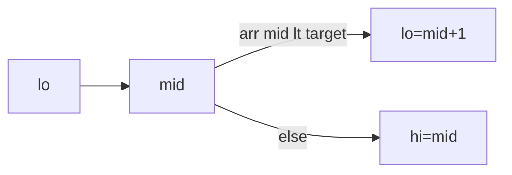

# 二分与双指针

**二分**在单调结构上 O(log n) 定位边界；**双指针**在同/异向扫描中把 O(n²) 降为 O(n)。搜索插入位置、两数之和、去重、合并区间，已排序列表、时间线、缓存窗口都适用。

---

## 二分查找

前提：**单调性**（答案可划分成「满足/不满足」两半）。

| 模板 | 用途 |
|------|------|
| `[lo, hi)` 左闭右开 | 第一个 ≥ target |
| upperBound | 第一个 > target |

```javascript
function lowerBound(arr, target) {
  let lo = 0, hi = arr.length;
  while (lo < hi) {
    const mid = (lo + hi) >> 1;
    if (arr[mid] < target) lo = mid + 1;
    else hi = mid;
  }
  return lo;
}
```



**变种**：旋转数组、平方根、答案二分（最大化最小值）。防溢出用 `lo + ((hi-lo)>>1)`。

---

## 双指针

### 对撞指针（相向）

有序数组两数之和、盛水、回文。

```javascript
function twoSumSorted(nums, target) {
  let l = 0, r = nums.length - 1;
  while (l < r) {
    const s = nums[l] + nums[r];
    if (s === target) return [l, r];
    if (s < target) l++; else r--;
  }
}
```

### 快慢指针（同向）

去重、链表环、滑动窗口。

```javascript
function dedupe(nums) {
  let slow = 1;
  for (let fast = 1; fast < nums.length; fast++)
    if (nums[fast] !== nums[slow - 1]) nums[slow++] = nums[fast];
  return slow;
}
```

---

## 复杂度对比

| 方法 | 两数之和（有序） |
|------|------------------|
| 暴力 | O(n²) |
| 哈希 | O(n) 空间 |
| 双指针 | O(n) O(1) 空间 |

无序数组两数之和用哈希 O(n)；有序数组双指针更省空间。

---

## 答案二分

「最小化最大值」类：判定 `check(mid)` 是否可行，单调则二分 mid。

```javascript
function minCapacity(weights, days) {
  let lo = Math.max(...weights), hi = weights.reduce((a,b)=>a+b,0);
  while (lo < hi) {
    const mid = (lo + hi) >> 1;
    if (canShip(weights, days, mid)) hi = mid;
    else lo = mid + 1;
  }
  return lo;
}
```

---

## 前端场景

| 场景 | 技巧 |
|------|------|
| autocomplete 已排序 | 二分找前缀范围 |
| 视频 seek | 二分关键帧 |
| 合并有序分页 | 双指针 merge |
| Vue3/React diff | LIS + 二分 |

```javascript
function merge(a, b) {
  const out = [];
  let i = 0, j = 0;
  while (i < a.length && j < b.length)
    out.push(a[i] <= b[j] ? a[i++] : b[j++]);
  return out.concat(a.slice(i), b.slice(j));
}
```

---

## 常见错误

- `while (lo <= hi)` 与 `lo < hi` 混用死循环
- 无单调性硬二分
- 双指针移动条件写反
- `lowerBound` 返回值等于 `length` 表示「所有元素 < target」

---

## 双指针模式

| 模式 | 条件 |
|------|------|
| 对撞 | 有序数组 |
| 快慢 | 链表环 |
| 滑动窗口 | 连续子数组 |

二分答案：把「求最小可行值」转为 `check(mid)` 单调性。
## 二分边界

`while (lo < hi)` 与 `lo <= hi` 决定找第一个/最后一个满足位置 — 模板要一致。

整数溢出 mid：`lo + ((hi - lo) >> 1)` 比 `(lo+hi)/2` 安全。

---

## 双指针分类

| 类型 | 场景 |
|------|------|
| 对撞 | 有序数组两数和 |
| 快慢 | 链表环、去重 |
| 同向 | 滑动窗口 |

```javascript
function twoSumSorted(a, target) {
  let lo = 0, hi = a.length - 1;
  while (lo < hi) {
    const s = a[lo] + a[hi];
    if (s === target) return [lo, hi];
    if (s < target) lo++; else hi--;
  }
}
```

| 对撞 | 有序数组两数和 |
| 快慢 | 链表环、去重 |
| 同向 | 滑动窗口 |

```javascript
function twoSumSorted(a, target) {
  let lo = 0, hi = a.length - 1;
  while (lo < hi) {
    const s = a[lo] + a[hi];
    if (s === target) return [lo, hi];
    if (s < target) lo++; else hi--;
  }
}
```

---

## 二分答案 check 函数

单调 `check(x)` 时，找最小可行 x：

```javascript
let lo = 0, hi = 1e9;
while (lo < hi) {
  const mid = lo + ((hi - lo) >> 1);
  if (check(mid)) hi = mid; else lo = mid + 1;
}
```

「最小化最大值」「最大化最小值」类题与下标二分共用「舍弃一半」框架。

---

## 模板速记

| 模板 | 循环条件 | 更新 |
|------|----------|------|
| lowerBound | `lo < hi` | `hi = mid` 或 `lo = mid+1` |
| 二分答案 | `lo < hi` | 依 check(mid) |
| 对撞指针 | `lo < hi` | 依 sum 与 target |

---

## 小结

二分 O(log n) 定位；双指针 O(n) 配对与去重。sorted 数据优先想这两个。

**易混点**：lowerBound 与 upperBound 差 1；链表环用快慢指针；答案二分的 check 必须单调。

核对：`lowerBound` 返回 `arr.length` 表示什么？盛水题为何双指针？旋转数组二分的关键是什么？
