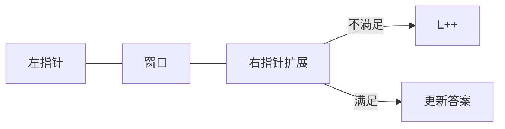

# 滑动窗口与子串

**滑动窗口**维护连续区间，右扩左收，把子数组/子串枚举从 O(n²) 降为 O(n)。最长无重复子串、固定窗口统计、最小覆盖子串，输入联想、限流、字符串校验共用同一框架。

---

## 固定窗口

窗口大小 k 不变，右移一格。

```javascript
function maxSumSubarray(nums, k) {
  let sum = 0;
  for (let i = 0; i < k; i++) sum += nums[i];
  let best = sum;
  for (let r = k; r < nums.length; r++) {
    sum += nums[r] - nums[r - k];
    best = Math.max(best, sum);
  }
  return best;
}
```

滚动平均、每分钟请求数等固定 k 场景。

---

## 可变窗口



**不变量**：窗口内满足某性质；扩大破坏则收缩左边界。

```javascript
function lengthOfLongestSubstring(s) {
  const last = new Map();
  let l = 0, best = 0;
  for (let r = 0; r < s.length; r++) {
    const ch = s[r];
    if (last.has(ch) && last.get(ch) >= l) l = last.get(ch) + 1;
    last.set(ch, r);
    best = Math.max(best, r - l + 1);
  }
  return best;
}
```

---

## 窗口 + 哈希计数

最小覆盖子串、异位词、字符频次约束。

```javascript
function minWindow(s, t) {
  const need = new Map();
  for (const c of t) need.set(c, (need.get(c) ?? 0) + 1);
  let missing = t.length, l = 0, best = '';
  for (let r = 0; r < s.length; r++) {
    const c = s[r];
    if (need.has(c) && need.get(c) > 0) missing--;
    if (need.has(c)) need.set(c, need.get(c) - 1);
    while (missing === 0) {
      const win = s.slice(l, r + 1);
      if (!best || win.length < best.length) best = win;
      const lc = s[l++];
      if (need.has(lc)) {
        need.set(lc, need.get(lc) + 1);
        if (need.get(lc) > 0) missing++;
      }
    }
  }
  return best;
}
```

---

## 子串 vs 子序列

| | 子串 | 子序列 |
|---|------|--------|
| 连续 | **必须** | 不要求 |
| 典型 | 滑动窗口 | DP |

---

## 前端场景

| 场景 | 窗口 |
|------|------|
| debounce 后统计最近 N 字符 | 固定/可变 |
| 滑动 P95 采样 | 固定队列 |
| 密码连续规则 | 窗口检测 |
| 限流滑动窗口 | 时间戳队列 |

---

## 模板 checklist

1. 右指针 for 扩展
2. 更新窗口状态
3. while 非法 → 左指针收缩
4. 合法时更新 ans

---

## 窗口不变量

| 题型 | 窗口维护 |
|------|----------|
| 最长无重复 | 字符频次 Map |
| 最小覆盖子串 | 缺少字符计数 |
| 固定长 K | 差分更新 |

右扩满足条件，左缩保持合法 — 均摊 O(n)。
## 模板代码

```javascript
function longestDistinct(s) {
  const last = new Map();
  let lo = 0, best = 0;
  for (let hi = 0; hi < s.length; hi++) {
    if (last.has(s[hi])) lo = Math.max(lo, last.get(s[hi]) + 1);
    last.set(s[hi], hi);
    best = Math.max(best, hi - lo + 1);
  }
  return best;
}
```

---

## 固定窗口 vs 可变窗口

| | 固定 k | 可变 |
|---|--------|------|
| 右扩 | 恒进 | 进直到不满足 |
| 左缩 | 超 k 则缩 | 不满足则缩 |
| 例 | 大小 k 子数组最大和 | 最长无重复子串 |

维护窗口内 **计数 Map** 或 **distinct 计数** 是常见不变量。

---

## 例题：至多 K 个不同字符的最长子串

```javascript
function longestKDistinct(s, k) {
  const freq = new Map();
  let l = 0, best = 0;
  for (let r = 0; r < s.length; r++) {
    freq.set(s[r], (freq.get(s[r]) ?? 0) + 1);
    while (freq.size > k) {
      const lc = s[l++];
      freq.set(lc, freq.get(lc) - 1);
      if (freq.get(lc) === 0) freq.delete(lc);
    }
    best = Math.max(best, r - l + 1);
  }
  return best;
}
```

输入联想「限制字符种类数」、限流「窗口内最多 N 种事件类型」同模板，右扩后 `while` 收缩直到合法。

---

## 最小覆盖子串（思路）

找包含 t 全部字符的最短 s 子串：窗口内维护 need/missing 计数，missing=0 时尝试收缩左边界。

| 步骤 | 操作 |
|------|------|
| 右扩 | 加入 s[right]，更新计数 |
| 合法 | missing==0 时更新答案并左缩 |
| 左缩 | 直至 missing>0 |

LeetCode 76 类题；前端可类比「最短包含某组 API 调用序列的日志窗口」。

| 题型 | 窗口类型 |
|------|----------|
| 最长无重复 | 可变 + freq Map |
| 固定 k 和 | 固定长度 |
| minWindow | 可变 + missing |

---

## 窗口题识别

| 题干信号 | 模式 |
|----------|------|
| 最长/最短子串满足… | 可变窗口 + Set/Map |
| 子数组和等于 k | 前缀和 + 哈希 |
| 固定长度 k | 固定窗口 |

---

## 小结

滑动窗口 O(n) 维护区间；固定 k 滚动求和，可变窗口配合 Map。

**易混点**：子串必须连续；收缩用 while 非 if；Map 存 last index vs freq 用途不同；minWindow 的 missing 是未满足字符数。

核对：最长无重复 Map 存什么？minWindow 里 missing 含义？固定窗口为何 O(n)？
