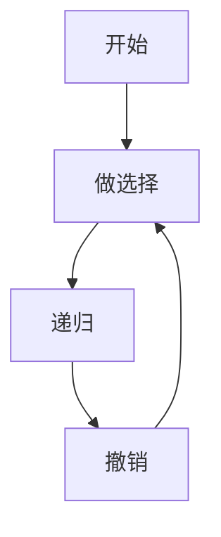

# 递归、回溯与剪枝

**递归**把问题拆成同型子问题；**回溯**在决策树上 DFS，试探 + 撤销；**剪枝**提前砍掉不可能更优的分支。全排列、组合、数独、路径枚举，配置生成、表单校验、棋盘 UI 都用回溯框架。

---

## 递归三要素

1. **终止条件** base case
2. **递推关系** 缩小规模
3. **返回值** 合并子结果

```javascript
function factorial(n) {
  if (n <= 1) return 1;
  return n * factorial(n - 1);
}
```

**栈深度**：n 过大改迭代 + 显式栈；深 JSON 解析可能爆栈。

---

## 回溯模板



```javascript
function permute(nums) {
  const res = [], path = [], used = new Array(nums.length).fill(false);
  function dfs() {
    if (path.length === nums.length) { res.push([...path]); return; }
    for (let i = 0; i < nums.length; i++) {
      if (used[i]) continue;
      used[i] = true; path.push(nums[i]);
      dfs();
      path.pop(); used[i] = false;
    }
  }
  dfs();
  return res;
}
```

| 要素 | 说明 |
|------|------|
| path | 当前路径 |
| 选择列表 | 可选项 |
| 撤销 | pop + 恢复 used |

---

## 剪枝

| 类型 | 例 |
|------|-----|
| 可行性 | 和已超 target |
| 最优性 | 路径已长于 best |
| 重复 | 组合 `i > start` |
| 对称 | N 皇后 |

```javascript
function combine(n, k) {
  const res = [], path = [];
  function dfs(start) {
    if (path.length === k) { res.push([...path]); return; }
    for (let i = start; i <= n - (k - path.length) + 1; i++) {
      path.push(i); dfs(i + 1); path.pop();
    }
  }
  dfs(1);
  return res;
}
```

---

## 子集 / 组合 / 排列

| 问题 | 重复控制 | 顺序 |
|------|----------|------|
| 子集 | 元素用一次 | 无关 |
| 组合 | start 递增 | 无关 |
| 排列 | used | **有关** |

```javascript
function subsets(nums) {
  const res = [], path = [];
  function dfs(i) {
    res.push([...path]);
    for (let j = i; j < nums.length; j++) {
      path.push(nums[j]); dfs(j + 1); path.pop();
    }
  }
  dfs(0);
  return res;
}
```

---

## 前端场景

| 场景 | 回溯 |
|------|------|
| 权限组合 | 子集 |
| 排班座位 | 排列+约束 |
| 迷宫路径 | DFS+剪枝 |

React 树形菜单 render 是结构递归，不是回溯，回溯强调**撤销状态**。

---

## 与 DFS 关系

回溯 = DFS + **状态恢复**；图遍历 visited 完成不撤销，回溯 path 必须 pop。

---

## 记忆化与回溯

重叠子问题（如斐波那契）用记忆化，不是回溯。回溯探索决策树，记忆化存子问题最优。

---

## 剪枝清单

| 剪枝 | 例子 |
|------|------|
| 可行性 | 和已超 target |
| 对称 | 组合只选后面元素 |
| 记忆化 | 重复子问题 |

全排列 n=10 约 3.6×10⁶，n=12 约 4.8×10⁸ — 必须剪枝或 DP。
## 复杂度估算

子集 2ⁿ，排列 n!，组合 C(n,k)。n>20 全搜索需剪枝或 meet-in-the-middle。

回溯栈深度 = 递归深度 — JS 默认栈约 1 万层，深递归改迭代或 trampolining。

---

## 全排列模板

```javascript
function permute(nums) {
  const res = [], path = [], used = new Array(nums.length).fill(false);
  function dfs() {
    if (path.length === nums.length) { res.push([...path]); return; }
    for (let i = 0; i < nums.length; i++) {
      if (used[i]) continue;
      used[i] = true; path.push(nums[i]); dfs();
      path.pop(); used[i] = false;
    }
  }
  dfs(); return res;
}
```

## 子集枚举

```javascript
function subsets(nums) {
  const res = [[]];
  for (const x of nums)
    for (let i = 0, len = res.length; i < len; i++)
      res.push([...res[i], x]);
  return res;
}
```

2ⁿ 子集 — n>20 需剪枝或 DP 按计数而非枚举。

---

## 子集与组合

```javascript
function subsets(nums) {
  const res = [], path = [];
  function dfs(i) {
    if (i === nums.length) { res.push([...path]); return; }
    dfs(i + 1);
    path.push(nums[i]); dfs(i + 1); path.pop();
  }
  dfs(0);
  return res;
}
```

组合用 `start` 只增不减，避免 `[2,1]` 与 `[1,2]` 重复。

## 小结

递归定义子问题；回溯 DFS 并撤销；剪枝减分支。排列组合子集是三板斧。

**易混点**：组合用 start；排列用 used；递归深度与栈溢出；子集 dfs(i+1) 与组合 dfs(i+1) 起点不同。

核对：全排列为何 used 而非 start？组合剪枝 `n-(k-path.length)+1` 含义？回溯与图 DFS 撤销有何不同？
