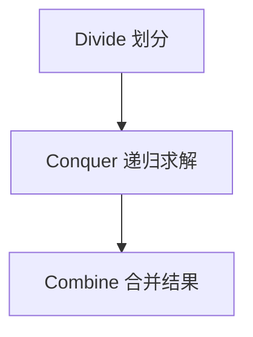
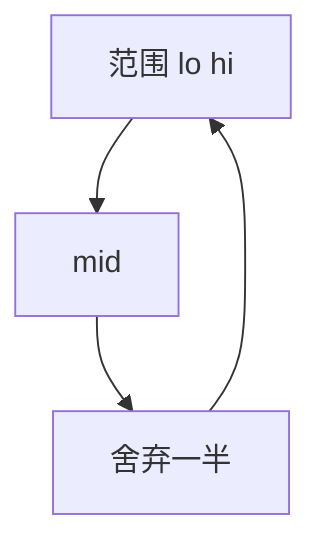

# 分治思想

**分治（Divide and Conquer）**把原问题拆成若干**规模更小、结构相同**的子问题，递归求解后再**合并**子问题的答案。归并排序、快速排序、二分查找都是分治；当子问题**互不重叠**且合并代价可控时，主定理能直接给出 Θ(n log n) 等级复杂度。

---

## 三步框架



| 步骤 | 要点 | 失败信号 |
|------|------|----------|
| Divide | 均分、按 pivot 划分、按中点切 | 子问题规模不下降 |
| Conquer | 递归到 base case 直接返回 | 无限递归 |
| Combine | merge、累加、取 max | 合并代价过高拖垮总复杂度 |

分治成立的前提：**子问题独立**（同一子问题不重算）且 **合并不太贵**。若子问题大量重叠，应改 **动态规划** 存中间结果。

---

## 递归式与主定理

分治常见递推：**T(n) = a·T(n/b) + f(n)**

| 符号 | 含义 |
|------|------|
| a | 子问题个数 |
| n/b | 每个子问题规模 |
| f(n) | 划分 + 合并代价 |

例：归并排序 a=2, b=2, f(n)=Θ(n) → T(n)=Θ(n log n)。二分 a=1, b=2, f(n)=O(1) → T(n)=O(log n)。

```
规模 n
   ├─ T(n/2)  ─┐
   └─ T(n/2)  ─┴─ merge O(n)
```

---

## 经典：归并排序

将数组从中点劈开，分别排序后 **merge** 两个有序段。

```javascript
function mergeSort(arr) {
  if (arr.length <= 1) return arr;
  const mid = arr.length >> 1;
  const left = mergeSort(arr.slice(0, mid));
  const right = mergeSort(arr.slice(mid));
  return merge(left, right);
}

function merge(a, b) {
  const out = [];
  let i = 0, j = 0;
  while (i < a.length && j < b.length)
    out.push(a[i] <= b[j] ? a[i++] : b[j++]);
  return out.concat(a.slice(i), b.slice(j));
}
```

| 性质 | 值 |
|------|-----|
| 时间 | Θ(n log n) |
| 空间 | O(n) 辅助数组 |
| 稳定 | 是（merge 时取左优先） |

JS 里 `slice` 会拷贝，工程实现宜用索引区间 `[lo, hi)` 原地归并。

---

## 经典：快速排序

选 **pivot**，partition 使左侧 ≤ pivot、右侧 ≥ pivot，再递归两侧。

```javascript
function quickSort(arr, lo = 0, hi = arr.length - 1) {
  if (lo >= hi) return;
  const p = partition(arr, lo, hi);
  quickSort(arr, lo, p - 1);
  quickSort(arr, p + 1, hi);
}
```

| 情况 | 复杂度 |
|------|--------|
| 平均 | O(n log n) |
| 最坏 | O(n²)（已有序 + 固定 pivot） |
| 缓解 | 随机 pivot、三数取中 |

快排与归并对比：快排 **两侧都递归**（分治）；二分 **只递归一侧**（减治）。快排原地、常数小；归并稳定、最坏界 guaranteed。

---

## 二分查找的分治模板

有序数组找 target，每次排除一半：

```javascript
function binarySearch(a, target) {
  let lo = 0, hi = a.length - 1;
  while (lo <= hi) {
    const mid = lo + ((hi - lo) >> 1);
    if (a[mid] === target) return mid;
    if (a[mid] < target) lo = mid + 1;
    else hi = mid - 1;
  }
  return -1;
}
```

递推 T(n)=T(n/2)+O(1) → **O(log n)**。变体：找第一个 ≥ x、旋转数组、答案在单调性上二分答案值。



---

## 其他分治应用

| 问题 | 分治点 | 合并 |
|------|--------|------|
| 最大子数组和 | 跨中点 maxLeft+maxRight | 取三者 max |
| 逆序对计数 | 归并时若左>右则 cnt+=左剩余 | 归并 |
| 最近点对 | 平面分半，跨中线带 | 筛选 strip |
| Karatsuba 大数乘 | 三分位数 | 组合公式 |

```javascript
function mergeCount(arr, tmp, lo, mid, hi) {
  let i = lo, j = mid + 1, k = lo, inv = 0;
  while (i <= mid && j <= hi) {
    if (arr[i] <= arr[j]) tmp[k++] = arr[i++];
    else { tmp[k++] = arr[j++]; inv += mid - i + 1; }
  }
  return inv;
}
```

---

## Strassen 矩阵乘法（概念）

朴素 n×n 矩阵乘 O(n³)。Strassen 分成四块子矩阵，7 次乘法合并，递推 **O(n^log₂7) ≈ O(n^2.81)**。

| 对比 | 朴素 | Strassen |
|------|------|----------|
| 乘法次数 | n³ | 约 n^2.81 |
| 常数 | 小 | 大，小矩阵不划算 |
| 工程 | BLAS 仍常用 blocked 朴素 | 理论意义大于前端 |

前端矩阵运算多在 WASM/GPU；知道「分块 + 减子问题次数」是分治在数值领域的延伸即可。

---

## 分治 vs 动态规划

| 维度 | 分治 | DP |
|------|------|-----|
| 子问题重叠 | 无 | 有 |
| 存储 | 合并后丢弃 | 表格记忆 |
| 典型 | 归并、快排 | 背包、LCS |
| 决策 | 固定划分 | 多种选择取最优 |

斐波那契裸递归 O(2^n) 是**重叠子问题** — 应记忆化或 DP，不是干净分治。

---

## 前端与工程中的分治

| 场景 | 分治思想 |
|------|----------|
| `Array.prototype.sort` | V8 Timsort 含归并段 |
| React Concurrent | 时间切片，分帧处理更新 |
| Web Worker 并行 | 大数组 map 分块（注意 structured clone 成本） |
| 归并式外部排序 | 大文件分块排序再 k 路归并 |

Worker 分块时要权衡：**传输开销**可能大于计算收益，适合 CPU 重、数据可序列化块。

---

## 实现易错点

| 坑 | 说明 |
|----|------|
| 边界 `[lo, hi)` | 中点 `mid = lo + ((hi-lo)>>1)` 防溢出 |
| 空数组 / 单元素 | base case 先返回 |
| JS 递归深度 | 极深数组可能栈溢出，改迭代栈 |
| merge 代价 | 若 f(n)=O(n²)，总复杂度可能退化 |

---

## CDQ 分治与离线处理（概览）

算法竞赛中的 **CDQ 分治**：按时间/维度分半，处理「左半边对右半边」的贡献，适合三维偏序、动态逆序对。

```plaintext
solve(l, r):
  if l == r: return
  mid = (l+r)/2
  solve(l, mid); solve(mid+1, r)
  merge contributions from left half to right half
```

前端业务直接用到少，但体现分治「先解决子区间，再处理跨区间信息」的通用模式。

---

## 小结

分治 = **划分 + 递归 + 合并**；用 a、b、f(n) 写递推，主定理估阶。子问题重叠转 DP；快排与归并是分治排序的两条主线。

**易混点**：分治 ≠ 所有递归；merge 稳定归并、partition 不稳定快排；逆序对在 merge 时计数而非暴力 O(n²)；二分是减治（只走一侧）。

核对：写出归并排序的 T(n) 递推式。快排最坏 O(n²) 的输入形态是什么？最大子数组跨中点合并需算哪三部分？二分 T(n) 为何是 O(log n)？
