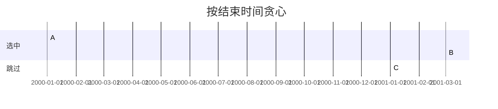
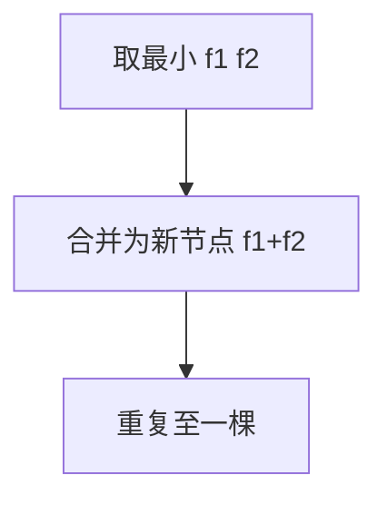

# 贪心算法

**贪心（Greedy）**在每一步做**当前看起来最优**的选择，不回溯，期望得到全局最优。活动选择、区间调度、霍夫曼编码在正确性可证时，比 DP 更省时间与空间；若贪心性质不成立，会得到局部最优但全局次优的答案。

---

## 贪心框架


典型流程：

1. 把候选按某种**排序键**或**优先级**排列
2. 线性扫描，若与已选集合**不冲突**则加入
3. 不做回溯，一次遍历结束

贪心能用的充要直觉：**贪心选择性质**（存在最优解与贪心第一步一致）+ **最优子结构**（选完后剩余仍是同类子问题）。

---

## 经典：活动选择 / 区间调度

n 个活动 [start, end)，选最多互不重叠的活动。

**策略**：按 **结束时间** 升序，能选就选（结束最早留最多空隙）。

```javascript
function maxActivities(intervals) {
  intervals.sort((a, b) => a[1] - b[1]);
  let end = -Infinity, count = 0;
  for (const [s, e] of intervals) {
    if (s >= end) { count++; end = e; }
  }
  return count;
}
```



**交换论证**：若最优解第一个活动不是结束最早，可换成结束更早的而不减少可选数量。

---

## 区间覆盖与最少箭

**用最少数箭引爆气球**（LeetCode 452）：区间 [start, end]，箭在 x 可射爆所有含 x 的区间。

**策略**：按 **end** 升序，尽量把箭放在当前区间右端点，能覆盖最多后续区间。

```javascript
function minArrows(points) {
  points.sort((a, b) => a[1] - b[1]);
  let arrows = 0, last = -Infinity;
  for (const [s, e] of points) {
    if (s > last) { arrows++; last = e; }
  }
  return arrows;
}
```

与活动选择同属「排序 + 扫描」，但目标是**最少覆盖集**而非最多不重叠集。

---

## 经典：跳跃游戏

**跳跃游戏 I**：`nums[i]` 表示从 i 最多跳几步，能否到最后下标。

```javascript
function canJump(nums) {
  let far = 0;
  for (let i = 0; i <= far && i < nums.length; i++)
    far = Math.max(far, i + nums[i]);
  return far >= nums.length - 1;
}
```

维护 **最远可达** `far`；若当前下标 i 超过 far 则中途断档。O(n) 一次扫描。

**跳跃游戏 II**（最少步数）不能简单贪心，常用 **BFS 层扩展** 或 DP — 勿与 I 混淆。

---

## 经典：找零与硬币

硬币面额 `coins`，凑金额 `amount` 用最少枚数。

| 币制 | 贪心 |
|------|------|
| 规范币制（如 1,5,10,25） | 从大面额往下取，正确 |
| 非规范（1,3,4）凑 6 | 贪心 4+1+1=3 枚，最优 3+3=2 枚 |

```javascript
function coinChangeGreedy(coins, amount) {
  coins.sort((a, b) => b - a);
  let left = amount, cnt = 0;
  for (const c of coins) {
    while (left >= c) { left -= c; cnt++; }
  }
  return left === 0 ? cnt : -1;
}
```

一般情况用 **DP** 求最少枚数；贪心前先确认或反例测试。

---

## 霍夫曼编码

按字符频率建**最优前缀码**：每次合并频率最小的两棵子树。



| 步骤 | 操作 |
|------|------|
| 初始化 | 每个字符一个节点，权=频率 |
| 循环 | 小根堆 pop 两个最小，push 合并节点 |
| 结果 | 左 0 右 1 得码字 |

gzip、JPEG 等压缩内部用类似思想；前端直接碰到的少，但理解「局部合并全局最优」的贪心模板。

---

## 最小生成树（Kruskal）

无向带权图，选 **n-1** 条边连通且权值和最小：

1. 边按权升序
2. 依次加边，若不成环则选入（并查集判环）

```javascript
// Kruskal 骨架：sort edges + unionFind
function kruskal(n, edges) {
  edges.sort((a, b) => a.w - b.w);
  const uf = new UnionFind(n);
  let cost = 0, used = 0;
  for (const { u, v, w } of edges) {
    if (uf.union(u, v)) { cost += w; if (++used === n - 1) break; }
  }
  return cost;
}
```

Prim 用堆维护「到已选集合的最小边」，也是贪心；Kruskal 按全局最小边贪心。

---

## 贪心 vs 动态规划

| 维度 | 贪心 | DP |
|------|------|-----|
| 决策 | 每步一条路径 | 保留多种子状态 |
| 正确性 | 需证明 | 转移方程保证 |
| 时间 | 常 O(n log n) 或 O(n) | 状态数 × 转移 |
| 空间 | O(1)～O(n) | 常 O(n) 表 |

| 问题 | 贪心 | DP |
|------|------|-----|
| 活动选择 | ✓ | 可但多余 |
| 0-1 背包 | ✗ | ✓ |
| 最长递增子序列 | ✗ | O(n²) / O(n log n) |

---

## 与堆结合

**合并 K 个有序链表 / 数组**：小根堆存每路当前最小，每次 pop 再 push 下一位 — 每步局部取最小，全局 K 路归并正确。

复杂度 O(N log K)，N 为总元素数，K 为路数。

---

## 前端场景

| 场景 | 贪心策略 |
|------|----------|
| 日历会议室 | 区间调度，按 end 排序 |
| 资源预加载 | 按 deadline 或 LCP 贡献排序 |
| 任务调度 | React Scheduler 按 expiration 优先 |
| 带宽分配 | 先满足高优先级流（需 QoS 证明） |

贪心在工程里常作为 **启发式**：不保证最优但实现简单、够快；关键路径仍要度量验证。

---

## 如何验证贪心

1. **举反例**：小输入 brute force 对比贪心输出  
2. **交换论证**：任意最优解可变换为以贪心第一步开头  
3. **归纳**：贪心一步 + 子问题最优 ⇒ 全局最优  

面试说「用贪心」时，至少一句证明直觉（如「按结束时间不会挡后面更多活动」）。

---

## 小结

贪心每步局部最优、不回头；区间类问题常 **排序 + 线性扫描**。必须验证贪心选择性质；硬币、背包等默认先想 DP。

**易混点**：排序键错误全盘错；跳跃 I（可达）与 II（最少步）算法不同；规范币制才能安全贪心找零；Kruskal 用并查集防环，不是纯排序。

核对：活动选择为何按 end 而非 start 排序？举一组硬币使贪心找零失败。K 路归并堆大小应为多少？霍夫曼每次合并哪两个节点？
