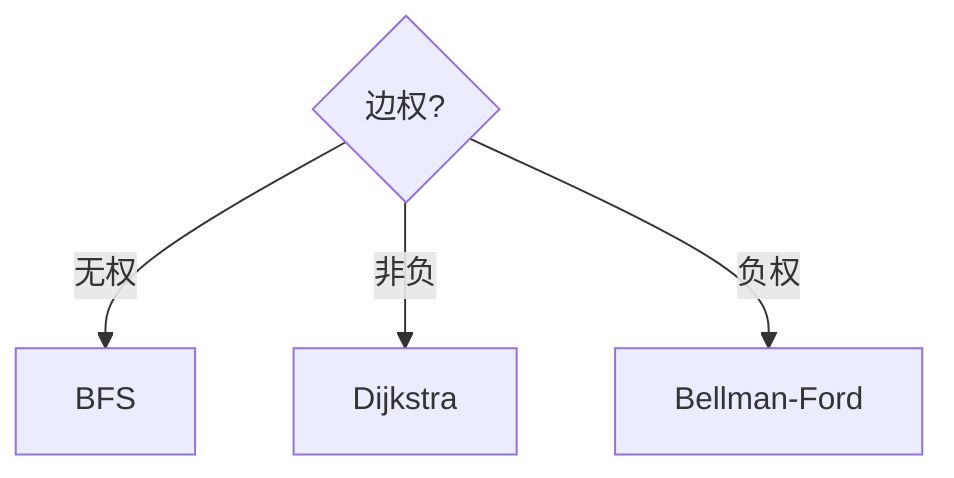

# 图算法

图上的**拓扑排序**、**最短路**、**最小生成树**是工程与面试重点。Webpack 依赖序、任务编排、地图 ETA，带权与有向约束出现时，BFS 不够，需要本章算法。

---

## 拓扑排序（DAG）

**Kahn**：入度 0 入队，出队减邻接入度。

```javascript
function topoSort(n, edges) {
  const indeg = Array(n).fill(0);
  const adj = Array.from({ length: n }, () => []);
  for (const [u, v] of edges) { adj[u].push(v); indeg[v]++; }
  const q = [];
  for (let i = 0; i < n; i++) if (!indeg[i]) q.push(i);
  const order = [];
  while (q.length) {
    const u = q.shift();
    order.push(u);
    for (const v of adj[u]) if (--indeg[v] === 0) q.push(v);
  }
  return order.length === n ? order : null; // null 有环
}
```

构建工具模块序、课程先修、CSS @import。

---

## 最短路

| 算法 | 图 | 复杂度 |
|------|-----|--------|
| **BFS** | 无权 | O(V+E) |
| **Dijkstra** | 非负权 | O(E log V) 堆 |
| Bellman-Ford | 可有负权 | O(VE) |

```javascript
function dijkstra(n, adj, src) {
  const dist = Array(n).fill(Infinity);
  dist[src] = 0;
  const pq = [[0, src]]; // min-heap by dist
  while (pq.length) {
    pq.sort((a,b)=>a[0]-b[0]);
    const [d, u] = pq.shift();
    if (d > dist[u]) continue;
    for (const { to, w } of adj[u]) {
      if (dist[u] + w < dist[to]) {
        dist[to] = dist[u] + w;
        pq.push([dist[to], to]);
      }
    }
  }
  return dist;
}
```

负权时 Dijkstra 失效，用 Bellman-Ford。

---

## BFS vs Dijkstra



---

## MST（概念）

Kruskal：边排序+并查集；Prim：类似 Dijkstra 扩点。前端直接少，理解连通最小代价即可。

| 算法 | 思路 |
|------|------|
| Kruskal | 小边优先，不成环 |
| Prim | 从源点扩最小边 |

---

## 前端场景

| 场景 | 算法 |
|------|------|
| Vite/Rollup | 拓扑+环检测 |
| 微前端加载 | DAG 拓扑 |
| 地图路径 | 调 API，内核 Dijkstra/A* |

环检测失败时 Rollup/Vite 报 **Circular dependency**。

---

## A* 简述

启发式 f(n)=g(n)+h(n)，地图导航常用；h 需可采纳（不高估）才保证最优。

---

## 复杂度对照

| 算法 | 复杂度 | 前提 |
|------|--------|------|
| BFS/DFS | O(V+E) | 邻接表 |
| Dijkstra | O(E log V) | 非负权 |
| Bellman-Ford | O(VE) | 可有负权 |
| Floyd | O(V³) | 全源 |
## 负权环

Dijkstra 不能处理负权边；Bellman-Ford 松弛 V-1 轮，第 V 轮仍能松弛则有负环。

货币套利检测可建模为对数权图找负环。

---

## 无权最短路

BFS 第一次到达即最短边数 — 网格迷宫、社交六度。边权均为 1 时 BFS 常数优于 Dijkstra。

## 拓扑排序

Kahn：入度 0 入队，出队减邻接入度 — O(V+E)。DFS 后序逆序等价。环存在则无拓扑序 — 模块循环依赖检测。

---

## Dijkstra 模板

非负权边，小根堆取当前距离最小节点：

```javascript
function dijkstra(g, src) {
  const dist = new Map([[src, 0]]);
  const pq = [[0, src]];
  while (pq.length) {
    pq.sort((a, b) => a[0] - b[0]);
    const [d, u] = pq.shift();
    if (d > (dist.get(u) ?? Infinity)) continue;
    for (const [v, w] of g.get(u) || []) {
      const nd = d + w;
      if (nd < (dist.get(v) ?? Infinity)) {
        dist.set(v, nd);
        pq.push([nd, v]);
      }
    }
  }
  return dist;
}
```

地图路由、依赖图最小代价、CDN 选路都可建模为最短路。

---

## Kahn 拓扑模板

```javascript
function topoSort(n, edges) {
  const indeg = Array(n).fill(0);
  const adj = Array.from({ length: n }, () => []);
  for (const [u, v] of edges) { adj[u].push(v); indeg[v]++; }
  const q = [];
  for (let i = 0; i < n; i++) if (indeg[i] === 0) q.push(i);
  const order = [];
  while (q.length) {
    const u = q.shift();
    order.push(u);
    for (const v of adj[u]) if (--indeg[v] === 0) q.push(v);
  }
  return order.length === n ? order : null; // null 表示有环
}
```

webpack 循环依赖、任务依赖调度、课程表问题都用到拓扑。

---

## BFS 无权最短路

```javascript
function bfsDist(g, start) {
  const dist = new Map([[start, 0]]);
  const q = [start];
  while (q.length) {
    const u = q.shift();
    for (const v of g.get(u) || []) {
      if (!dist.has(v)) { dist.set(v, dist.get(u) + 1); q.push(v); }
    }
  }
  return dist;
}
```

网格迷宫、社交关系「几度人脉」、状态机最少步数 — 边权均为 1 时 BFS 最优。

## 小结

DAG 用拓扑；非负单源 Dijkstra，无权 BFS；有环时拓扑无完整序。

**易混点**：Dijkstra 不能负权；拓扑结果不唯一；BFS 层数 = 无权最短路长。

核对：环检测失败 webpack 报什么？Dijkstra 用堆为何 O(E log V)？Kahn 拓扑为何入度 0 才入队？
