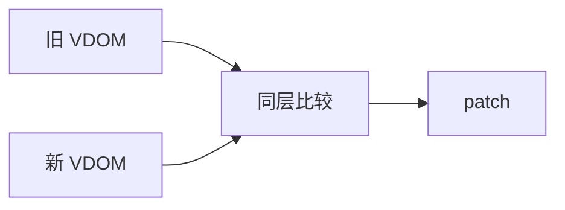
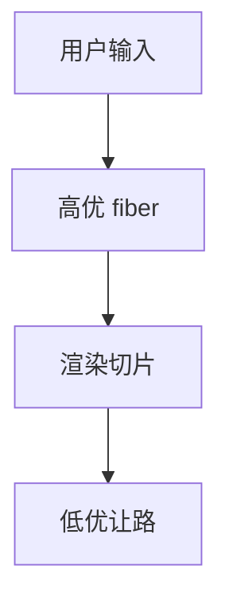

# 前端相关算法

React/Vue 性能来自几类可命名算法：**树 Diff**、**虚拟列表**、**LRU 缓存**、**Scheduler 优先级队列**。理解它们，才能读懂 `key`、Concurrent Mode、keep-alive 与长列表优化。

---

## 树 Diff（React / Vue）

目标：旧树 → 新树，**最少 DOM 操作**。



| 策略 | 说明 |
|------|------|
| 同层比较 | 不跨层移动，O(n) 启发 |
| **key** | 稳定标识，防错位复用 |
| Vue2 双端 | 头头/尾尾/头尾/尾头 |
| Vue3 LIS | 最小 move 次数 |

```javascript
// 好: items.map(it => <Row key={it.id} />)
// 差: items.map((it, i) => <Row key={i} />)
```

React Fiber：链表+可中断；与 LCS/Myers diff 思想相关。

---

## 虚拟列表

只渲染 viewport + buffer，滚动更新 offset。

| 模式 | 适用 |
|------|------|
| 固定高度 | start = scrollTop / itemHeight |
| 动态高度 | 预估+测量+二分找 start |

```javascript
function visibleRange(scrollTop, itemH, count, viewH) {
  const start = Math.floor(scrollTop / itemH);
  const visible = Math.ceil(viewH / itemH) + 1;
  return { start, end: Math.min(count, start + visible) };
}
```

react-window / vue-virtual-scroller 封装；万级 DOM 变几十个。

---

## LRU 缓存

满则踢最久未用；O(1) 需 **哈希 + 双向链表**（或 ES2015+ Map 顺序）。

```javascript
class LRU {
  constructor(cap) { this.cap = cap; this.map = new Map(); }
  get(k) {
    if (!this.map.has(k)) return -1;
    const v = this.map.get(k);
    this.map.delete(k); this.map.set(k, v);
    return v;
  }
  put(k, v) {
    if (this.map.has(k)) this.map.delete(k);
    this.map.set(k, v);
    if (this.map.size > this.cap) this.map.delete(this.map.keys().next().value);
  }
}
```

keep-alive、图片内存、React Query 淘汰策略同源。

---

## Scheduler 与优先级

React 18 Concurrent：lane/priority，可打断续跑。



requestIdleCallback、MessageChannel 宏任务插队，与 deadline 贪心调度呼应。

Vue：微任务 flush batch；编译期 block tree 静态提升。

---

## 其他前端算法

| 算法 | 用途 |
|------|------|
| 防抖/节流 | 时间窗口 |
| 深比较 | 递归 O(n) |
| 碰撞检测 | AABB / 四叉树 |
| 国际化排序 | `localeCompare` |

---

## 性能核对清单

1. 列表 **稳定 key**
2. 长列表 **虚拟化**
3. 重复计算 **memo** / LRU
4. 大更新 **batch** / transition
5. **Profiler** 定位 hot path

---

## Diff 与 key 案例

```javascript
// 插入头部 — index key 导致错位复用
// 旧 [A,B,C] key 0,1,2 → 新 [X,A,B,C] key 0,1,2,3
// React 可能 patch A→X, B→A... 应使用 id key
```

---

## 工程算法

| 问题 | 套路 |
|------|------|
| 虚拟列表 | 窗口 + 二分定位 |
| diff | 最长上升子序列启发 |
| 防抖节流 | 时间窗口 |
| 深比较 | DFS + 循环引用 Map |
## LRU 实现

Map 保持插入序：get 时 delete 再 set 移到末尾；超容量删最旧。

React useMemo 缓存是键值记忆化 — 与 LRU  eviction 策略不同，依赖数组变则重算。

---

## 构建与拓扑

模块依赖环 — webpack circular warning 即 DAG 破坏。拓扑序不唯一，可并行构建多个就绪节点。

## 深比较要点

```javascript
function deepEqual(a, b, seen = new WeakMap()) {
  if (a === b) return true;
  if (typeof a !== 'object' || a === null || typeof b !== 'object' || b === null) return false;
  if (seen.has(a)) return seen.get(a) === b;
  seen.set(a, b);
  const keys = new Set([...Object.keys(a), ...Object.keys(b)]);
  for (const k of keys) if (!deepEqual(a[k], b[k], seen)) return false;
  return true;
}
```

---

## LRU 缓存实现

Map 保插入序：get 时 delete+set 移到末尾；满时删首项。

```javascript
class LRU {
  constructor(cap) { this.cap = cap; this.map = new Map(); }
  get(k) {
    if (!this.map.has(k)) return -1;
    const v = this.map.get(k);
    this.map.delete(k); this.map.set(k, v);
    return v;
  }
  put(k, v) {
    if (this.map.has(k)) this.map.delete(k);
    else if (this.map.size >= this.cap) this.map.delete(this.map.keys().next().value);
    this.map.set(k, v);
  }
}
```

HTTP 缓存、React Query staleTime、图片内存池思路相近。

---

## 虚拟列表定位公式

可见区 `[start, end)` 由 scrollTop 与行高估算：

```javascript
function visibleRange(scrollTop, rowHeight, viewportH, total, buffer = 3) {
  const start = Math.max(0, Math.floor(scrollTop / rowHeight) - buffer);
  const visibleCount = Math.ceil(viewportH / rowHeight);
  const end = Math.min(total, start + visibleCount + 2 * buffer);
  return { start, end };
}
```

| 变量 | 作用 |
|------|------|
| buffer | 上下预渲，减快速滚动白屏 |
| 动态行高 | 需 prefix sum + 二分找 start |

渲染复杂度 O(可见行数)，非 O(总行数)，万行表格仍流畅的关键。

## 小结

Diff 靠 key 与同层；虚拟列表只渲可见；LRU Map 顺序 O(1)；Scheduler 保交互。

**易混点**：index key 重排错位；动态高需 remeasure；Concurrent transition 优先级；Vue3 LIS 减 DOM move。

核对：Vue3 LIS 解决什么？LRU Map 为何 delete 再 set？虚拟列表 buffer 区作用？
