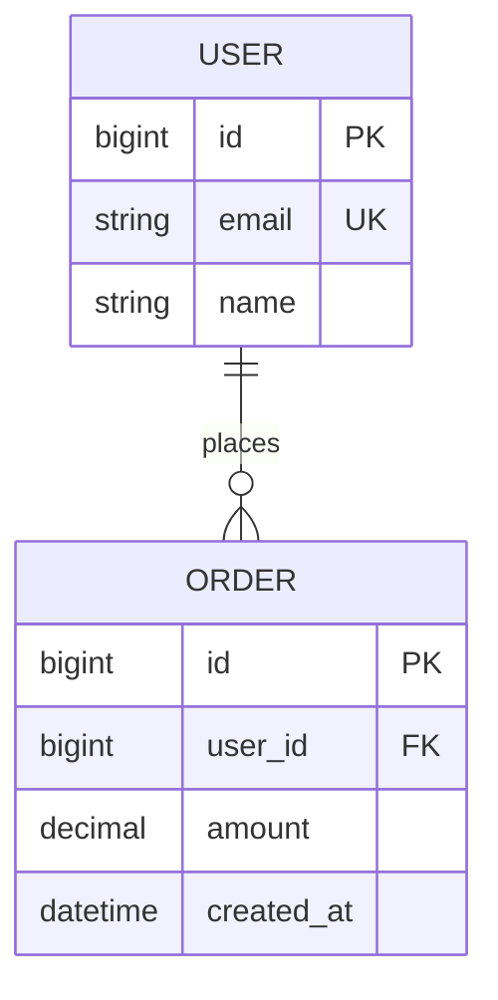
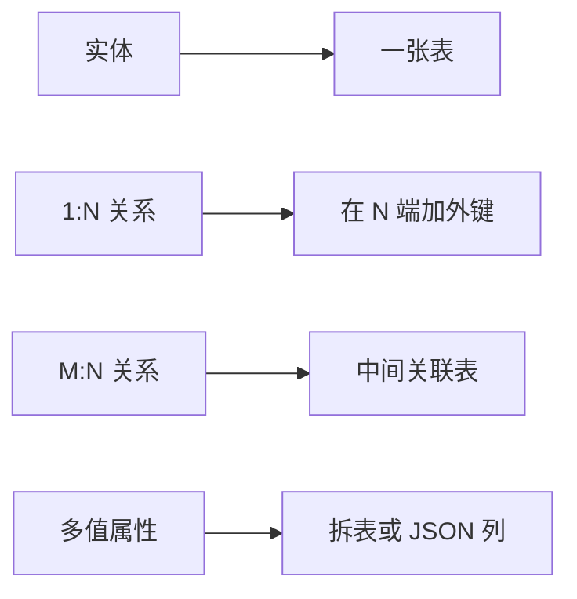
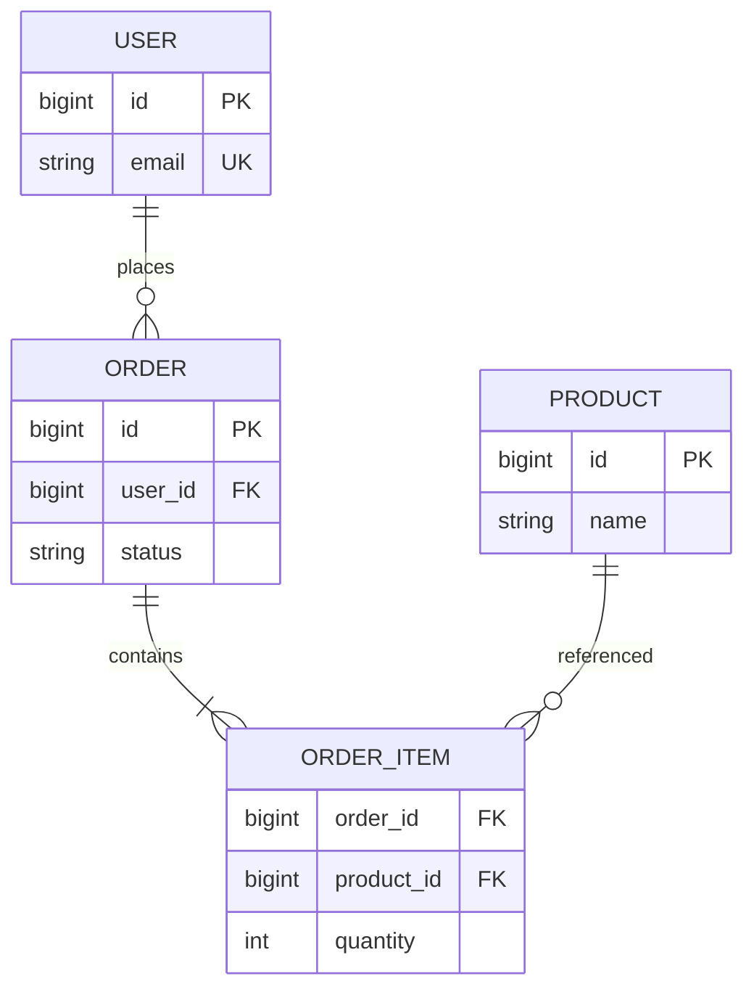

# 关系模型与 ER 设计

业务实体与约束若只在代码里隐式存在，表结构会随需求漂移、联表成本失控。**关系模型**用表、键、范式把数据语义固定下来 — 全栈写 API 与读 Explain 之前，应先能画出清晰的 ER 与表设计。

---

## 关系模型核心概念

| 概念 | 含义 | 前端/全栈常见对应 |
|------|------|-------------------|
| **关系（表）** | 行的集合，模式固定 | `users`、`orders` |
| **元组（行）** | 一条记录 | 一条用户 JSON |
| **属性（列）** | 字段及域 | `email VARCHAR(255)` |
| **域** | 列取值范围 | ENUM、CHECK 约束 |
| **键** | 唯一标识或关联 | 主键、外键 |



---

## 键的类型

| 键 | 作用 | 设计注意 |
|----|------|----------|
| **超键** | 能唯一标识行的属性集 | 含冗余列也算 |
| **候选键** | 最小超键 | 如 `email` 或 `(tenant_id, slug)` |
| **主键 PK** | 选定的候选键 | 倾向稳定、短、数值自增或 UUID |
| **外键 FK** | 引用他表主键/候选键 | 级联策略影响删除行为 |
| **唯一键 UK** | 业务唯一，非主键 | 登录名、订单号 |

全栈场景：**不要用可变业务字段当 PK**（手机号改绑会伤 FK）；多租户常 composite UK `(tenant_id, local_id)`。

---

## ER 图到表：映射规则



| ER 结构 | 关系表设计 |
|---------|------------|
| 1:1 | 任一侧加 FK，或合并（字段少时） |
| 1:N | N 端 FK 指向 1 端 PK |
| M:N | 关联表 `(A_id, B_id)` + 联合 PK/UK |
| 弱实体 | FK 含属主部分键 |

---

## 范式（避免冗余与更新异常）

| 范式 | 要求（直观） | 反例 |
|------|--------------|------|
| **1NF** | 列原子、无重复组 | 一行存多个 tag 字符串 |
| **2NF** | 1NF + 非键列完全依赖 PK | 订单明细里混存商品名（仅依赖 product_id） |
| **3NF** | 2NF + 非键列不传递依赖 PK | 部门表里存 `dept_name` 又存 `dept_location` 可拆 |
| **BCNF** | 每个决定因素都是候选键 | 更严，少见设计卡点 |

**反规范化**：为读性能冗余字段（如订单快照商品名）— 用触发器/应用层保证一致，并文档化。

---

## 全栈设计清单

```sql
-- 典型用户-订单：外键 + 索引 + 时间戳
CREATE TABLE users (
  id         BIGINT PRIMARY KEY AUTO_INCREMENT,
  email      VARCHAR(255) NOT NULL UNIQUE,
  created_at TIMESTAMP NOT NULL DEFAULT CURRENT_TIMESTAMP
);

CREATE TABLE orders (
  id         BIGINT PRIMARY KEY AUTO_INCREMENT,
  user_id    BIGINT NOT NULL,
  amount     DECIMAL(12,2) NOT NULL,
  status     VARCHAR(32) NOT NULL,
  created_at TIMESTAMP NOT NULL DEFAULT CURRENT_TIMESTAMP,
  FOREIGN KEY (user_id) REFERENCES users(id)
);
CREATE INDEX idx_orders_user_created ON orders(user_id, created_at DESC);
```

| 检查项 | 说明 |
|--------|------|
| 每张表有 PK | ORM `@id` 映射清晰 |
| FK 与索引 | JOIN/WHERE 列要有索引（见 03-索引原理） |
| 软删除 | `deleted_at` 影响 UK 设计 |
| 枚举 vs 字典表 | 高频变更用字典表 |

ORM 建模与迁移实操见 后端 05 · 数据库与 ORM（Prisma 等）；本篇聚焦**表语义与范式**，不替代迁移工具。

---

## 与 API / 前端的边界

| 层 | 职责 |
|----|------|
| ER/表 | 持久化真相、约束、关联 |
| DTO/ViewModel | 接口形状、脱敏、聚合 |
| 前端 Store | 展示态、缓存，非唯一数据源 |

列表页需要的「用户+最近订单」可能是 JOIN 或 BFF 聚合，不应逼前端存整张宽表。

---

## ER 建模实战：从需求到表

以「用户下单买多件商品」为例，先画 ER 再落表，比直接堆 JSON 字段更可控。



| 步骤 | 动作 |
|------|------|
| 1 | 识别实体：User、Order、Product |
| 2 | 判定基数：User 1:N Order；Order M:N Product → 拆 ORDER_ITEM |
| 3 | 定 PK：各表 surrogate id；业务单号另建 UK |
| 4 | 快照字段：`order_item.unit_price` 冗余商品价，防改价影响历史 |

```
  需求句：「一个订单有多行明细，每行对应一个商品及数量」
           │
           ▼
  不能只在 orders 表存 JSON items — 难索引、难约束 FK
           │
           ▼
  拆 order_items(order_id, product_id, qty, unit_price)
```

---

## 小结

关系模型用表与键表达实体联系；ER → 表时按基数加 FK 或关联表，并按范式削减冗余，再在热点读路径上有意识地反规范化。

**易混点**：候选键 vs 主键（主键只是被选中的一个）；M:N 不能只在一端加 FK；3NF 不是「不能冗余」，而是「冗余要有理由与同步策略」。

核对：订单-商品 M:N 应几张表？把 `user_name` 冗余进 `orders` 违反哪条范式、何时仍合理？
