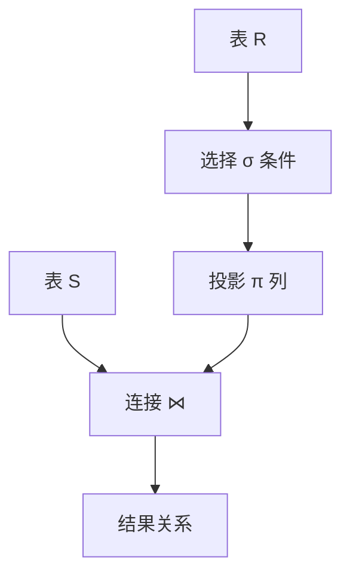

# SQL 与关系代数

SQL 是声明式查询语言，底层可映射到**关系代数**运算。读懂 `SELECT … JOIN … WHERE` 在逻辑上做了什么，才能写出可索引的 SQL、看懂 ORM 生成的语句，而不是靠拼接字符串碰运气。

---

## 关系代数六种基本运算

| 运算 | 符号/直觉 | SQL 对应 |
|------|-----------|----------|
| **选择 σ** | 按条件筛行 | `WHERE` |
| **投影 π** | 选列 | `SELECT col1, col2` |
| **笛卡尔积 ×** | 两表所有行组合 | 无 `ON` 的 `FROM A, B` |
| **并 ∪** | 去重合并 | `UNION` |
| **差 −** | 在 A 不在 B | `EXCEPT` / `NOT IN` |
| **重命名 ρ** | 别名 | `AS` |



---

## 连接（Join）族

| 连接 | 语义 | 典型 SQL |
|------|------|----------|
| **等值连接** | 按等式匹配 | `INNER JOIN … ON a.id = b.a_id` |
| **自然连接** | 同名列自动等值 | `NATURAL JOIN`（少用，列名易坑） |
| **外连接** | 保留无匹配侧 | `LEFT/RIGHT/FULL OUTER JOIN` |
| **半连接** | 存在性，不扩列 | `WHERE EXISTS (SELECT 1 …)` |
| **反连接** | 不存在 | `WHERE NOT EXISTS` |

```sql
-- 半连接：有订单的用户（不重复用户列）
SELECT u.*
FROM users u
WHERE EXISTS (
  SELECT 1 FROM orders o WHERE o.user_id = u.id
);
```

ORM 的 `include` / `relation` 往往生成 `LEFT JOIN` 或多次查询 — 对照 后端 ORM 篇 理解 N+1 与 `JOIN` 取舍。

---

## SQL 逻辑执行顺序


| 阶段 | 注意 |
|------|------|
| `WHERE` | 行级过滤，不能用 SELECT 别名 |
| `GROUP BY` | 聚合前分组；SELECT 非聚合列须在 GROUP BY 或聚合函数内 |
| `HAVING` | 聚合后过滤 |
| `ORDER BY` | 可用 SELECT 别名 |

```sql
SELECT user_id, COUNT(*) AS cnt
FROM orders
WHERE created_at >= '2026-01-01'
GROUP BY user_id
HAVING COUNT(*) >= 5
ORDER BY cnt DESC
LIMIT 10;
```

---

## 聚合与窗口函数

| 类型 | 作用 | 示例 |
|------|------|------|
| 聚合 | 多行变一行 | `SUM(amount)`, `COUNT(*)` |
| 窗口 | 保留行，加分析列 | `ROW_NUMBER()`, `SUM() OVER (PARTITION BY …)` |

```sql
-- 每用户按时间排序的订单序号（分页、去重常用）
SELECT id, user_id, amount,
       ROW_NUMBER() OVER (PARTITION BY user_id ORDER BY created_at DESC) AS rn
FROM orders;
```

仪表盘「每类 Top3」用窗口比自连接更清晰。

---

## 子查询 vs CTE

```sql
WITH recent AS (
  SELECT * FROM orders WHERE created_at >= CURRENT_DATE - INTERVAL '7 days'
)
SELECT u.email, SUM(r.amount) AS total
FROM users u
JOIN recent r ON r.user_id = u.id
GROUP BY u.email;
```

| 方式 | 适用 |
|------|------|
| 相关子查询 | 行级 EXISTS、标量子查询 |
| CTE (`WITH`) | 多步可读、递归（组织树） |
| 临时表 | 超大中间结果、多次复用 |

优化器常把 CTE **内联**或**物化**，以 `EXPLAIN` 为准（见 03-索引原理）。

---

## 与全栈开发的衔接

| 场景 | SQL 要点 |
|------|----------|
| 分页 | `LIMIT/OFFSET` 深分页慢 → 键集分页 `WHERE id > ? ORDER BY id` |
| 批量更新 | 避免 ORM 循环单条 UPDATE |
| 报表 | 聚合在 DB 做，减轻 Node 内存 |
| 防注入 | 参数化查询，禁止拼接用户输入 |

```typescript
// 参数化（概念示意）
await db.query('SELECT * FROM users WHERE email = $1', [email]);
```

---

## NULL 与三值逻辑

SQL 里 `NULL` 表示「未知」，比较结果不是 true/false 而是 **UNKNOWN**，`WHERE` 只保留 true 的行。

| 表达式 | 结果 |
|--------|------|
| `NULL = NULL` | UNKNOWN（用 `IS NULL`） |
| `NULL AND true` | UNKNOWN |
| `COUNT(*)` | 计所有行含 NULL |
| `COUNT(col)` | 忽略 col 为 NULL 的行 |

```sql
SELECT * FROM users WHERE email IS NULL;
SELECT COALESCE(nickname, email, 'anonymous') AS display FROM users;
```

ORM 的 `optional` 字段映射到可空列时，应用层仍要区分 `undefined`（不更新）与 `null`（显式置空）。

---

## 小结

SQL 语句可分解为选择、投影、连接等关系代数运算；先理清逻辑顺序与连接语义，再谈索引与 ORM 映射，查询才既正确又可控。

**易混点**：`WHERE` 在 `GROUP BY` 前、`HAVING` 在后；`INNER JOIN` 与 `WHERE` 等值过滤不等价于外连接；`COUNT(*)` vs `COUNT(col)` 对 NULL 行为不同。

核对：`LEFT JOIN` 后 `WHERE b.id IS NULL` 实现什么连接？深分页为何推荐键集而非大 OFFSET？
