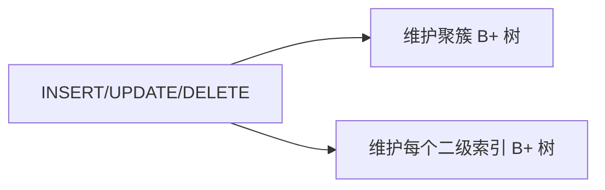

# 索引原理

全表扫描在百万行上会把 API 拖垮。**索引**用额外结构（主流 **B+ 树**）把「找行」从 O(n) 降到 O(log n)，但会拖慢写入并占磁盘 — 全栈排障慢查询时，Explain 里的 `type`、`key`、`rows` 都建立在索引模型之上。

---

## 为什么用 B+ 树

| 结构 | 特点 | 数据库中的角色 |
|------|------|----------------|
| 二叉搜索树 | 可能退化成链 | 不直接用 |
| B 树 | 节点存键+数据 | 部分系统 |
| **B+ 树** | 数据只在叶子；叶子链表 | **InnoDB 二级索引、MySQL 聚簇** |

```mermaid
flowchart TB
  Root[根节点 键指针]
  I1[内部节点]
  I2[内部节点]
  L1[叶子 键+行指针/数据]
  L2[叶子 键+行指针/数据]
  L3[叶子 键+行指针/数据]
  Root --> I1
  Root --> I2
  I1 --> L1
  I1 --> L2
  I2 --> L2
  I2 --> L3
  L1 -.->|双向链表| L2
  L2 -.->|L3
```

**B+ 树优势**：扇出高、树矮、**范围扫描**沿叶子链表顺序读；磁盘页对齐友好。

---

## 聚簇索引 vs 二级索引

| 类型 | InnoDB 行为 | 查询含义 |
|------|-------------|----------|
| **聚簇（主键）** | 叶子存整行，表即索引 | PK 查找一次 B+ 树 |
| **二级索引** | 叶子存 **索引列 + PK** | 先查二级，再 **回表** 查聚簇 |

```sql
-- 假设 PRIMARY KEY(id)，INDEX idx_user_created(user_id, created_at)
SELECT amount FROM orders
WHERE user_id = 42 AND created_at >= '2026-06-01';
```

若 `amount` 不在索引中：二级索引定位 → 回表取 `amount`（**随机 I/O**）。

**覆盖索引**：SELECT 列全在索引内 → 无需回表。

```sql
CREATE INDEX idx_cover ON orders(user_id, created_at, amount);
-- 上例可只扫 idx_cover
```

---

## 最左前缀与联合索引

联合索引 `(a, b, c)` 排序等价于先按 `a`，再 `b`，再 `c`。

| 条件 | 能否用上索引 |
|------|--------------|
| `a = ?` | 是 |
| `a = ? AND b = ?` | 是 |
| `b = ?` | 通常**不能**（跳过最左 a） |
| `a = ? ORDER BY b` | 常可 |

| 反模式 | 原因 |
|--------|------|
| 对索引列 `函数/运算` | 破坏有序性，`WHERE YEAR(created_at)=2026` |
| 隐式类型转换 | 字符串列与数字比较 |
| 低选择性列单独索引 | 性别列几乎无效 |

---

## Explain 速读（MySQL 为例）

```sql
EXPLAIN SELECT * FROM orders WHERE user_id = 1 ORDER BY created_at DESC LIMIT 20;
```

| 字段 | 关注 |
|------|------|
| `type` | `ALL` 全表最差；`range`/`ref`/`const` 较好 |
| `key` | 实际使用的索引 |
| `rows` | 估算扫描行数 |
| `Extra` | `Using filesort` / `Using temporary` 需警惕 |

ORM 生成的 SQL 应用 `EXPLAIN` 验证；迁移里加索引见 后端 05 · ORM。

---

## 其他索引形态（了解）

| 类型 | 场景 |
|------|------|
| 唯一索引 | 业务 UK + 加速查找 |
| 前缀索引 | 长 VARCHAR 列 |
| 全文索引 | 搜索引擎级需求另议 |
| 哈希索引 | Memory 引擎等；仅等值 |

NoSQL / Redis 索引模型见 07-NoSQL与NewSQL选型。

---

## 写入代价



索引越多，写入越慢；读多写少的报表列可单独从库或缓存，而非堆索引。

---

## 慢查询排查顺序

| 步骤 | 动作 |
|------|------|
| 1 | 开启慢查询日志或 APM 定位 SQL |
| 2 | `EXPLAIN` 看 `type`、`rows`、`Extra` |
| 3 | 核对 WHERE/ORDER BY 是否命中联合索引最左列 |
| 4 | 评估覆盖索引或改写 SQL（避免 `SELECT *`） |

ORM `findMany` 带 `orderBy` + `where` 时，迁移里索引字段顺序应与查询一致。

---

## 索引失效典型场景

| SQL 写法 | 为何难用索引 |
|----------|--------------|
| `WHERE YEAR(created_at) = 2026` | 对列套函数，破坏有序性 |
| `WHERE name LIKE '%张%'` | 前缀通配，无法走 B+ 树前缀 |
| `WHERE id + 1 = 10` | 对索引列运算 |
| 隐式转换 `WHERE phone = 13800138000`（phone 为 VARCHAR） | 可能全表扫描 |
| `OR` 跨不同列 | 优化器可能合并为 range 或放弃索引 |

改写示例：

```sql
-- 差
WHERE YEAR(created_at) = 2026
-- 好：范围扫描仍能用 (created_at) 索引
WHERE created_at >= '2026-01-01' AND created_at < '2027-01-01'
```

联合索引设计顺序口诀：**等值列放前，范围列放后，排序列尽量纳入** — `(user_id, status, created_at)` 服务 `WHERE user_id=? AND status=? ORDER BY created_at`。

---

## 小结

InnoDB 以 B+ 树组织数据：主键聚簇存行，二级索引叶子指向主键；联合索引遵守最左前缀，覆盖索引可避免回表。

**易混点**：B 树 vs B+ 树（数据是否只在叶子、范围扫描）；索引不是越多越好；`LIKE '%abc'` 无法用普通 B+ 树前缀。

核对：`(user_id, status, created_at)` 索引对 `WHERE status = 'paid'` 是否友好？何谓回表、何谓覆盖索引？
