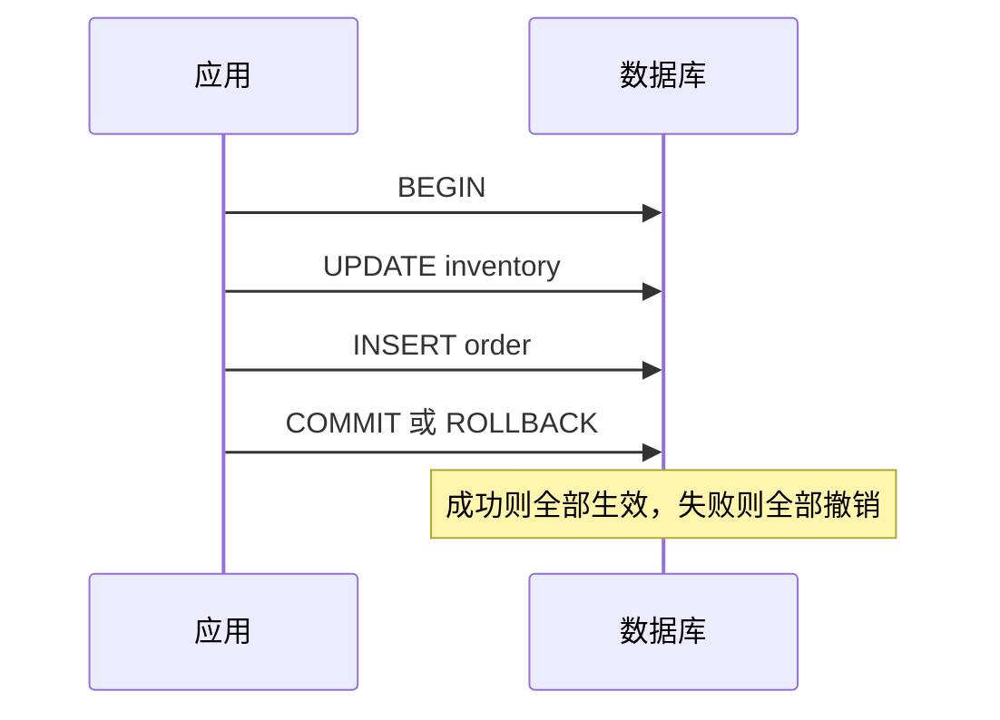
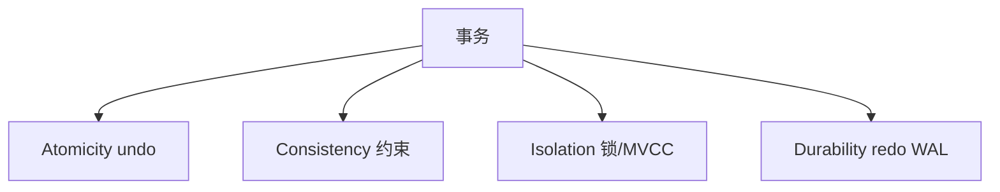
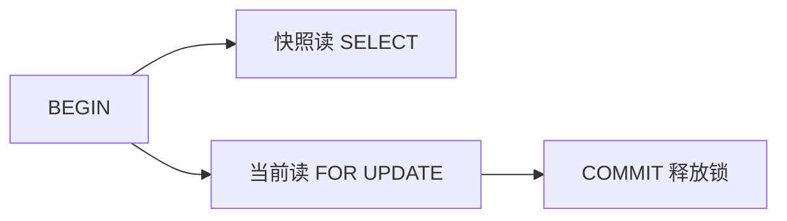

# 事务与 ACID

一次「扣库存 + 写订单 + 记流水」若中途失败，不能只完成一半 — **事务**把多条语句绑成原子单元。**ACID** 是关系库对正确性与持久性的承诺，也是理解隔离级别、redo/undo 的入口。

---

## 事务是什么



| 语句 | 作用 |
|------|------|
| `BEGIN` / `START TRANSACTION` | 开启事务 |
| `COMMIT` | 永久生效 |
| `ROLLBACK` | 撤销本事务修改 |
| 自动提交 | 单条语句默认一事务（JDBC/驱动可关） |

Node/pg、Prisma `$transaction` 是对同一语义的封装 — 原理见本篇，API 见 后端 05 · ORM。

---

## ACID 四性质

| 性质 | 含义 | 实现抓手（概念） |
|------|------|------------------|
| **A 原子性** | 全做或全不做 | **undo log** 回滚 |
| **C 一致性** | 约束始终成立 | PK/FK/CHECK + 应用不变式 |
| **I 隔离性** | 并发事务互不干扰（程度可调） | 锁 + **MVCC**（见 05） |
| **D 持久性** | 提交后掉电不丢 | **redo log + WAL**（见 06） |



**一致性**常被误读为「数据库自动保证业务正确」— 实际上 DB 保证约束，**余额不为负**等规则仍要应用层或 CHECK 共同维护。

---

## 典型并发异常（为何需要隔离）

| 异常 | 现象 |
|------|------|
| 脏读 | 读到未提交的数据 |
| 不可重复读 | 同一行两次读结果不同（他事务已提交） |
| 幻读 | 同一条件两次读，行数不同 |

隔离级别在 **正确性 vs 并发度** 间权衡 — 详见下一篇。

---

## 事务边界怎么划

```
  请求进入
     │
     ├─ 只读列表？ ──→ 通常不必显式 BEGIN
     │
     ├─ 单库多表写？ ──→ DB 事务包住
     │
     └─ 跨 HTTP 服务？ ──→ 本地事务不够，见 Saga/Outbox
```

| 场景 | 建议 |
|------|------|
| 单库多表 | DB 事务 |
| 跨服务 | **无单库事务** → Saga / Outbox / 最终一致 |
| 只读查询 | 一般无需显式事务；报表可用只读副本 |
| 长事务 | 避免 — 占锁、拖 MVCC 版本链 |

```typescript
// 概念：Prisma 交互式事务
await prisma.$transaction(async (tx) => {
  await tx.inventory.update({ /* … */ });
  await tx.order.create({ /* … */ });
});
```

**反模式**：在事务里调 HTTP、发邮件 — 拉长持锁时间，易死锁与超时。

---

## 与前端的关系

前端不直接 `BEGIN`，但会感受到：

| 现象 | 可能根因 |
|------|----------|
| 提交后刷新仍旧数据 | 读从库延迟 |
| 双点提交重复订单 | 缺少幂等键 / 唯一约束 |
| 502 后不确定是否成功 | 需查单或幂等重试设计 |

API 设计应返回可追踪 `order_id`，配合 DB 唯一键防重。

```sql
-- 幂等：客户端带 idempotency_key，表上唯一约束
CREATE UNIQUE INDEX uk_orders_idem ON orders(idempotency_key);
```

---

## 持久性：WAL 一瞥

提交时先写 **WAL（redo log）** 再慢慢刷数据页 — 崩溃恢复时重放已提交日志。与 06-锁日志与崩溃恢复 衔接。

| 步骤 | 顺序 |
|------|------|
| 1 | 修改缓冲池中的数据页（内存） |
| 2 | 写 redo log（顺序写，快） |
| 3 | `COMMIT` 返回（通常等 redo 落盘） |
| 4 | 后台异步刷脏页到数据文件 |

因此：**提交成功时数据页未必已在磁盘**，但 redo 保证掉电后可恢复。

---

## 隔离级别速览（与下一层机制衔接）

| 级别 | 脏读 | 不可重复读 | 幻读 | 全栈常见默认 |
|------|------|------------|------|--------------|
| READ UNCOMMITTED | 可能 | 可能 | 可能 | 几乎不用 |
| READ COMMITTED | 否 | 可能 | 可能 | PostgreSQL |
| REPEATABLE READ | 否 | 否 | 可能* | MySQL InnoDB |
| SERIALIZABLE | 否 | 否 | 否 | 报表、强一致批处理 |

\* InnoDB 在 RR 下用 Next-Key Lock 在多数场景抑制幻读。



库存扣减应走**单条原子 UPDATE** 或乐观锁版本号，而不是「SELECT 读库存 → 应用判断 → UPDATE」三段无锁读改写。

---

## 小结

事务保证一组操作的原子提交；ACID 中 A/D 靠日志，I 靠隔离与 MVCC，C 需要模式约束与业务规则共同守住。

**易混点**：ACID 的 C ≠ CAP 的 C；原子性由 undo 回滚实现，持久性由 redo+刷盘策略实现；跨微服务不能用本地 DB 事务代替分布式一致性。

核对：事务里调用第三方支付 API 合适吗？`COMMIT` 成功但客户端超时，如何避免重复下单？
