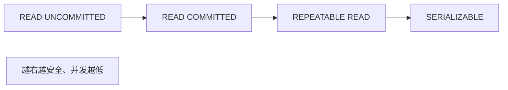
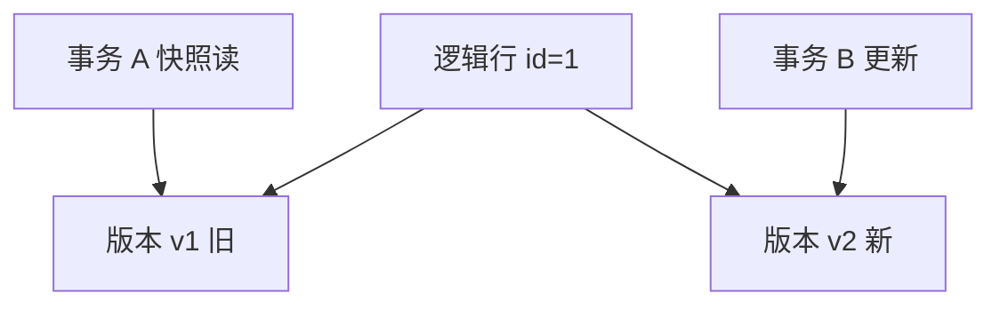

# 隔离级别与 MVCC

并发连接同时读写同一表时，若不加控制会出现脏读与幻读。**隔离级别**规定可见性边界；**MVCC**（多版本并发控制）用版本链让读少阻塞写 — MySQL InnoDB、PostgreSQL 默认路径都依赖这套机制。

---

## SQL 标准四级隔离

| 级别 | 脏读 | 不可重复读 | 幻读 | 典型实现 |
|------|------|------------|------|----------|
| READ UNCOMMITTED | 可能 | 可能 | 可能 | 几乎不用 |
| **READ COMMITTED** | 否 | 可能 | 可能 | Oracle、PG 默认 |
| **REPEATABLE READ** | 否 | 否 | 可能* | MySQL InnoDB 默认 |
| SERIALIZABLE | 否 | 否 | 否 | 锁读，最严 |

\* InnoDB RR 通过 **Next-Key Lock** 在多数场景避免幻读。



---

## MVCC 核心思路

每行存多个版本；读事务看到 **快照**（某一时刻一致视图），写事务产生新版本，旧版本保留至无读者需要。



| 组件 | 作用 |
|------|------|
| 隐藏列 `trx_id` / `roll_ptr` | 版本链（InnoDB） |
| Read View | 判断版本对当前事务是否可见 |
| undo log | 存旧版本供回滚与一致性读 |

**快照读**：普通 `SELECT` — 不加锁，走 MVCC。  
**当前读**：`SELECT … FOR UPDATE`、`UPDATE`、`DELETE` — 读最新已提交并加锁。

---

## RC vs RR（InnoDB）

| 对比 | READ COMMITTED | REPEATABLE READ |
|------|----------------|-----------------|
| 快照 | 语句级 | 事务级 |
| 同一事务两次读 | 可能不同 | 同一快照 |
| 间隙锁 | 较少 | Next-Key Lock 防幻读 |

```sql
-- 会话 1
START TRANSACTION;
SELECT balance FROM accounts WHERE id = 1; -- 100

-- 会话 2 提交 UPDATE balance = 200

-- 会话 1 再 SELECT
-- RC: 200   RR: 仍 100（快照读）
```

报表与缓存一致性：RR 下长事务可能读到「旧快照」，需知业务容忍度。

---

## 幻读与 Next-Key Lock

| 锁类型 | 范围 |
|--------|------|
| 记录锁 | 单行 |
| 间隙锁 | 索引间隙，不含行 |
| Next-Key | 记录锁 + 前间隙 |

`WHERE id BETWEEN 10 AND 20` 的 `FOR UPDATE` 可能锁住范围内间隙，阻止插入 id=15 的新行 — 降低幻读概率。

```
  索引键:  ...  8    [10────20]    25  ...
                    ↑ gap lock 覆盖此区间
```

---

## 全栈常见坑

| 现象 | 原因 |
|------|------|
| 更新丢失 | 读-改-写无锁或无条件 UPDATE |
| 超卖 | 库存扣减非 `UPDATE … WHERE stock >= 1` 原子 |
| 死锁 | 多表加锁顺序不一致 |

```sql
-- 乐观：版本号
UPDATE products SET stock = stock - 1, version = version + 1
WHERE id = ? AND stock >= 1 AND version = ?;
```

ORM 的 `@version` / `$executeRaw` 需显式建模；见 后端 ORM 实践。

---

## 锁与索引的交互

InnoDB 行锁加在**索引记录**上；`WHERE` 无可用索引时可能扫描并锁住大量行或间隙，慢查询与锁竞争会叠加。

| 情况 | 后果 |
|------|------|
| `WHERE` 列无索引 | 可能全表/大范围扫描 + 锁表级效果 |
| 二级索引回表 | 聚簇索引对应记录也会加锁 |
| 非唯一二级索引 | 可能加 gap lock 防幻读 |

```mermaid
flowchart TB
  SQL[UPDATE ... WHERE status='pending']
  Idx{有 (status) 索引?}
  Scan[全表扫描锁多行]
  Range[索引 range 锁命中行+间隙]
  SQL --> Idx
  Idx -->|否| Scan
  Idx -->|是| Range
```

长事务持锁期间，其他会话的 `UPDATE` 可能 `Lock wait timeout` — 与业务超时设置联动排查。

---

## 读已提交下的「不可重复读」演示

| 时刻 | 会话 A（RC） | 会话 B |
|------|--------------|--------|
| T1 | `BEGIN; SELECT balance → 100` | |
| T2 | | `UPDATE balance=200; COMMIT` |
| T3 | `SELECT balance → 200` | |
| T4 | `COMMIT` | |

同一事务内两次读不一致 — RC 允许；RR 下快照读仍见 100。报表若要求「打开事务后数字不变」，需 RR 或显式锁。

---

## 小结

隔离级别定义并发读写的可见性；MVCC 用版本链实现快照读，当前读与 Next-Key Lock 处理更新与幻读；默认 RR（MySQL）与 RC（PG）行为差异影响同一事务内重复查询结果。

**易混点**：MVCC 不消除写冲突，只减少读阻塞；快照读与 `FOR UPDATE` 当前读不同；幻读 vs 不可重复读（行数 vs 同行内容）。

核对：InnoDB 默认级别下，事务内两次相同 SELECT 结果一定相同吗？何种读会加 gap lock？
