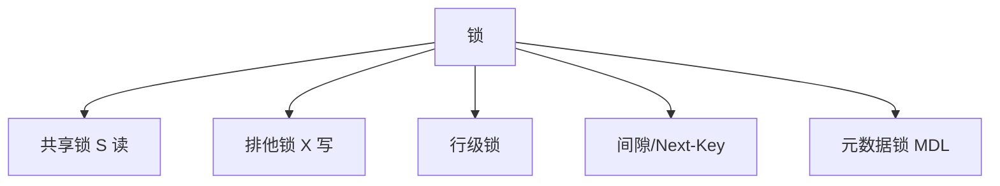
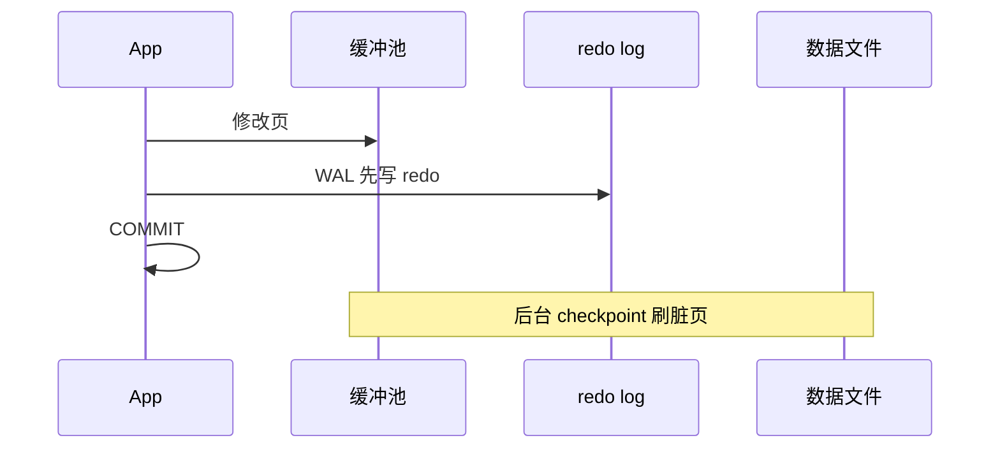

# 锁、日志与崩溃恢复

事务的 **A（原子）** 与 **D（持久）** 不靠「希望磁盘别坏」实现，而靠 **undo/redo 日志** 与 **两阶段锁** 等机制。线上死锁告警、`Lock wait timeout`、崩溃后仍能启动 — 都发生在这层。

---

## 锁的分类（InnoDB 视角）



| 锁 | 兼容 | 场景 |
|----|------|------|
| S | 与 S 兼容，与 X 冲突 | `LOCK IN SHARE MODE` |
| X | 与 S/X 都冲突 | `UPDATE`、`FOR UPDATE` |
| MDL | 保护表结构 | `ALTER TABLE` 与 DML 互斥 |

**意向锁**（IS/IX）：表级信号，加速行锁与表锁冲突判断。

---

## 两阶段锁（2PL）

| 阶段 | 行为 |
|------|------|
| 加锁 | 访问数据前加锁 |
| 解锁 | **事务结束**（commit/rollback）才释放 |

因此长事务持锁久 → 阻塞他人 → 死锁概率升。应用层应缩短事务、固定多表加锁顺序。

```sql
-- 查看 InnoDB 死锁（示例）
SHOW ENGINE INNODB STATUS;
-- 或 performance_schema / 错误日志
```

---

## redo log 与 undo log

| 日志 | 作用 | 类比 |
|------|------|------|
| **redo** | 已提交修改的物理/逻辑重做 | 施工日记：断电后接着干 |
| **undo** | 未提交或 MVCC 需要的旧版本 | 撤销栈 |



**WAL**：先顺序写 redo（快），数据页异步刷盘 — 提交只等 redo 落盘（`innodb_flush_log_at_trx_commit` 等可调）。

---

## 崩溃恢复流程


1. **Redo**：从 checkpoint 起重放已提交事务到数据页。  
2. **Undo**：对崩溃时仍活跃的事务，用 undo 回滚。

这与 04-事务与ACID 的 A/D 一一对应。

---

## checkpoint 与刷盘

| 概念 | 说明 |
|------|------|
| 脏页 | 内存中已改未刷盘的数据页 |
| checkpoint | 推进「已安全 redo 覆盖」的边界，回收 redo 空间 |
| doublewrite | 防部分页写入（InnoDB） |

调优属于 DBA 领域；全栈需知：**提交成功 ≠ 数据页已在磁盘**，但 redo 保证可恢复。

---

## binlog 与 redo 分工（MySQL）

| | redo | binlog |
|---|------|--------|
| 层级 | InnoDB 引擎 | Server 层 |
| 用途 | 崩溃恢复 | 主从复制、PITR |
| 格式 | 物理页/逻辑 | STATEMENT/ROW/MIXED |

**两阶段提交（2PC）**：commit 时 redo 与 binlog 一致写入，避免主从不一致。

---

## 全栈排障清单

| 症状 | 排查 |
|------|------|
| `Lock wait timeout` | 长事务、缺索引导致锁范围大 |
| 死锁 | 日志看谁持有什么；调整 SQL 顺序 |
| 主从延迟 | 大事务、单线程回放；读从库脏读窗口 |
| 磁盘满 | redo/binlog 未归档 |

---

## 日志轮转与磁盘空间

redo log 循环写、binlog 按策略滚动；磁盘满会导致无法提交或复制中断。

| 日志 | 典型路径 | 风险 |
|------|----------|------|
| redo | InnoDB 表空间旁 | checkpoint 推进慢则空间紧张 |
| binlog | `/var/lib/mysql` 等 | 未 purge 占满磁盘 |
| slow log | `/var/log/mysql/` | 排障后应归档 |

```bash
mysql -e "SHOW BINARY LOGS;"
du -sh /var/lib/mysql/binlog.*
```

配置 `binlog_expire_logs_seconds` 与磁盘告警；`logrotate` 可轮转应用慢日志，避免 `/var/log` 撑满。

---

## InnoDB 死锁后谁回滚

InnoDB 检测到死锁后，选**回滚代价较小**的事务（undo 量更少），另一事务继续。应用应捕获 `1213 Deadlock` 并重试，而非假定己方一定成功。

```sql
SHOW ENGINE INNODB STATUS\G  -- 查看最近一次死锁节选
```

应用层应对 `1213 Deadlock found` 做有限次指数退避重试；幂等键保证重试不会重复扣款。

---

## WAL 与提交顺序（为何先写日志）

```
  事务修改数据页（内存脏页）
        │
        ▼
  顺序写 redo log（WAL）
        │
        ▼
  fsync redo（COMMIT 等待点，可配置）
        │
        ▼
  返回客户端「提交成功」
        │
        ▼
  后台异步刷脏页到 .ibd
```

掉电时内存脏页丢失无妨 — 重启后 redo 重放已提交事务；未提交事务由 undo 回滚。这就是 **D 持久性** 与 **A 原子性** 的物理基础。

---

## 小结

行锁与 2PL 保证隔离下的写互斥；redo 实现持久性与崩溃重做，undo 实现回滚与 MVCC 旧版本；binlog 服务复制，与 redo 通过 2PC 对齐。

**易混点**：redo 是「重做提交」、undo 是「撤销未提交/多版本」；锁在索引上，全表扫描锁更多；MDL 与行锁不同层。

核对：为何 COMMIT 先写 redo 再慢慢刷数据页？死锁后 InnoDB 通常杀哪条事务？
