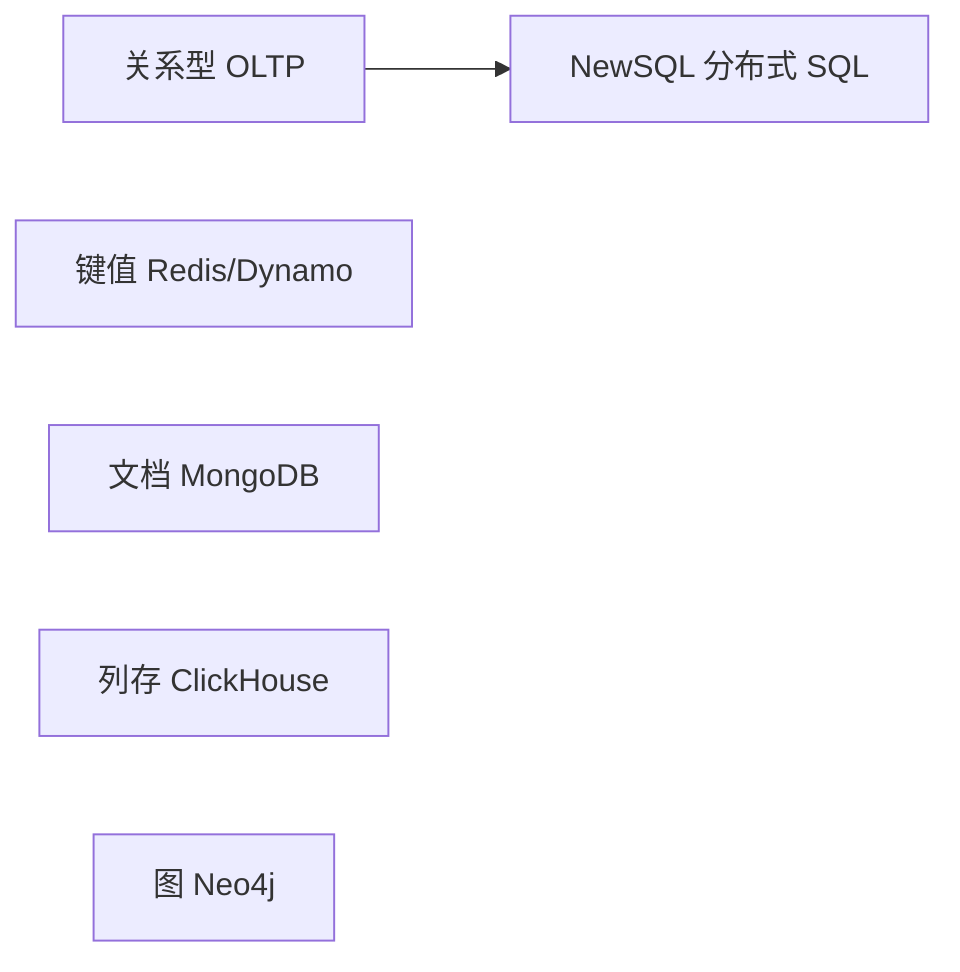
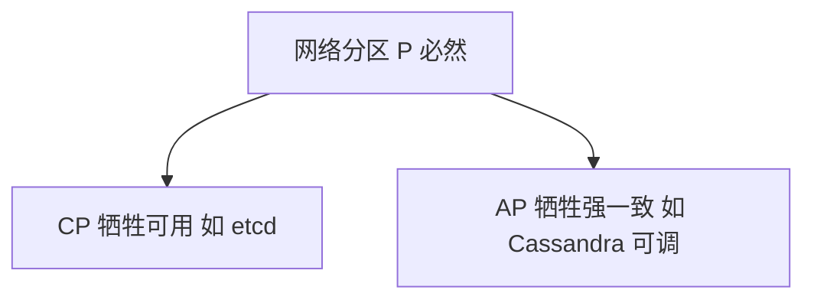
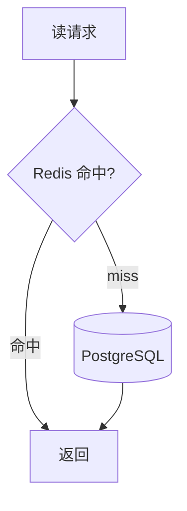

# NoSQL 与 NewSQL 选型

关系库不是唯一答案：会话缓存用 Redis、文档型配置用 MongoDB、分析用列存 — **NoSQL** 换模型换扩展路径；**NewSQL** 则在分布式上保留 SQL/事务。全栈选型要在 CAP、查询模式与运维成本间对齐，而非追标签。

---

## 数据存储谱系



| 类别 | 代表 | 强项 |
|------|------|------|
| 关系 OLTP | PostgreSQL、MySQL | 事务、复杂 JOIN、生态 |
| 键值 | Redis、etcd | 极低延迟、TTL、结构简单 |
| 文档 | MongoDB | 灵活 schema、嵌套 JSON |
| 宽列 | Cassandra、HBase | 写扩展、时序/日志 |
| 列存 OLAP | ClickHouse、BigQuery | 聚合扫描 |
| 图 | Neo4j | 多跳关系 |
| NewSQL | CockroachDB、TiDB | 水平扩展 + SQL/事务 |

---

## CAP 与 BASE（务实理解）

| 定理 | 含义 |
|------|------|
| **CAP** | 分区发生时只能在 C（一致）与 A（可用）间侧重 |
| **BASE** | 基本可用、软状态、最终一致 — 许多 NoSQL 的默认 |



前端常见 **最终一致**：点赞数、库存展示 — 需产品接受延迟；支付状态需强一致路径。

---

## 何时仍用关系库

| 信号 | 说明 |
|------|------|
| 多表 JOIN、FK | ER 清晰（见 01-关系模型） |
| 强事务 | 订单、账务 |
| 复杂报表 | 可先 OLTP + 只读副本 / ETL 到 OLAP |

单表 CRUD 微服务也可 PostgreSQL 走到底 — 不必为「微服务」强行 NoSQL。

---

## Redis：缓存 vs 存储

| 用法 | 注意 |
|------|------|
| 会话 / 热点读 | 设 TTL、防穿透/击穿/雪崩 |
| 分布式锁 | Redlock 争议；简单场景可用 DB 唯一键 |
| 队列 | Stream/List；严肃 MQ 用 Kafka 等 |
| 持久化 | RDB/AOF；**内存贵，非通用主库** |

Prisma + Redis 场景见 后端 05 · ORM/缓存。

---

## 文档库 MongoDB

| 适合 | 不适合 |
|------|--------|
| 嵌套文档、 schema 多变 | 跨文档复杂事务（已改善但仍弱于 PG） |
| 内容、配置、日志型 | 强 FK 网状模型 |

**嵌入 vs 引用**：一对少且常一起读 → 嵌入；一对多且独立增长 → 引用 + `$lookup` 或应用层聚合。

---

## NewSQL 与分库分表

| 路径 | 特点 |
|------|------|
| 应用分片 + MySQL | 路由键、跨片 JOIN 难 |
| TiDB/Cockroach | 透明扩展，兼容 SQL |
| Vitess | MySQL 中间件分片 |

全栈先优化单库（索引、读写分离）再谈分片 — 复杂度跃迁。

---

## 选型决策表（简版）

| 需求 | 倾向 |
|------|------|
| ACID 订单 | PostgreSQL / MySQL |
| 毫秒级会话 | Redis |
| 灵活 JSON 配置 | Mongo / PG JSONB |
| 亿级日志分析 | ClickHouse |
| 多跳社交关系 | 图库或多次 JOIN 权衡 |
| 全球多活强一致 | NewSQL 或 Spanner 类 |

```typescript
// 反模式：把 Redis 当唯一订单库且无 AOF
// 正模式：PG 落库 + Redis 缓存订单详情，失效策略明确
```

---

## 缓存三件套：穿透、击穿、雪崩

| 问题 | 现象 | 常见对策 |
|------|------|----------|
| **穿透** | 查不存在 key，每次都打 DB | 布隆过滤器、空值短 TTL 缓存 |
| **击穿** | 热点 key 过期瞬间并发打穿 DB | 互斥锁、逻辑过期异步刷新 |
| **雪崩** | 大量 key 同时过期 | TTL 加随机抖动、多级缓存 |



Cache-Aside：应用先读缓存，miss 再读 DB 并回填 — 写路径先写 DB 再删缓存，避免双写不一致。

---

## PostgreSQL JSONB vs 独立 Mongo

| 维度 | PG JSONB | MongoDB |
|------|----------|---------|
| 事务 | 与关系表同一事务 | 多文档事务有，生态偏文档 |
| 查询 | SQL + GIN 索引 | 聚合管道 |
| 运维 | 已有 PG 栈则零新增 | 多一套集群 |
| 适合 | 配置、扩展字段、与订单同库 | 独立内容域、schema 剧烈变化 |

「要不要上 Mongo」先问：是否需要与订单行**同一 ACID 事务** — 若要，JSONB 常更省事。

---

## 小结

NoSQL 按访问模式优化扩展与模型；NewSQL 补分布式 SQL；多数全栈业务仍以 PostgreSQL/MySQL 为主库，Redis 作缓存，分析 workload 再引入列存或数仓。

**易混点**：NoSQL ≠ 不要 schema；CAP 指分区下的权衡非三选二全丢；Mongo 嵌入过深会导致文档膨胀与写放大。

核对：购物车放 Redis 还是 DB？何时 JSONB 优于 Mongo 独立部署？
