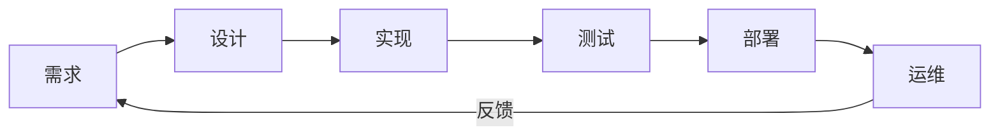
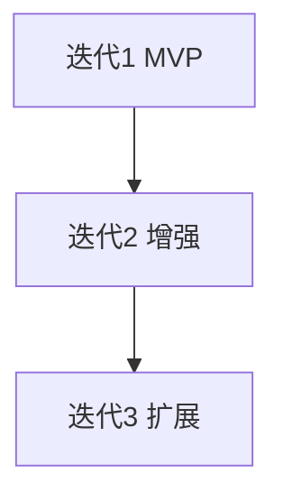
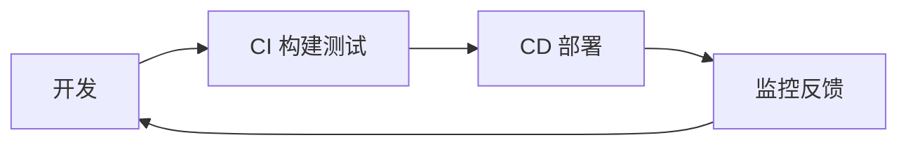
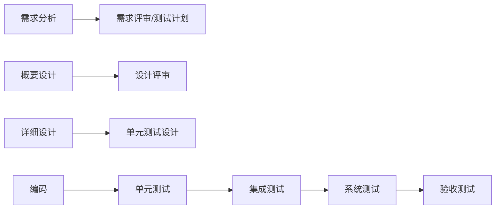

# 软件生命周期与开发模型

软件从想法到下线不是「写完代码就结束」，而是一串可重复的**生命周期**活动：需求、设计、实现、测试、发布、运维。**开发模型**决定这些活动如何排期、如何反馈 — 前端/全栈在敏捷迭代里日常接触的 Sprint、CI，都植根于此。

---

## 经典生命周期（SDLC）

| 阶段 | 产出（示例） | 全栈触点 |
|------|--------------|----------|
| 需求 | 用户故事、验收标准 | PRD、接口契约 |
| 设计 | 架构草图、API | OpenAPI、ER 图 |
| 实现 | 代码、迁移 | Feature 分支 |
| 测试 | 用例、报告 | 见 05-测试分类 |
| 部署 | 流水线、回滚 | 工程化 05 · CI/CD |
| 运维 | 监控、告警 | SLO、on-call |

---

## 瀑布模型

| 特点 | 适用 |
|------|------|
| 阶段串行、文档重、变更贵 | 监管强、需求极稳定（部分嵌入式、政务） |
| 风险后置 | 不适合需求频繁变的互联网产品 |

前端较少纯瀑布，但**合同项目**仍可能「设计冻结 → 开发 → 验收」。

---

## 迭代与增量

| 概念 | 含义 |
|------|------|
| **增量** | 每次交付可用子集（先登录，后支付） |
| **迭代** | 重复「计划-构建-评审」环，逐步完善 |

与「大 bang 发布一年一次」相对 — 现代 Web 偏小步快跑。

---

## 敏捷（Agile）核心

| 价值观（摘要） | 实践 |
|----------------|------|
| 个体与互动 > 流程与工具 | 站会、结对 |
| 可工作软件 > 详尽文档 | 可演示增量 |
| 客户协作 > 合同谈判 | PO 排优先级 |
| 响应变化 > 遵循计划 | 短周期调整 |

**Scrum**（常见）：

| 元素 | 说明 |
|------|------|
| Sprint | 固定长度迭代（常 2 周） |
| Product Backlog | 优先级需求池 |
| Definition of Done | 完成标准含测试、Review |
| 仪式 | 计划会、每日站会、评审、回顾 |

Kanban：可视化 WIP、限制在制品 — 适合运维与支持队列。

---

## DevOps 与持续交付

| 实践 | 目标 |
|------|------|
| 主干/短分支 | 减少集成地狱 |
| 自动化测试 | 快速反馈 |
| 特性开关 | 未完成代码可合入但不暴露 |
| 可观测性 | 发布与回滚有据 |

全栈常身兼「前端 + BFF + 部署脚本」— DevOps 不是专属运维岗位，而是**缩短从 commit 到用户的距离**。

---

## 模型选型（务实）

| 情境 | 倾向 |
|------|------|
| 创业 MVP | 敏捷 + 极简文档 |
| 多端大团队 | Scrum + 架构决策记录 ADR |
| 强合规 | 瀑布/ V 模型 + 审计痕迹 |
| 开源社区 | 迭代 + RFC 流程 |

没有银弹 — **混合**常见：对外里程碑像瀑布，对内 Sprint 像敏捷。

---

## 与前端特有的节奏

| 话题 | 说明 |
|------|------|
| 设计稿冻结 | 与组件库、设计系统版本对齐 |
| 联调窗口 | 契约先行（Mock / OpenAPI） |
| 版本发布 | 静态资源缓存与灰度 |
| 技术债 | 见 06-技术债务 |

---

## V 模型与验证

瀑布的变体：**每阶段有对应验证**，测试计划前置而非开发结束后才补。

| 对比敏捷 | V 模型 |
|----------|--------|
| 文档与里程碑 | 更重，变更成本高 |
| 测试介入 | 各阶段同步规划 |
| 适用 | 航空、医疗、强合规交付 |

互联网产品多数走敏捷，但**上线 checklist**（冒烟、回滚预案）仍吸收 V 模型「验证关口」思想。

---

## 小结

SDLC 覆盖从需求到运维的闭环；瀑布重前期、敏捷重短周期反馈、DevOps 打通构建与运行 — 互联网全栈多在敏捷 + CI/CD 语境下协作。

**易混点**：敏捷 ≠ 无文档；迭代 ≠ 无计划；MVP ≠ 可忽略质量（DoD 仍要守）。

核对：Scrum 中 Sprint 与发布的区别？DevOps 解决的是「开发 vs 运维对立」还是替代敏捷？
