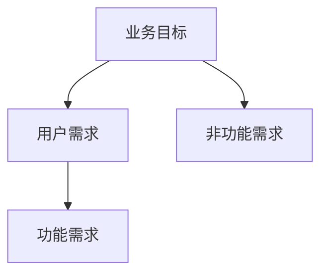
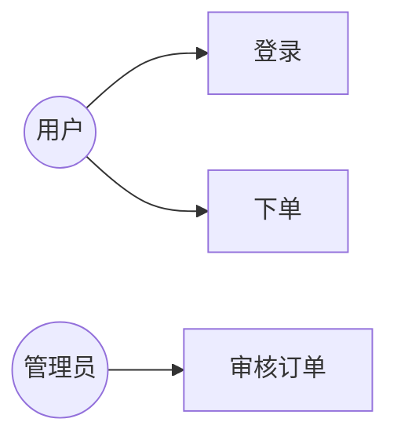
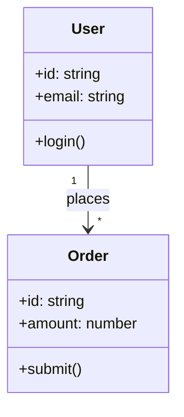
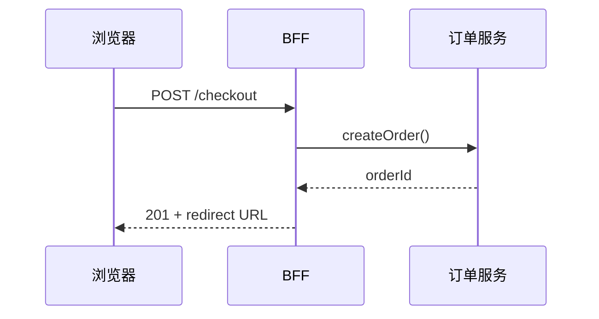

# 需求分析与 UML 入门

接口字段对不上、状态机漏分支，往往根因是**需求未结构化**而非代码能力。**需求分析**把模糊目标变成可验证的用例与模型；**UML** 提供跨角色（产品、前端、后端）的图形词汇 — 不必画全套图，但用例图、类图、时序图应能读懂与手绘。

---

## 需求层次



| 类型 | 例子 | 测试关联 |
|------|------|----------|
| 功能 | 「用户可重置密码」 | 验收用例 |
| 非功能 | 「P99 < 200ms」 | 性能测试 |
| 约束 | 「必须 HTTPS」 | 安全扫描 |

非功能详见 05-测试分类与质量属性。

---

## 用例（Use Case）

| 要素 | 说明 |
|------|------|
| 参与者 Actor | 人、外部系统 |
| 用例 | 系统对外可见的能力 |
| 主成功场景 | Happy path 步骤 |
| 扩展 | 异常、分支 |



**用户故事**模板：`As a <角色>, I want <能力>, so that <价值>` — 敏捷 backlog 常用，与用例互补（故事偏优先级，用例偏步骤）。

---

## 类图（静态结构）



| 关系 | 含义 | 代码近似 |
|------|------|----------|
| 关联 | 引用 | 字段持有对象 |
| 聚合 | 整体-部分，部分可独立 | `team.members` |
| 组合 | 生命周期绑定 | `order.items` 同删 |
| 继承 | is-a | `class Admin extends User` |
| 依赖 | 临时使用 | 方法参数 |

前端 TS：`interface` 与类图属性对应；**组合关系**影响是否嵌套 state 还是 ID 引用。

---

## 时序图（动态交互）



| 用途 | 全栈场景 |
|------|----------|
| 理清调用链 | 登录 OAuth、支付回调 |
| 发现缺失步骤 | 幂等、错误码 |
| 联调契约 | 与 OpenAPI 对齐 |

活动图/状态图：订单 `pending → paid → shipped` — 前端路由守卫与按钮可用性依赖状态机。

---

## 从需求到任务拆分

| 步骤 | 产出 |
|------|------|
| 用例 → API | REST/GraphQL 端点列表 |
| 类图 → 模块 | 包/目录边界 |
| 时序 → 集成测试 | E2E 脚本骨架 |
| 原型 → 组件树 | Figma ↔ Storybook |

```typescript
// 需求「仅本人可读订单」→ 验收标准
// Given 用户 A 登录 When GET /orders/123 且归属 B Then 403
```

---

## 需求陷阱（前端常见）

| 陷阱 | 后果 |
|------|------|
| 隐含规则未写 | 「列表默认按时间倒序」遗漏 |
| 边界未定义 | 空态、超长文本、并发提交 |
| 角色混淆 | 访客 vs 登录 vs 管理员 |
| 只画 UI 不画数据 | 联调时字段对不上 |

**INVEST** 检查用户故事：Independent、Negotiable、Valuable、Estimable、Small、Testable。

---

## 工具与粒度

| 工具 | 适用 |
|------|------|
| Excalidraw / draw.io | 轻量协作 |
| PlantUML / Mermaid | 文档即代码（本库风格） |
| Figma + 注释 | 视觉需求 |

不必为 CRUD 页画完整 UML — **关键路径、复杂状态、跨服务** 才值得建模。

---

## 小结

需求分功能与非功能；用例描述系统能力与步骤，类图描述结构，时序图描述交互 — 三者支撑 API 设计与联调，减少返工。

**易混点**：类图继承 vs 实现接口；聚合 vs 组合生命周期；用户故事不是不用 acceptance criteria。

核对：下单用例应写哪些扩展场景？类图中 Order–OrderLine 用组合还是聚合？
