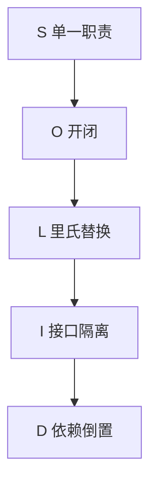
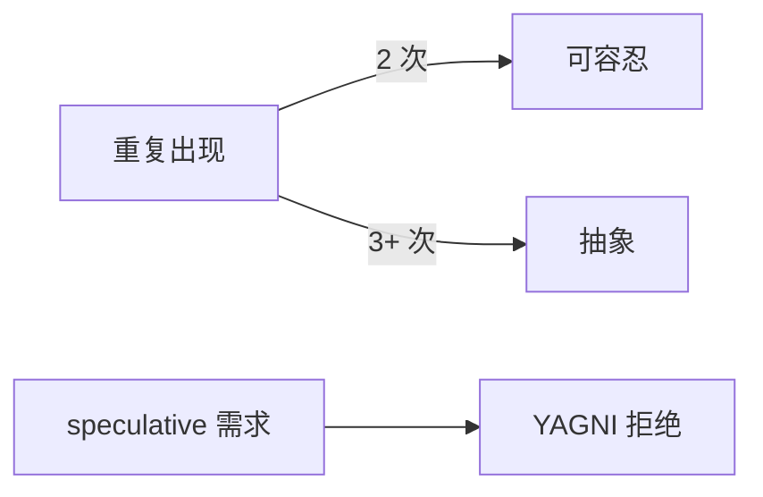
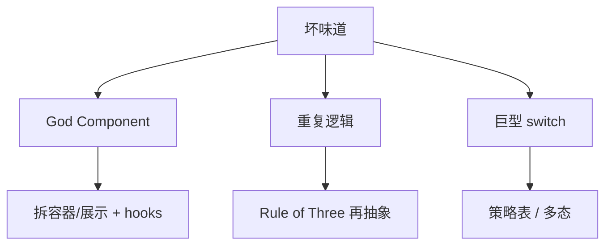

# 设计原则

代码能跑不等于易扩展。**设计原则**是多年工程教训的压缩：SOLID 约束类与模块职责，DRY/YAGNI/KISS 约束重复与范围 — React 组件拆分、Node 服务分层、API 边界都直接受益。

---

## SOLID 一览



| 原则 | 一句话 | 前端/全栈例 |
|------|--------|-------------|
| **S** Single Responsibility | 一类因一种原因而变 | `UserAvatar` 不兼管 fetch |
| **O** Open/Closed | 对扩展开、对修改关 | 策略模式换支付方式 |
| **L** Liskov Substitution | 子类型可替换父类型 | 子组件不破坏父组件契约 |
| **I** Interface Segregation | 接口小而专 | 拆分 `Readable`/`Writable` |
| **D** Dependency Inversion | 依赖抽象非具体 | 注入 `PaymentGateway` 接口 |

---

## S：单一职责

| 坏味道 | 改进 |
|--------|------|
| God Component 千行 | 容器/展示分离、hooks 抽逻辑 |
| `utils.ts` 万能 | 按域分 `date/`、`api/` |
| Route 里写 SQL | Controller → Service → Repository |

```typescript
// 展示组件：只负责 UI
function OrderSummary({ order }: { order: Order }) {
  return <dl>{/* … */}</dl>;
}

// 容器：数据与副作用
function OrderPage() {
  const { data } = useOrder(id);
  return data ? <OrderSummary order={data} /> : <Skeleton />;
}
```

---

## O：开闭

```typescript
type Notifier = { send(msg: string): Promise<void> };

const notifiers: Record<string, Notifier> = {
  email: emailNotifier,
  sms: smsNotifier,
};

// 新增渠道：加 notifiers 条目，不改 dispatch 核心
async function dispatch(channel: string, msg: string) {
  await notifiers[channel].send(msg);
}
```

插件架构、Webpack loader、Express 中间件链同属 O 思想。

---

## L / I / D 简例

| 原则 | 反例 | 正例 |
|------|------|------|
| L | 子类 `Square` 改 `setWidth` 破坏矩形语义 | 组合优于强继承 |
| I | `Animal` 强迫 `Fish.fly()` | `Flyable` 小接口 |
| D | Service 内 `new MySQLRepo()` | 构造函数注入 `Repo` 接口 |

```typescript
interface OrderRepo {
  save(order: Order): Promise<void>;
}

class OrderService {
  constructor(private repo: OrderRepo) {}
}
```

测试时注入内存 Fake — 见 05-测试分类 与 工程化 13 · 测试方法论。

---

## DRY、YAGNI、KISS

| 缩写 | 含义 | 平衡 |
|------|------|------|
| **DRY** | 不要重复知识 | 重复三次再抽象，避免 premature abstraction |
| **YAGNI** | 不做当前不需要的 | 不为「万一」加微服务 |
| **KISS** | 保持简单 | 能表驱动就不上 DSL 框架 |



**Rule of Three**：两次相似可复制，第三次再抽 — 与组件库沉淀节奏一致。

---

## 与架构风格的关系

原则指导**模块内**；04-架构风格 指导**模块间** — MVC、分层、六边形不矛盾，而是不同粒度。

| 层级 | 适用原则 |
|------|----------|
| 函数/组件 | SRP、KISS |
| 包/服务 | DIP、ISP |
| 系统 | OCP（扩展新服务） |

---

## 代码审查时可问

| 问题 | 对应原则 |
|------|----------|
| 这个类有几种修改理由？ | S |
| 加新类型要改几处 switch？ | O |
| Mock 是否必须继承具体类？ | D |
| 接口是否有未实现方法？ | I |

---

## 反模式速查

| 反模式 | 违背 | 前端/全栈例 |
|--------|------|-------------|
| God Object | S | 一个 `AppService` 管用户+订单+支付 |
| Shotgun Surgery | S/O | 改一个字段要动 20 个文件 |
| Switch 爆炸 | O | 每加支付方式改巨型 `switch` |
| 过度抽象 | YAGNI/KISS | 三层 Repository 包 CRUD |
| 继承滥用 | L | 深继承树组件 |



重构时先消除**重复知识**（同一业务规则散落多处），再谈抽象接口 — DRY 针对的是语义重复，不是禁止两行相似代码。

---

## 小结

SOLID 让模块职责清晰、依赖可替换；DRY/YAGNI/KISS 控制抽象时机与复杂度 — 日常 refactor 与 PR review 的共用词汇表。

**易混点**：DRY ≠ 禁止任何重复代码行（语义重复才危险）；YAGNI ≠ 不写测试；DIP 在 JS 里靠接口/type + 注入，非只有 IoC 容器。

核对：`useOrder` hook 算 SRP 吗？为「可能换 DB」抽象三层 Repository 是否 YAGNI？
