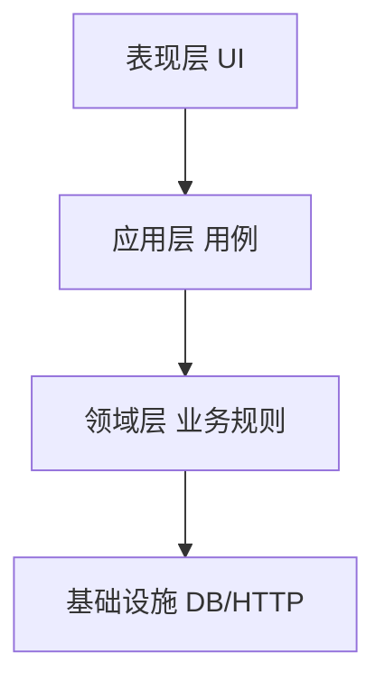
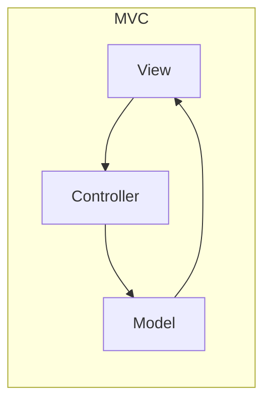
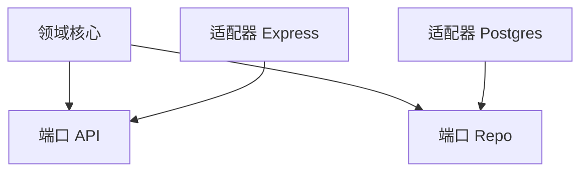
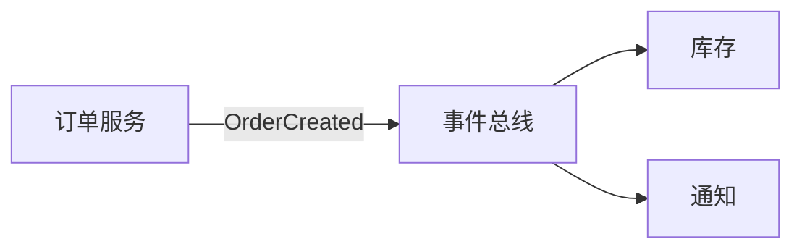
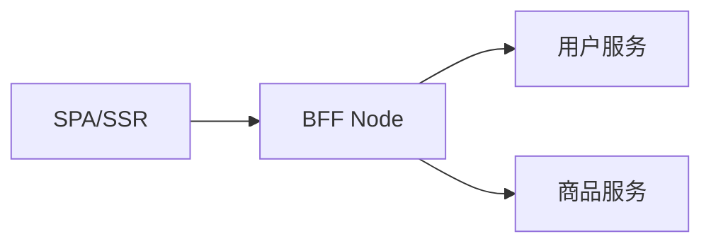

# 架构风格

**架构风格**是模块如何划分、如何通信的惯用模式 — 不替代具体框架，但解释为何 React 应用常分「页面 / hooks / api」，Node 服务常分「路由 / 服务 / 仓储」。选对风格降低耦合并明确边界。

---

## 分层架构（Layered）

| 层 | 职责 | 全栈例 |
|----|------|--------|
| 表现 | 渲染、输入 | React 组件 |
| 应用 | 编排用例 | `checkout()` 调多 repo |
| 领域 | 实体、规则 | `Order.canCancel()` |
| 基础设施 | 持久化、第三方 | Prisma、axios |

**规则**：依赖向下 — UI 不直接 import SQL。小项目可合并应用+领域，但**禁止** UI 直连 DB。

---

## MVC / MVP / MVVM

| 模式 | 数据流 | 代表 |
|------|--------|------|
| **MVC** | Controller 更新 Model，View 观察 | 经典服务端模板 |
| **MVP** | Presenter 中介 | 部分 Android |
| **MVVM** | View 绑定 ViewModel | Vue、WPF |

React 官方不称 MVC，但 **Container + hooks + 纯组件** 接近「Controller/Presenter + View」；Vue 的 `ref/computed` 更接近 MVVM 双向绑定语义。

---

## 六边形 / 端口适配器

| 概念 | 作用 |
|------|------|
| 端口 | 核心定义的接口 |
| 适配器 | HTTP、DB、消息队列实现 |

换 Express → Fastify 只换外层适配器，领域测试仍跑内存适配器 — 与 03-设计原则 的 DIP 一致。

---

## 事件驱动架构（EDA）

| 优点 | 代价 |
|------|------|
| 解耦、易扩展消费者 | 最终一致、调试链路过长 |
| 削峰 |  schema 演进、死信队列 |

前端侧：**浏览器 CustomEvent**、**Redux 中间件**、**SSE/WebSocket** 推送都是局部事件驱动；微服务间常用 Kafka/RabbitMQ。

---

## 微服务 vs 模块化单体

| | 模块化单体 | 微服务 |
|---|------------|--------|
| 部署 | 一个（或少量）产物 | 多独立服务 |
| 边界 | 包/模块 + 类型 | 网络 + 契约 |
| 事务 | 本地 ACID | 分布式 Saga |
| 适用 | 中小团队、域未清晰 | 大团队、独立扩展 |

**先模块化单体，后按需拆** — 过早微服务放大运维与分布式事务成本。BFF 模式见 后端 04 · BFF。

---

## 前后端分离与 BFF

| 层 | 职责 |
|----|------|
| 前端 | UI 状态、路由、客户端校验 |
| BFF | 聚合接口、鉴权 cookie、裁剪 DTO |
| 后端 | 领域服务、数据库 |

避免前端直连十个微服务 — 协议与鉴权爆炸。

---

## 其他风格（速览）

| 风格 | 场景 |
|------|------|
| CQRS | 读写模型分离、复杂域 |
| Serverless | 事件触发、弹性计费 |
| 管道-过滤器 | 构建链、ETL |
| 微前端 | 多团队独立部署 UI — 工程化 09 |

---

## 选型提示

| 信号 | 倾向 |
|------|------|
| 团队 < 10、域耦合 | 分层单体 + BFF |
| 读远大于写 | CQRS + 缓存 |
| 异步通知多 | EDA |
| 多团队同页面 | 微前端 |

架构决策宜写 **ADR**（Architecture Decision Record）：背景、决策、后果 — 便于后人知「为何不用 Redux 全局事件总线」。

---

## 小结

分层与 MVC/MVVM 组织 UI 与业务；六边形用端口适配器隔离基础设施；事件驱动与微服务解决扩展与解耦，但引入分布式复杂度 — 全栈常见「前端 + BFF + 单体/少量服务」。

**易混点**：微服务 ≠ 多个 npm 包；BFF 不是「把 SQL 写进 Node」；EDA 同步调用仍可能存在（发事件前先写库）。

核对：React hooks 分层对应哪几层？何时 BFF 优于前端直连微服务？
