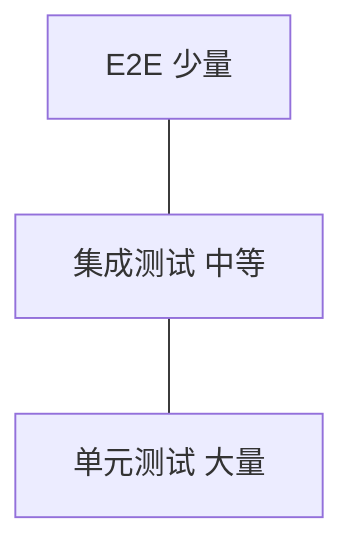
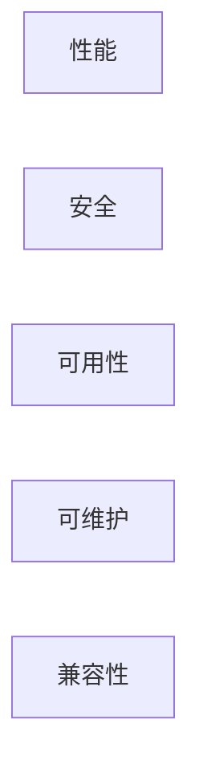
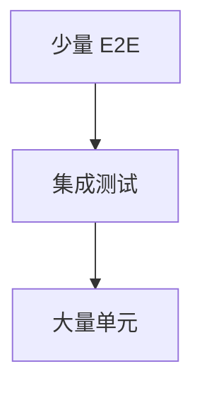
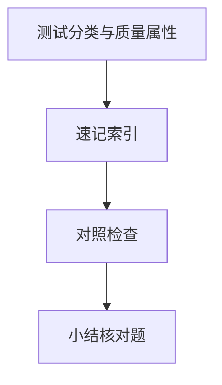

# 测试分类与质量属性

「能手动点通」无法支撑重构与 CI。**测试金字塔**与**质量属性**（性能、安全、可用）定义何为「完成」 — 前端 Jest/Vitest、Playwright 与后端接口测试都落在这套分类里；实操深度见 工程化 13 · 前端测试方法论。

---

## 测试金字塔



| 层级 | 范围 | 速度 | 工具例 |
|------|------|------|--------|
| **单元** | 函数、组件、纯逻辑 | 快 | Vitest、RTL |
| **集成** | 多模块、API+DB | 中 | Supertest + test DB |
| **E2E** | 真浏览器全链路 | 慢 | Playwright、Cypress |
| **契约** | 消费者/提供者 API | 中 | Pact |

**反模式**：冰淇淋锥（E2E 过多）— CI 慢、flake 多。

---

## 按意图分类

| 类型 | 目的 |
|------|------|
| 功能测试 | 行为符合需求 |
| 回归测试 | 旧 bug 不再现 |
| 冒烟测试 | 部署后主干路径可用 |
| 探索测试 | 人脑补边界 |

```typescript
// 单元：纯函数
expect(calcDiscount(100, 'VIP')).toBe(80);

// 组件：RTL
render(<Button disabled />);
expect(screen.getByRole('button')).toBeDisabled();
```

---

## 测试替身（Test Double）

| 替身 | 作用 |
|------|------|
| Stub | 固定返回值 |
| Mock | 验证调用 |
| Fake | 可工作简化实现（内存 DB） |
| Spy | 记录真实对象调用 |

与 03-设计原则 的依赖注入配合 — 测 Service 时 Fake `OrderRepo`。

---

## 非功能需求（质量属性）



| 属性 | 指标/手段 | 全栈触点 |
|------|-----------|----------|
| **性能** | P95 延迟、LCP | Lighthouse、k6 |
| **安全** | OWASP Top 10 | 工程化 07 · 安全 |
| **可用性** | SLO、错误预算 | 监控告警 |
| **可维护** | 覆盖率、复杂度 | ESLint、Sonar |
| **可访问** | WCAG | axe、手动键盘 |

工程化 04 · 质量保障 覆盖 lint、类型检查在流水线中的位置。

---

## 前端特有测试点

| 场景 | 建议 |
|------|------|
| 组件 | RTL 测行为非实现细节 |
| Hooks | `@testing-library/react-hooks` 或 renderHook |
| 路由 | MemoryRouter 包裹 |
| API | MSW mock 网络 |
| 视觉 | Storybook + 可选快照/Chromatic |
| a11y | `jest-axe` |

**不测**：第三方库内部、CSS 像素级（除非设计系统契约）。

---

## 后端 / 全栈接口测试

```typescript
// Supertest 概念
const res = await request(app).post('/api/orders').send(payload);
expect(res.status).toBe(201);
```

| 实践 | 说明 |
|------|------|
| test 容器 DB | 迁移后跑集成测 |
| 固定时钟 | 测过期 token |
| 幂等 | 重复 POST 期望 |

数据库事务原理不影响「测什么」，但集成测需 **rollback 或 truncate** 保隔离 — 见 06-数据库 · 事务。

---

## 覆盖率与 DoD

| 指标 | 误用 |
|------|------|
| 行覆盖 80% | 只 assert true |
| 分支覆盖 | 忽略边界 |

**Definition of Done** 应含：关键路径测试绿、无 P0 lint、文档/API 变更同步。

---

## 测试左移与 CI 门禁


| 门禁 | 目的 |
|------|------|
| `eslint ，max-warnings 0` | 风格与常见 bug |
| `tsc ，noEmit` | 类型回归 |
| Vitest 单元 | 快反馈，PR 必过 |
| Playwright 冒烟 | 部署后 checkout 等主路径 |

**左移**：在 PR 阶段跑集成测，比上线后 E2E 才发现 DB 迁移错误成本低一个数量级。flake 测试应修或隔离，而非 `--passWithNoTests` 糊弄。

---

## 快照、契约与视觉回归

| 类型 | 测什么 | 注意 |
|------|--------|------|
| Jest 快照 | 组件树、序列化输出 | 有意更新用 `-u`，防无脑通过 |
| 视觉回归 | 像素/布局 diff | Chromatic、Percy，容忍抗锯齿差异 |
| API 契约 | 请求/响应形状 | Pact、OpenAPI diff |

```typescript
// MSW：集成测层 mock HTTP，不测 fetch 实现
import { setupServer } from 'msw/node';
const server = setupServer(/* handlers */);
beforeAll(() => server.listen());
afterEach(() => server.resetHandlers());
```

契约测在**消费者仓库**跑，可先于提供者发版发现破坏性变更 — 与 02-HTTP与API设计 的 versioning 配合。

---

## 非功能测试手段



| 属性 | 可测手段 |
|------|----------|
| 性能 | Lighthouse、k6 |
| 安全 | SAST、依赖扫描 |
| 可用 | 混沌、故障注入 |

## 契约测试

微服务 consumer-driven contract — Pact 等保证 API 形状；比端到端快、比单元更接近集成。

快照测试适合 UI 组件回归；语义变更需人工 review snapshot diff。
---

## 速记索引

| 小节 | 复习方式 |
|------|----------|
| 测试左移与 CI 门禁 | 复述定义 + 举一个前端相关例子 |
| 快照、契约与视觉回归 | 复述定义 + 举一个前端相关例子 |
| 测试金字塔 | 复述定义 + 举一个前端相关例子 |
| 契约测试 | 复述定义 + 举一个前端相关例子 |

## 对照检查

| 维度 | 自检 |
|------|------|
| 测试左移与 CI 门禁 易错 | 对照上文「易混点」或表格中的对比项 |
| 快照、契约与视觉回归 易错 | 对照上文「易混点」或表格中的对比项 |
| 测试金字塔 易错 | 对照上文「易混点」或表格中的对比项 |
| 契约测试 易错 | 对照上文「易混点」或表格中的对比项 |



本节目标：离开文档仍能解释 **测试分类与质量属性** 的核心机制，并能在浏览器、Node 或工程排障中指认对应现象。
## 小结

单元打底、集成验证协作、E2E 守主干；质量属性把性能与安全纳入「完成」标准 — 与 CI 门禁和工程化 13 的工具体系衔接。

**易混点**：集成测 vs E2E（是否真浏览器）；Mock 过度导致测与生产脱节；覆盖率是手段非目标。

核对：应用 MSW 的组件测算哪一层？订单集成测为何要隔离数据库？
