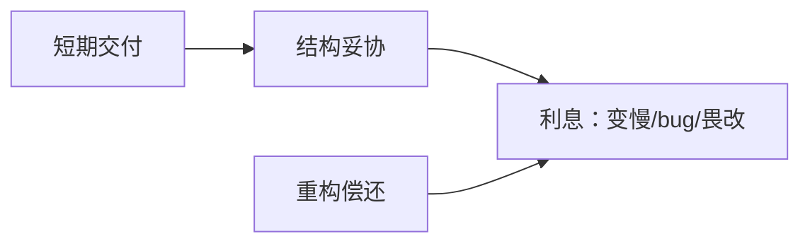
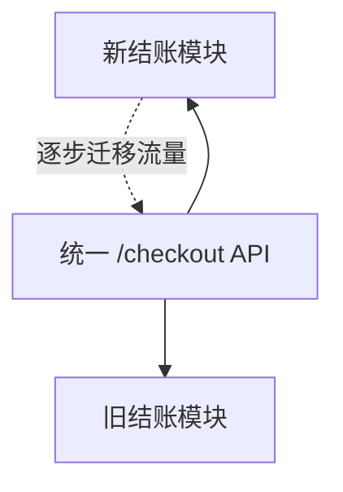
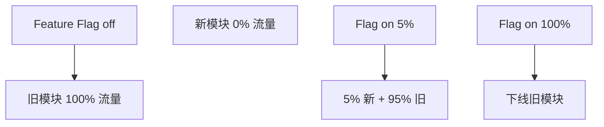
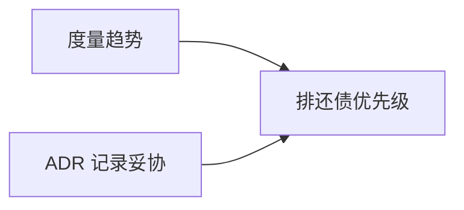
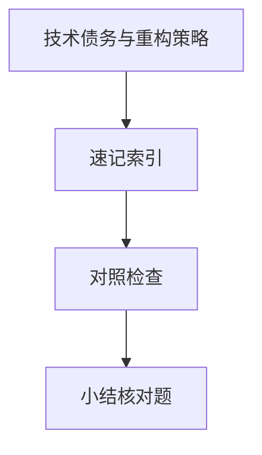

# 技术债务与重构策略

为赶上线留下的「临时方案」会复利计息 — **技术债务**是换取短期速度而欠下的维护成本。**重构**在不改外部行为的前提下改善结构；识别债务、排优先级、小步偿还，比「大爆炸重写」更适合持续交付的前端/全栈团队。

---

## 什么是技术债务



| 类型 | 例 |
|------|-----|
| 代码债务 | 重复、God 文件、无类型 |
| 架构债务 | 单体里藏微服务边界 |
| 测试债务 | 无回归、flake E2E |
| 文档债务 | API 与实现不一致 |
| 基础设施债务 | Node 14、过期依赖 |

**有意债务**（文档化、有偿还计划）优于**无意腐化**。

---

## 识别信号

| 信号 | 含义 |
|------|------|
| 改一行崩三处 | 耦合高 |
| 新人一周不敢动 | 缺测试与文档 |
| 依赖 CVE 堆积 | 升级恐惧 |
| 同样 bug 反复 | 未修根因 |
| 构建 > 10min | 工具链债务 |

静态分析：ESLint complexity、Sonar 重复率、依赖 `npm audit`。

---

## 重构 vs 重写

| | 重构 | 重写 |
|---|------|------|
| 行为 | 保持不变（有测试护航） | 可能变 |
| 风险 | 可控、可增量 | 高、周期长 |
| 适用 | 主干仍可用 | 技术栈死局、域模型错误 |

**Strangler Fig（绞杀者）**：新模块包旧接口，逐步替换 — 微前端、新 BFF 路由常用手法。



---

## 重构手法（Martin Fowler 精选）

| 手法 | 场景 |
|------|------|
| 提取函数/组件 | 长函数、重复 JSX |
| 搬移函数 | 错层调用 |
| 以多态取代条件 | 巨大 switch |
| 引入参数对象 | 参数过多 |
| 分离查询与修改 | CQRS 轻量版 |

```typescript
// 提取前：组件内混杂 fetch + 格式化
// 提取后：useOrder(id) + OrderView
```

**前提**：有测试或能手动验证的关键路径 — 见 05-测试分类。

---

## 童子军规则与偿还策略

| 规则 | 说明 |
|------|------|
| **童子军** | 离开代码比来时干净一点 |
| **20% 时间** | 迭代留容量还债（理想态） |
| **债随特性** | 动到旧模块时顺带小 refactor |
| **禁止** | 无测试大改、与功能混杂无 review |

| 优先级 | 还什么 |
|--------|--------|
| P0 | 安全、数据正确性 |
| P1 | 阻塞发布的构建/测试 |
| P2 | 高频变更区的耦合 |
| P3 | 美观、命名 |

---

## 与产品协作

| 沟通 | 说法 |
|------|------|
| 勿只说「要重构」 | 「此模块改需求从 3 天→0.5 天，需 2 天整理测试」 |
| 可视化利息 | 缺陷率、lead time 趋势 |
| ADR | 记录「为何暂用 any」与偿还条件 |

YAGNI 与还债平衡：**不为假想未来抽象**，但**已产生的重复**要还。

---

## 依赖升级

| 策略 | 说明 |
|------|------|
| Renovate/Dependabot | 小版本自动 PR |
| 大版本 | 专 Sprint、读 migration guide |
| lockfile | CI 可复现 |

Monorepo 升级见 工程化 01 · 包管理。

---

## 重构安全网：特征开关与分支

| 手段 | 作用 |
|------|------|
| Feature Flag | 新实现与旧实现并行，流量可回切 |
| 绞杀者 Facade | 对外 API 不变，内部逐步替换 |
| 金丝雀发布 | 小流量验证再全量 |



无测试的大 refactor 应拆成：**补关键路径测 → 小步提取 → 每步可发布**。童子军规则适合「路过顺手整理」，不适合「整库换架构 overnight」。

---

## 债务度量（让利息可见）

| 指标 | 工具/来源 | 解读 |
|------|-----------|------|
| 圈复杂度 | ESLint `complexity` | 单函数分支过多 |
| 重复率 | Sonar、jscpd | 拷贝粘贴区优先提取 |
| 变更失败率 | DORA、部署记录 | 某模块反复回滚 |
| 依赖陈旧度 | `npm outdated`、Renovate PR 积压 | 升级恐惧 |
| MTTR / Lead Time | 工单系统 | 改同一域越来越慢 |



与产品对齐时，用**趋势图**比「代码很烂」更有说服力：「结账模块过去两季缺陷占 40%，建议本迭代 2 人日补测试 + 提取 `useCheckout`」。

---

## 重构安全网

| 步骤 | 说明 |
|------|------|
| 加测试 | 覆盖关键路径 |
| 小步提交 | 行为不变 |
| 特性开关 | 灰度切换 |
| 度量 | 复杂度、覆盖率 |

「大爆炸重写」风险高；绞杀者模式逐步替换旧模块。
## 识别债务

Sonar 复杂度、重复率、覆盖率趋势；PR 里「临时 hack」注释是债务信号。

Boy Scout Rule：路过时略改善 — 比专门「债务 sprint」更易持续。
---

## 速记索引

| 小节 | 复习方式 |
|------|----------|
| 重构安全网：特征开关与分支 | 复述定义 + 举一个前端相关例子 |
| 债务度量（让利息可见） | 复述定义 + 举一个前端相关例子 |
| 重构安全网 | 复述定义 + 举一个前端相关例子 |
| 识别债务 | 复述定义 + 举一个前端相关例子 |

## 对照检查

| 维度 | 自检 |
|------|------|
| 重构安全网：特征开关与分支 易错 | 对照上文「易混点」或表格中的对比项 |
| 债务度量（让利息可见） 易错 | 对照上文「易混点」或表格中的对比项 |
| 重构安全网 易错 | 对照上文「易混点」或表格中的对比项 |
| 识别债务 易错 | 对照上文「易混点」或表格中的对比项 |



本节目标：离开文档仍能解释 **技术债务与重构策略** 的核心机制，并能在浏览器、Node 或工程排障中指认对应现象。
## 小结

技术债务是未偿还的设计妥协；用测试保护的小步重构优于长期搁置或全面重写；童子军规则与「动则修」让债务可管理。

**易混点**：重构 ≠ 加功能；重写 ≠ 重构；有意的 hack 若文档化仍是债务但可控。

核对：绞杀者模式如何降低重写风险？无测试时应先补测还是先 refactor？
