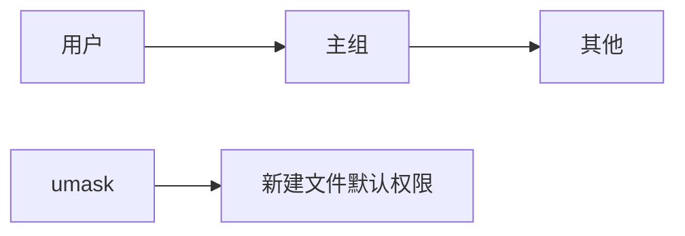
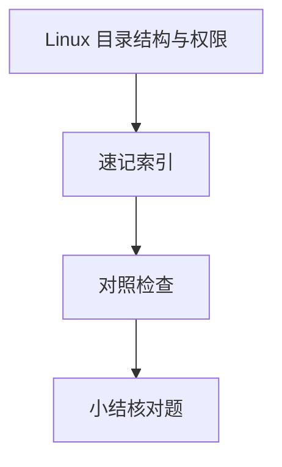

# Linux 目录结构与权限

部署 Node 服务、查 Nginx 配置、修 `Permission denied`，都绕不开 **FHS 目录约定**与 **rwx 权限模型**。Linux 服务器是多数全栈生产环境的运行时 — 路径与权限比背命令更重要。

---

## FHS 关键目录

```mermaid
flowchart TB
  root[/]
  root --> etc[/etc 配置]
  root --> var[/var 可变数据]
  root --> home[/home 用户家]
  root --> usr[/usr 程序与库]
  root --> tmp[/tmp 临时]
  var --> log[/var/log 日志]
  var --> www[/var/www 站点]
```

| 路径 | 用途 | 全栈常见操作 |
|------|------|--------------|
| `/etc` | 系统与服务配置 | `nginx/`、`systemd/` |
| `/var/log` | 日志 | `journalctl`、应用 log |
| `/home/<user>` | 用户目录 | SSH、`.ssh/authorized_keys` |
| `/usr/local` | 本地安装软件 | 手动装 Node |
| `/tmp` | 临时文件 | 上传中转（注意清理） |
| `/opt` | 可选大型包 | 第三方应用 |

容器内路径常映射 volume — 见 02-OS · 虚拟化。

---

## 路径与 inode

| 概念 | 说明 |
|------|------|
| **绝对路径** | 从 `/` 起 |
| **相对路径** | `.` `..` 当前/上级 |
| **inode** | 文件元数据与数据块指针（硬链接同 inode） |
| **软链接** | 独立 inode，指向路径 |

```bash
ls -li /etc/hosts          # 看 inode
readlink -f ./config.yaml  # 解析真实路径
```

删文件是减链接计数 — 进程仍持有 fd 时空间不立刻释放（日志轮转需注意）。

---

## 权限位 rwx

```bash
ls -l
# -rw-r--r-- 1 deploy deploy 4096 Jun 22 10:00 app.env
#  │││ │││ │││
#  u  g   o
```

| 对象 | r | w | x（对目录） |
|------|---|---|-------------|
| 文件 | 读内容 | 改内容 | 可执行 |
| 目录 | 列目录 | 增删改名 | **进入(cd)** |

**chmod 数字**：`755` = `rwxr-xr-x`；`644` = `rw-r，r--`。

```bash
chmod 640 app.env          # 敏感配置收紧
chmod +x deploy.sh
chown deploy:deploy app/   # 改属主属组
```

---

## 用户、组与 umask



| 命令 | 作用 |
|------|------|
| `id` | 当前 uid/gid 与组列表 |
| `sudo` | 以 root 执行 |
| `umask` | 默认去掉的位（常见 022） |

Node 以 `www-data` 跑时，上传目录需写权限但**不可**全局 777 — 最小权限原则。

---

## 特殊权限（了解）

| 位 | 作用 |
|----|------|
| setuid | 执行时有效 uid 为文件属主 |
| setgid | 目录新建文件继承组 |
| sticky | 目录仅属主可删自己的文件（如 `/tmp`） |

`ls -l` 中 `s`、`t` 出现在 x 位 — 排障 SSH/脚本偶发权限问题时有用。

---

## ACL（细粒度）

```bash
# 给额外用户读权限（需文件系统支持 ACL）
setfacl -m u:deploy:r-- /etc/nginx/nginx.conf
getfacl file
```

共享部署密钥、多用户协作时比反复 `chmod o+` 清晰。

---

## 全栈实践清单

| 场景 | 建议 |
|------|------|
| `.env` | `600`，属主运行用户 |
| 静态资源 | Nginx 用户只读 |
| CI 部署 | 专用 `deploy` 用户 + sudo 限命令 |
| Docker volume | 注意宿主机 uid 映射 |

---

## SELinux 与 AppArmor（权限仍 403 时）

`chmod 755` 正确仍可能被 **MAC（强制访问控制）** 拦截 — CentOS/RHEL 常见 SELinux，Ubuntu 常见 AppArmor。

| 现象 | 排查 |
|------|------|
| Nginx 无法读静态文件 | `getenforce` 是否为 Enforcing |
| 自定义 `/opt/app` 路径 | 需 `chcon -R -t httpd_sys_content_t` 或等价上下文 |
| 容器挂载卷 | 宿主机 SELinux `:z` / `:Z` 标签 |

```bash
getenforce                    # Enforcing / Permissive / Disabled
ausearch -m avc -ts recent    # 查 SELinux 拒绝记录
```

排障顺序：**DAC（rwx）→ 属主 → SELinux/AppArmor → 挂载只读**。生产勿长期 `setenforce 0`，应修上下文或策略。

---

## `/proc` 与运行时信息

Linux 把内核与进程状态暴露为**虚拟文件**，只读即可诊断，无需装 GUI：

| 路径 | 内容 |
|------|------|
| `/proc/cpuinfo` | CPU 型号、核数 |
| `/proc/meminfo` | 内存与 swap |
| `/proc/<pid>/fd` | 进程打开的文件描述符 |
| `/proc/<pid>/maps` | 内存映射 |

```bash
cat /proc/loadavg              # 1/5/15 分钟负载
ls -l /proc/$(pgrep -f node)/fd  # Node 进程打开了哪些文件
```

容器内 `/proc` 可能被裁剪；`docker exec` 进容器后 uid 与 volume 挂载权限仍要对照宿主机 `ls -n`。

---

## 权限位

| 位 | 文件 | 目录 |
|----|------|------|
| r | 读内容 | 列目录 |
| w | 写内容 | 增删改名 |
| x | 执行 | 进入 cd |

`chmod 755`：属主 rwx，组和其他 rx。容器内 `/proc`、`/sys` 虚拟文件系统只读为主。
## FHS 要点

| 路径 | 用途 |
|------|------|
| /etc | 配置 |
| /var/log | 日志 |
| /tmp | 临时 |
| /home | 用户 |

容器只读根文件系统时，可写层通常在 /var 或 overlay upperdir。
---

## 速记索引

| 小节 | 复习方式 |
|------|----------|
| SELinux 与 AppArmor（权限仍 403 时） | 复述定义 + 举一个前端相关例子 |
| `/proc` 与运行时信息 | 复述定义 + 举一个前端相关例子 |
| 权限位 | 复述定义 + 举一个前端相关例子 |
| FHS 要点 | 复述定义 + 举一个前端相关例子 |

## 对照检查

| 维度 | 自检 |
|------|------|
| SELinux 与 AppArmor（权限仍 403 时） 易错 | 对照上文「易混点」或表格中的对比项 |
| `/proc` 与运行时信息 易错 | 对照上文「易混点」或表格中的对比项 |
| 权限位 易错 | 对照上文「易混点」或表格中的对比项 |
| FHS 要点 易错 | 对照上文「易混点」或表格中的对比项 |



本节目标：离开文档仍能解释 **Linux 目录结构与权限** 的核心机制，并能在浏览器、Node 或工程排障中指认对应现象。
## 小结

FHS 规定配置、日志、程序的标准位置；rwx 作用于文件与目录语义不同；chmod/chown/umask 控制谁能在生产机上读密钥、写上传目录。

**易混点**：目录 x 是进入而非执行；软链 vs 硬链；777 不能解决 SELinux/AppArmor 拦截。

核对：`drwxr-x---` 中「其他用户」能否 cd 进入？为何 `.env` 不应 644？
