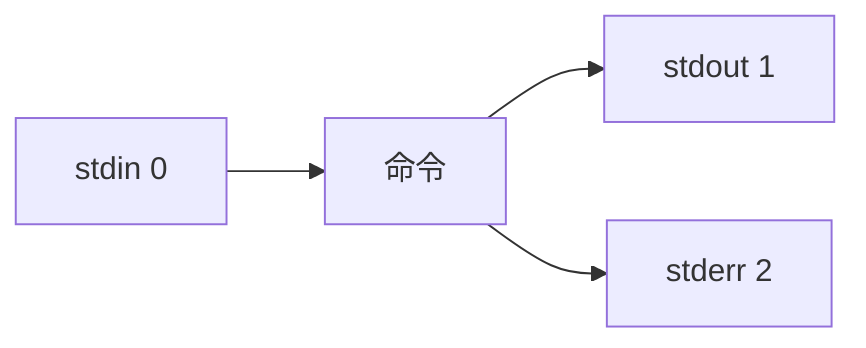
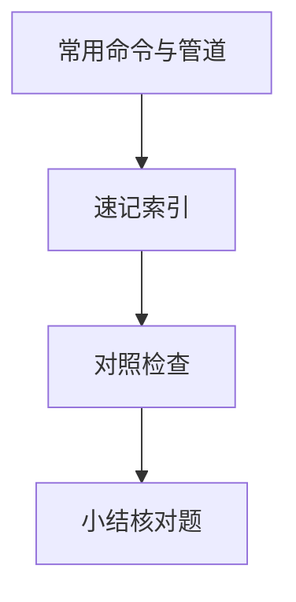

# 常用命令与管道

SSH 登服务器后，**组合小命令**比安装重型 GUI 更高效。**标准流**、**管道**、**grep/awk/sed** 是查日志、筛进程、批处理文本的基础 — 与本地 Git Bash/WSL 同源。

---

## 标准流与重定向



| 语法 | 含义 |
|------|------|
| `cmd > file` | stdout 覆盖写 |
| `cmd >> file` | stdout 追加 |
| `cmd 2>&1` | stderr 合并到 stdout |
| `cmd &> file` | 两者都写文件 |
| `cmd < file` | stdin 来自文件 |

```bash
npm run build 2>&1 | tee build.log
curl -sf https://api/health || echo "down"
```

`-sf`：静默 + 失败 HTTP 码非 0 退出 — 脚本友好。

---

## 管道与命令链

| 操作符 | 作用 |
|--------|------|
| `\|` | 前 stdout → 后 stdin |
| `&&` | 前成功才执行后 |
| `\|\|` | 前失败才执行后 |
| `;` | 顺序执行不管成败 |

```bash
ps aux | grep node | grep -v grep
cat access.log | awk '{print $1}' | sort | uniq -c | sort -rn | head
```

**管道左侧**应产生文本流；`grep` 过滤、`sort` 排序、`uniq -c` 计数。

---

## 文件与目录 essentials

| 命令 | 用途 |
|------|------|
| `ls -lah` | 详情+隐藏+人类可读大小 |
| `cd`, `pwd` | 导航 |
| `cp -a`, `mv`, `rm -rf` | 复制保留属性、移动、删（慎用） |
| `find . -name '*.log' -mtime +7` | 按名/时间找 |
| `du -sh *` | 目录占用 |
| `df -h` | 磁盘空间 |

```bash
find /var/log/nginx -name '*.gz' -mtime +30 -delete
```

---

## grep 与 ripgrep

```bash
grep -R "ERROR" /var/log/app --include='*.log' -n
grep -E '5[0-9]{2}' access.log    # 5xx
rg "TODO" src/                     # 本地开发更快
```

| 选项 | 说明 |
|------|------|
| `-i` | 忽略大小写 |
| `-v` | 反向 |
| `-A/-B/-C` | 上下文行 |
| `-E` | 扩展正则 |

---

## sed 与 awk 入门

```bash
# sed：替换（备份加 -i.bak）
sed 's/http:\/\//https:\//g' config.txt

# awk：按列处理
awk -F',' '$3 > 100 { sum += $3 } END { print sum }' orders.csv
```

| 工具 | 擅长 |
|------|------|
| sed | 行替换、删除 |
| awk | 列计算、报表 |
| cut | 简单定界符切列 |

nginx `combined` 日志：`awk '{print $7}' access.log` 取 URL 路径。

---

## 网络与下载

| 命令 | 用途 |
|------|------|
| `curl -I url` | 只看响应头 |
| `curl -o out.zip url` | 下载 |
| `wget -c url` | 断点续传 |
| `scp`, `rsync -avz` | 拷文件/同步部署 |

```bash
curl -s localhost:3000/health | jq .
```

---

## 快捷与历史

| 按键/命令 | 作用 |
|-----------|------|
| `Ctrl+R` | 反向搜索历史 |
| `!!` | 上一条命令 |
| `!$` | 上条最后一个参数 |
| `man cmd` | 手册 |

---

## xargs 与 find 组合

`find` 输出文件名，`xargs` 批量喂给后续命令 — 比 `for` 循环简洁，注意文件名含空格时用 `-print0` + `xargs -0`。

```bash
find /var/log/app -name '*.log' -mtime +7 -print0 | xargs -0 rm -f
find src -name '*.ts' | xargs wc -l | tail -1
echo "file1 file2" | xargs -n1 md5sum
```

| 模式 | 说明 |
|------|------|
| `xargs -n1` | 每次传一个参数 |
| `xargs -I{}` | 占位符替换 |
| `parallel` | GNU parallel 多核并行（需安装） |

---

## 进程与作业快捷

| 命令 | 用途 |
|------|------|
| `ps aux \| grep node` | 找 Node 进程 |
| `kill -15 PID` | 优雅终止 |
| `nohup cmd &` | 挂断终端仍运行（生产用 systemd） |

---

## 管道组合

```bash
ps aux | grep node | awk '{print $2}' | xargs kill
```

| 命令 | 用途 |
|------|------|
| `find` | 按条件找文件 |
| `grep -r` | 递归搜文本 |
| `jq` | JSON 管道处理 |
## 进程与信号

`kill -15` SIGTERM 可捕获优雅退出；`-9` SIGKILL 强杀。

`lsof -i :3000` 查端口占用；`strace -e trace=network` 跟 syscall（调试 Node 偶用）。
---

## 速记索引

| 小节 | 复习方式 |
|------|----------|
| xargs 与 find 组合 | 复述定义 + 举一个前端相关例子 |
| 进程与作业快捷 | 复述定义 + 举一个前端相关例子 |
| 管道组合 | 复述定义 + 举一个前端相关例子 |
| 进程与信号 | 复述定义 + 举一个前端相关例子 |

## 对照检查

| 维度 | 自检 |
|------|------|
| xargs 与 find 组合 易错 | 对照上文「易混点」或表格中的对比项 |
| 进程与作业快捷 易错 | 对照上文「易混点」或表格中的对比项 |
| 管道组合 易错 | 对照上文「易混点」或表格中的对比项 |
| 进程与信号 易错 | 对照上文「易混点」或表格中的对比项 |



本节目标：离开文档仍能解释 **常用命令与管道** 的核心机制，并能在浏览器、Node 或工程排障中指认对应现象。
## 小结

stdout/stderr 可重定向与合并；管道把简单命令串成数据处理链；grep/find/awk 支撑日志分析与运维脚本 — 细节脚本见 03-Shell脚本基础。

**易混点**：`\|` 只传 stdout 不传 stderr（需 `2>&1`）；`uniq` 前必须 `sort`；`rm -rf` 无回收站。

核对：如何把 stderr 也打进管道？统计 access.log 中各 IP 访问量的一行命令结构？
