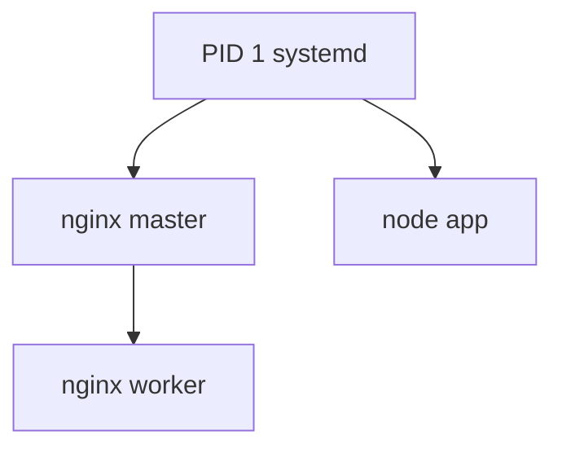
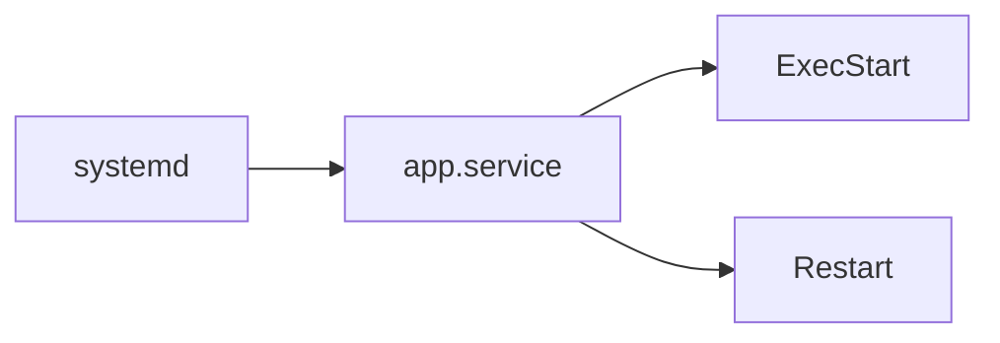

# 进程管理与 systemd

Node 服务「挂了没人拉」、僵尸进程占端口 — 生产环境需要理解 **进程**如何创建、信号如何终止、**systemd** 如何托管重启。与 02-OS · 进程线程 对照：那边讲模型，本篇讲 Linux 实操。

---

## 进程基本概念



| 概念 | 说明 |
|------|------|
| PID | 进程 ID |
| PPID | 父进程 ID |
| 前台/后台 | `&`、`fg`、`bg` |
| 守护进程 | 脱离终端、通常由 systemd 拉起 |

```bash
ps aux | head
ps -ef --forest          # 树形
pgrep -a node
```

---

## 信号与 kill

| 信号 | 默认 | 用途 |
|------|------|------|
| SIGTERM (15) | 终止 | 优雅退出（先注册 handler） |
| SIGKILL (9) | 强杀 | 不可捕获，最后手段 |
| SIGHUP (1) | 挂起 | 常用来 reload 配置 |
| SIGINT (2) | 中断 | Ctrl+C |

```bash
kill -15 $PID
kill -9 $PID              # 慎用
killall -TERM nginx
pkill -f "node dist/server.js"
```

Node：`process.on('SIGTERM', () => server.close())` — 配合 K8s/systemd 滚动发布。

---

## 作业控制（交互 SSH）

```bash
node server.js &
jobs
fg %1
disown -h %1              # 脱离 shell 挂断影响
nohup node server.js > app.log 2>&1 &
```

生产更推荐 **systemd** 而非 nohup。

---

## systemd 单元



`/etc/systemd/system/app.service` 示例：

```ini
[Unit]
Description=Node API
After=network.target

[Service]
Type=simple
User=deploy
WorkingDirectory=/opt/app
Environment=NODE_ENV=production
ExecStart=/usr/bin/node dist/server.js
Restart=on-failure
RestartSec=5
LimitNOFILE=65535

[Install]
WantedBy=multi-user.target
```

| 命令 | 作用 |
|------|------|
| `systemctl daemon-reload` | 改 unit 后重载 |
| `systemctl enable ，now app` | 开机启 + 立即启 |
| `systemctl status app` | 状态与最近日志 |
| `journalctl -u app -f` | 跟踪日志 |

---

## 资源与限制

| 命令/配置 | 查看 |
|-----------|------|
| `top` / `htop` | CPU、内存实时 |
| `free -h` | 内存概览 |
| `LimitNOFILE` | 最大 fd — 高并发 Web |
| `cgroups` | 容器与 systemd 资源配额 |

OOM Killer 杀进程时 dmesg 有迹 — 见 06-性能工具入门。

---

## 端口与进程

```bash
ss -tlnp | grep 3000
# 或
lsof -i :3000
```

「Address already in use」：找占端口 PID → 优雅停服务或改配置。

---

## 与容器的关系

Docker/K8s 内 PID 1 常是 tini/应用本身 — 仍应处理 SIGTERM。宿主机上 **dockerd** 本身由 systemd 管理。

---

## journalctl 常用过滤

```bash
journalctl -u nginx -f                    # 跟踪某 unit
journalctl -u app --since "1 hour ago"
journalctl -p err -b                       # 本次启动的错误级
journalctl _PID=12345
```

| 字段 | 含义 |
|------|------|
| `-u` | 按 systemd unit |
| `-f` | follow 类似 tail -f |
| `-b` | 本次 boot |
| `--since/，until` | 时间范围 |

应用 stdout 默认进 journal — 比散落 `/tmp/nohup.out` 更易集中检索；结构化日志（JSON 行）便于 `journalctl` 管道 jq。

---

## 小结

进程由 PID 标识，SIGTERM 优雅、SIGKILL 强杀；systemd 用 unit 文件定义启动、重启与日志，是 Linux 服务器托管 Node/Nginx 的标配。

**易混点**：kill 默认是 SIGTERM 非 9；僵尸进程需父进程 wait；改 unit 必须 daemon-reload。

核对：滚动发布时 Node 应响应哪个信号？`Restart=always` 与 `on-failure` 区别？
