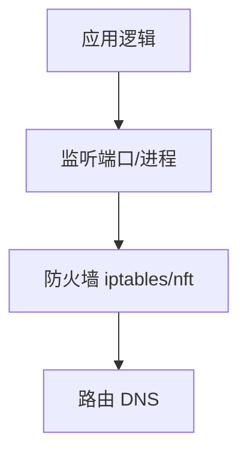

# 网络与服务排查

接口 502、TLS 握手失败、DNS 指错环境 — 全栈联调一半问题在**网络路径**。**ss/curl/dig/traceroute** 从本机到目标逐段缩小范围，比盲目改 CORS 更高效。

---

## 排查分层



| 层次 | 先问 |
|------|------|
| DNS | 域名解析到哪？ |
| 连通 | IP 端口通吗？ |
| TLS | 证书链有效吗？ |
| HTTP | 状态码/头/体？ |
| 应用 | 日志堆栈？ |

---

## 套接字与 ss

```bash
ss -tlnp                 # TCP 监听
ss -tan state established | head
ss -ulnp                 # UDP
```

| 状态 | 含义 |
|------|------|
| LISTEN | 等待连接 |
| ESTAB | 已建立 |
| TIME-WAIT | 关闭后等待（高并发常见） |

与 03-计算机网络 · TCP 的挥手状态对应。

---

## curl 调试 HTTP

```bash
curl -v https://api.example.com/v1/users
curl -I -s -o /dev/null -w '%{http_code} %{time_total}s\n' https://...
curl -X POST -H 'Content-Type: application/json' \
  -d '{"email":"a@b.c"}' http://localhost:3000/api/login
curl --resolve api.example.com:443:127.0.0.1 https://api.example.com/
```

| 选项 | 用途 |
|------|------|
| `-v` | 请求/响应头详情 |
| `-k` | 跳过 TLS 校验（仅调试） |
| `-H` | 自定义头 |
| `--resolve` | 本地覆盖 DNS |

**502 Bad Gateway**：前置 Nginx 连不上 upstream — 查 upstream 端口与防火墙。  
**504**：超时 — 查应用慢查询或 proxy_read_timeout。

---

## DNS

```bash
dig api.example.com +short
dig api.example.com @8.8.8.8
nslookup api.example.com
```

| 现象 | 可能 |
|------|------|
| 解析到旧 IP | TTL 未过期、/etc/hosts |
| 间歇失败 | 多 A 记录其一宕机 |

`/etc/hosts` 本地开发常用来指 `127.0.0.1 dev.local`。

---

## 路由与连通

```bash
ping -c 3 8.8.8.8
traceroute api.example.com
nc -zv host 443
telnet host 80          # 老工具，nc 更好
```

云服务器：**安全组**放行 80/443 — 比应用内 bug 更常见的「连不上」。

---

## Nginx 反向代理速查

```nginx
location /api/ {
  proxy_pass http://127.0.0.1:3000/;
  proxy_set_header Host $host;
  proxy_set_header X-Real-IP $remote_addr;
}
```

| 问题 | 检查 |
|------|------|
| 404 | `proxy_pass` 末尾 `/` 是否 strip 路径 |
| 413 | `client_max_body_size` |
| WebSocket | `Upgrade` / `Connection` 头 |

`nginx -t && systemctl reload nginx`

---

## 防火墙（概念）

```bash
# firewalld / ufw 因发行版而异
sudo ufw status
sudo iptables -L -n
```

Docker 会改 iptables 规则 — 端口映射 `0.0.0.0:3000` 意外暴露时需审计。

---

## 本地与远程对照

| 工具 | 场景 |
|------|------|
| 浏览器 DevTools Network | 前端视角 |
| `curl` | 复现无浏览器因素 |
| Charles/mitmproxy | HTTPS 解密（仅测试环境） |
| `tcpdump -i any port 443` | 包级（需权限） |

---

## TLS 证书快速自检

```bash
openssl s_client -connect api.example.com:443 -servername api.example.com </dev/null 2>/dev/null \
  | openssl x509 -noout -dates -subject
echo | openssl s_client -connect host:443 2>/dev/null | openssl x509 -noout -issuer
```

| 问题 | 常见原因 |
|------|----------|
| `certificate has expired` | 未自动续期 Let's Encrypt |
| `hostname mismatch` | 证书 SAN 不含访问域名 |
| 链不完整 | 中间证书未配全 |

浏览器报 `NET::ERR_CERT_*` 时，先用 `openssl s_client` 排除应用层，再查 Nginx `ssl_certificate` 路径。

---

## 小结

从 DNS → 端口 → TLS → HTTP 逐层用 dig/ss/curl 验证；502/504 多在上游与超时；Nginx 代理路径与安全组是生产联调高频坑。

**易混点**：CORS 是浏览器策略，curl 不受限；TIME-WAIT 多不等于泄漏；`localhost` vs `127.0.0.1` 可能走不同解析（IPv6）。

核对：curl 返回 200 但浏览器失败应先查什么？Nginx `proxy_pass` 带不带尾斜杠路径差？
