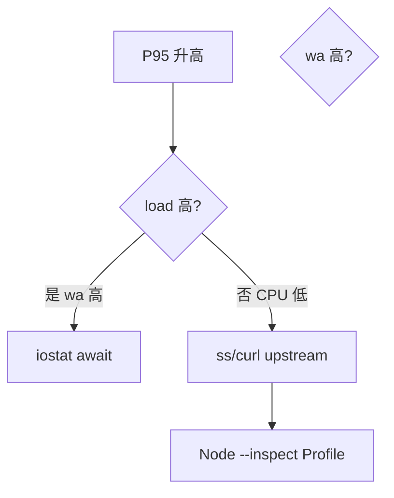

# 性能工具入门

「线上变慢」需要数据而非猜测。**top/vmstat/iostat/perf** 从 CPU、内存、磁盘 I/O 视角定位瓶颈 — 与 02-OS · 调度/内存 理论互补，并衔接 工程化 06 · 性能监控 的应用层指标。

---

## 排查总流程


| 症状 | 先看 |
|------|------|
| Load 高 CPU 低 | I/O wait、磁盘 |
| CPU 单核 100% | 热点线程/无限循环 |
| 内存涨不回落 | 泄漏、缓存无界 |
| 延迟抖动 | GC、swap、锁 |

---

## top / htop

```bash
top
# 交互：P CPU排序 M 内存 1 展开CPU
htop   # 更友好，需安装
```

| 字段 | 含义 |
|------|------|
| load average | 可运行+不可中断队列长度（相对核数） |
| `%Cpu(s) wa` | I/O wait |
| RES | 常驻内存 |
| TIME+ | 累计 CPU 时间 |

```bash
top -Hp $PID    # 某进程内线程
```

Node：单线程 CPU 100% 常见死循环或同步 JSON — 用 `--inspect` + Chrome Profiler。

---

## vmstat / free

```bash
vmstat 1 5
free -h
```

| vmstat 列 | 关注 |
|-----------|------|
| r | 运行队列 |
| b | 阻塞 |
| si/so | swap 换入换出（应接近 0） |
| us/sy/id/wa | 用户/内核/空闲/I/O wait |

**swap 活跃** → 内存不足，延迟爆炸 — 加内存或限进程 RSS。

---

## 磁盘 iostat

```bash
iostat -xz 1
df -h
du -sh /var/log/*
```

| 指标 | 说明 |
|------|------|
| `%util` | 设备繁忙度接近 100% 饱和 |
| `await` | I/O 平均等待 ms |
| 读写 MB/s | 吞吐 |

数据库 redo/log 与 nginx access 占满磁盘 → 写放大 — 见 06-DB · 日志。

---

## perf（采样）

```bash
sudo perf top -p $PID
sudo perf record -g -p $PID -- sleep 30
sudo perf report
```

内核允许时看**用户栈+内核栈**热点 — 适合 CPU 火焰图前置。容器内需 `perf_event_paranoid` 等权限。

---

## Node / 应用层

| 工具 | 用途 |
|------|------|
| `clinic doctor/flame` | Node 诊断 |
| `0x` | 火焰图 |
| Chrome DevTools | `--inspect` CPU Profile |
| `autocannon`, `k6` | 压测 QPS/延迟 |

```bash
node --inspect dist/server.js
# chrome://inspect
```

区分 **CPU bound** vs **I/O bound**：后者 `top` CPU 不高但响应慢 — 查 DB、外部 API。

---

## 容器与 cgroup

```bash
docker stats
cat /sys/fs/cgroup/memory.current   # cgroup v2 路径因系统而异
```

K8s：`kubectl top pod` — limits 过小会 OOMKilled。

---

## 简要对照表

| 工具 | 主要看 |
|------|--------|
| top/htop | 谁吃 CPU/内存 |
| vmstat | 全局调度、swap |
| iostat | 磁盘瓶颈 |
| ss | 连接数、TIME-WAIT |
| perf | 热点函数 |

网络层细节见 05-网络与服务排查。

---

## 一次完整排查示例

现象：API P95 从 200ms 升到 2s，CPU 不高。



| 步骤 | 命令 | 发现 |
|------|------|------|
| 1 | `uptime` / `top` | load 8，4 核，wa 25% |
| 2 | `iostat -xz 1` | `%util` 99%，await 40ms |
| 3 | `du -sh /var/log/*` | nginx access 80G |
| 4 | 轮转 + 归档 | P95 回落 |

wa 高优先怀疑磁盘 I/O；CPU 单核 100% 再开 V8 Profiler — 避免在 I/O 瓶颈时误优化 JS。

---

## 小结

性能排查先系统后应用：load 与 wa 区分 CPU/IO；top 找进程、iostat 找磁盘、perf/Node profiler 找代码热点 — 与 Web Vitals 的应用指标形成上下层。

**易混点**：load 高不等于 CPU 满；Node 单进程占满一核；free 的 available 比 cached 误读更重要。

核对：wa 持续 30% 应查什么？Node CPU 高但 QPS 低可能原因？
