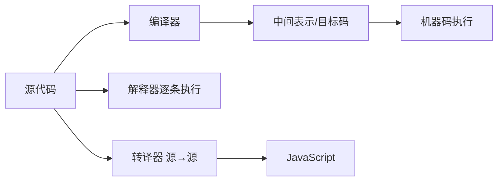
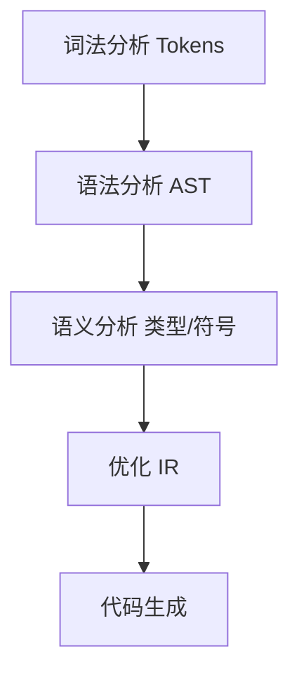
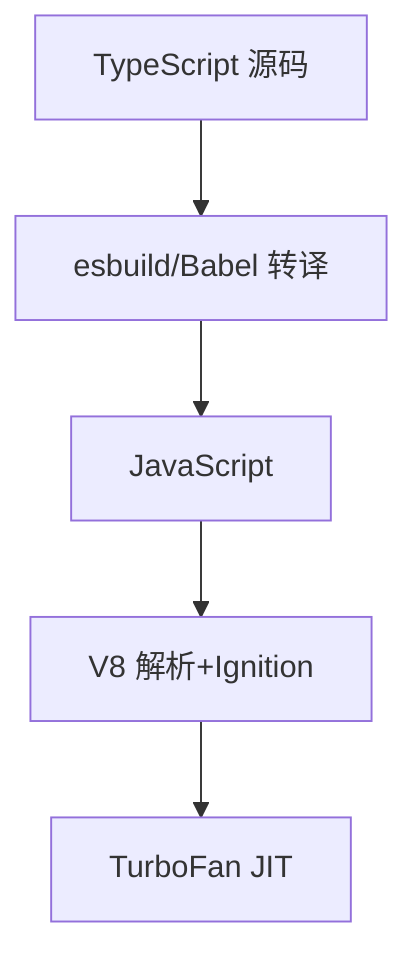
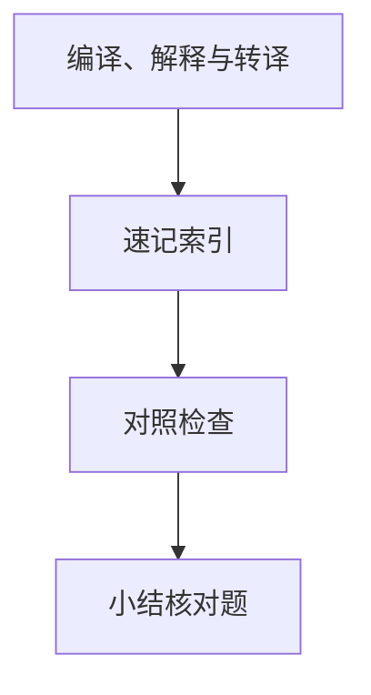

# 编译、解释与转译

前端日常接触的 TypeScript、JSX、Vue SFC 并非 CPU 直接执行 — 它们都要经**编译器管线**变成浏览器能跑的 JavaScript。**分清编译、解释、转译**是理解 Vite 开发时「秒开」与生产构建「慢但优化」差异的起点。

---

## 三种执行路径



| 模式 | 典型产物 | 特点 |
|------|----------|------|
| **编译** | 机器码 / WASM | 一次翻译，多次执行；C/Rust → 原生 |
| **解释** | 无独立产物 | 边读边跑；早期 JS、Python REPL |
| **转译** | 另一门高级语言 | TS→JS、JSX→`React.createElement` |

现代引擎常**混合**：V8 先 Ignition 字节码解释，热点再 TurboFan JIT 编译 — 见 05-运行时与V8概览。

---

## 前端为何几乎全是转译

浏览器只认（有限版本的）JavaScript + Web API，因此：

| 输入 | 工具 | 输出 |
|------|------|------|
| `.ts` / `.tsx` | `tsc`、esbuild、SWC | `.js` |
| `.vue` | `@vue/compiler-sfc` | render 函数 + CSS 模块 |
| JSX | Babel、SWC | `createElement` / `_jsx` |
| 新语法 | Babel preset-env | 目标浏览器可跑的 ES 版本 |

这不是「把 TS 编译成机器码」，而是**源到源**的转译，再交给 V8 解释/JIT。

---

## 编译管线概览



各阶段详见本目录 02–05 篇。ESLint 停在 AST 层做规则检查；Babel 在 AST 上做**变换**后打印代码。

```
  源码字符流
      │ 词法
      ▼
  [const][IDENT][=][1][;]   ← Token 流
      │ 语法
      ▼
  VariableDeclaration AST
      │ 语义 / 变换 / 生成
      ▼
  目标 JS 或字节码
```

---

## 开发 vs 生产：两套「编译」策略

| 场景 | Vite 开发 | 生产 `vite build` |
|------|-----------|-------------------|
| TS/JSX | esbuild **转译**（快、少优化） | Rollup + esbuild，tree-shaking |
| 依赖预构建 | esbuild 把 CJS→ESM | 已缓存于 `node_modules/.vite` |
| 目标 | 启动与 HMR 延迟 | 体积、分包、压缩 |

开发路径偏**解释式体验**（按需转译模块）；生产路径偏**完整编译管线**（打包、DCE、minify）。

---

## 与「运行时编译」的边界

| 机制 | 发生时机 | 例子 |
|------|----------|------|
| 构建时转译 | `vite build` / CI | Babel、Vue SFC compile |
| 运行时编译 | 页面加载后 | `new Function`、Vue 运行时 `compile`（生产通常关闭） |
| 引擎 JIT | V8 执行中 | TurboFan 优化热点函数 |

Vue 3 默认**预编译**模板；若用完整版 + 运行时编译，包体积与首屏解析成本都会上升。

---

## 同一份源码的三条执行路径

| 路径 | 何时 | 产出 |
|------|------|------|
| 转译 | `vite dev` / `tsc` | 另一份 JS 源码 |
| 解释 | V8 Ignition 首次执行 | 字节码 |
| JIT | 热点函数 | 机器码 |



前端工程主要控制**转译层**（语法、模块格式、摇树）；**JIT 层**由写法影响（隐藏类、deopt）。

---

## WebAssembly 在谱系中的位置

| 形态 | 执行者 | 与 JS 关系 |
|------|--------|------------|
| `.wasm` 模块 | 浏览器 WASM 引擎 | 与 V8 并列，经 import 调 JS |
| `wasm-pack` / Rust | 编译到 WASM | 重计算下沉，非替代 DOM |
| AssemblyScript | 类 TS 写 WASM | 仍受线性内存模型约束 |

WASM 走**编译到字节码**路径，适合编解码、图像处理；UI 逻辑仍以 JS/TS 为主。Vite 可用 `vite-plugin-wasm` 加载 `.wasm` 资源。

---

## 与前端工程化的衔接

| 问题 | 对应概念 |
|------|----------|
| dev 秒开、build 慢 | 开发少优化、生产全管线 |
| `tsc ，noEmit` 与 `vite build` 分工 | 类型检查 vs 转译打包 |
| Source map 断点错位 | 多段转译需链式 map |

工具链对照见 06-前端工具链对照；构建分层见 工程化 02 · 模块化与构建层。

---

## 解释型语言的性能错觉

「解释慢、编译快」在 JS 上常被 **JIT** 打破：冷启动走 Ignition，热点函数接近原生速度。仍可能慢的情况：

| 场景 | 原因 |
|------|------|
| 首次加载大 bundle | 解析 + 编译字节码成本 |
| 频繁 deopt | 类型假设失效 |
| 重 DOM / 布局 | 与是否编译无关 |

因此前端优化常是 **减 JS 体积 + 稳对象形状 + 少强制同步布局**，而不只是「换更快的转译器」。

---

## 转译目标与 `target` 配置

| 配置项 | 作用 |
|--------|------|
| `tsconfig target` | `tsc` 降级语法级别 |
| Vite `esbuild.target` | dev/build 转译目标 |
| `browserslist` | Babel/Autoprefixer 共用 |

```json
// tsconfig.json 片段
{ "compilerOptions": { "target": "ES2020", "module": "ESNext" } }
```

`target` 过高会在旧 WebView 上语法错误；过低则多余 polyfill 与 helper。移动端壳内嵌浏览器版本常是瓶颈，宜单独一条 browserslist。

---

## 前端编译链

| 阶段 | 工具示例 |
|------|----------|
| 词法/语法 | Babel parser |
| 转换 | Babel plugin |
| 打包 | esbuild/Rollup |
| 压缩 | terser |

TS 是转译 + 类型擦除；类型错误不阻止 emit（除非 noEmitOnError）。
## Source Map

编译后代码映射回 TS/JSX — 浏览器 DevTools 断点打在源码。生产可 hidden source map 只上传监控平台。
---

## 速记索引

| 小节 | 复习方式 |
|------|----------|
| 解释型语言的性能错觉 | 复述定义 + 举一个前端相关例子 |
| 转译目标与 `target` 配置 | 复述定义 + 举一个前端相关例子 |
| 前端编译链 | 复述定义 + 举一个前端相关例子 |
| Source Map | 复述定义 + 举一个前端相关例子 |

## 对照检查

| 维度 | 自检 |
|------|------|
| 解释型语言的性能错觉 易错 | 对照上文「易混点」或表格中的对比项 |
| 转译目标与 `target` 配置 易错 | 对照上文「易混点」或表格中的对比项 |
| 前端编译链 易错 | 对照上文「易混点」或表格中的对比项 |
| Source Map 易错 | 对照上文「易混点」或表格中的对比项 |



本节目标：离开文档仍能解释 **编译、解释与转译** 的核心机制，并能在浏览器、Node 或工程排障中指认对应现象。
## 小结

前端工程里的「编译」多数是**转译到 JS**，真正到机器码发生在 V8 JIT 层。工具链在词法→AST→变换→打印；Vite 用 esbuild 换开发速度，生产再用 Rollup 做完整优化。

**易混点**：转译 ≠ 编译到机器码；`tsc ，noEmit` 只做类型检查不产出 JS；Babel 转译与 V8 JIT 是两条管线。

核对：`import './App.vue'` 在 dev 与 build 各经过哪几步？为何生产环境不建议依赖 Vue 运行时编译器？
