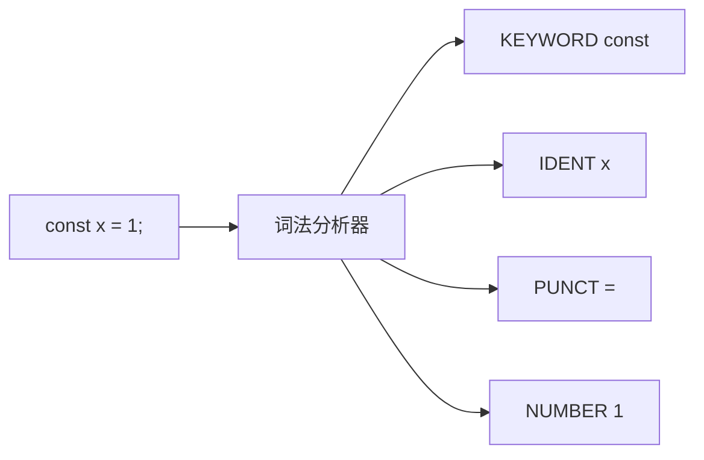
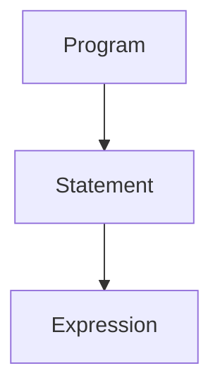
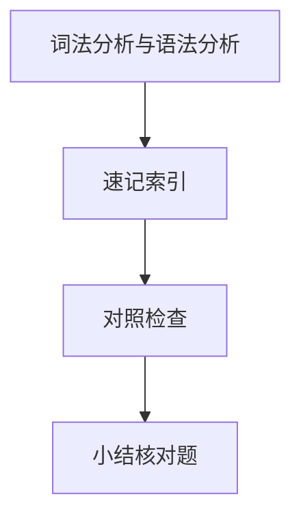

# 词法分析与语法分析

源代码进入编译器后，先被切成**记号流（Token）**，再按文法规则组装成**抽象语法树（AST）**。ESLint 报错行号、Babel 能否解析可选链、Prettier 如何断行 — 都取决于这两步是否成功。

---

## 词法分析：从字符到 Token



| Token 类型 | 示例 | 说明 |
|------------|------|------|
| 关键字 | `const`, `async`, `import` | 保留字表 |
| 标识符 | `useState`, `_private` | 变量/函数名 |
| 字面量 | `42`, `'hi'`, `` `tpl` `` | 含模板字符串分段 |
| 运算符 | `===`, `?.`, `??` | 多字符需最长匹配 |
| 标点 | `{`, `}`, `;`, `,` | 结构分隔 |

**最长匹配原则**：`>>>` 不会被拆成三个 `>`。注释与空白通常**不产出 Token**，但影响行列号映射（source map 依赖此信息）。

---

## 正则与手工扫描

早期词法器常用正则；生产级解析器（Acorn、@babel/parser）多为**手工状态机**，便于处理 JSX、TypeScript 类型谓词等上下文敏感片段。

```javascript
// 概念示意：标识符扫描
function scanIdent(src, i) {
  let j = i;
  while (/[A-Za-z0-9_$]/.test(src[j])) j++;
  return { type: 'IDENT', value: src.slice(i, j), end: j };
}
```

模板字符串、JSX `<` 与小于号、正则字面量 `/a/g` 都需**回溯或分支状态** — 纯正则难以覆盖全 ECMAScript。

---

## 语法分析：CFG 与 AST

语法用**上下文无关文法（CFG）**描述合法结构。解析器消费 Token 流，输出 AST。



| 算法 | 特点 | 典型场景 |
|------|------|----------|
| 递归下降 | 直观、易扩展 | Babel、Acorn、TS parser |
| LR/LALR | 表驱动、严谨 | Yacc、部分语言官方前端 |
| GLR | 处理歧义 | 复杂 C++ 子集 |

JavaScript 含少量**歧义**（ASI 自动分号插入），解析器需与规范一致，否则同一源码 AST 不同。

---

## ASI 与解析陷阱

```javascript
return
{ a: 1 }   // 被解析为 return; 后跟块，非返回对象

// 正确写法
return { a: 1 };
```

| 规则 | 效果 |
|------|------|
| 行尾缺 `;` 且下一 token 不能继续语句 | 自动插入 `;` |
| `return` / `break` 后换行 | 常在 `return` 后断句 |

Prettier 会按 ASI 规则格式化；手写代码仍要注意 `return` 换行坑。

---

## 前端工具中的解析入口

| 工具 | 解析器 | 备注 |
|------|--------|------|
| Babel | `@babel/parser` | `plugins: ['jsx','typescript']` |
| ESLint | Espree / typescript-eslint | 需与 ESTree 节点对齐 |
| Prettier | 各语言自带 | 解析失败则无法格式化 |
| SWC | Rust 实现 | 与 Babel AST 有差异，插件生态不同 |
| Vite | esbuild 内置 | 极快，语法子集略别于 Babel |

```javascript
// @babel/parser 示例
import { parse } from '@babel/parser';
const ast = parse('const x = 1', { sourceType: 'module' });
```

---

## 解析失败时的表现

| 现象 | 原因 |
|------|------|
| `Unexpected token` | 词法/语法不匹配，如缺 `)` |
| TS 与 Babel 插件不一致 | 一方支持 `satisfies` 另一方未开 plugin |
| `.vue` 报错 | 需 `@vue/compiler-sfc` 先拆 `<script>` 再解析 |

HMR 红屏往往是**解析阶段**失败，尚未到类型检查或运行。

---

## 有限状态机处理歧义

JS 里 `/` 可能是除法、正则开头或注释 — 词法器靠**上下文状态**区分：

```
  状态: DEFAULT
    见 /  → 可能是 /、//、/*、/=
    见 <  → 可能是 <、<=、<< 或 JSX 开始
```

| 歧义点 | 解析策略 |
|--------|----------|
| 正则 vs 除法 | 看前一 token 是否允许 RegExpLiteral |
| JSX | Babel `plugins: ['jsx']` 切换 JSX 子模式 |
| 模板字符串 | 遇 `` ` `` 进入 TEMPLATE 状态，内嵌 `${` 嵌套表达式 |

TypeScript 在 `>` 处还要区分泛型闭合与 JSX 闭合 — 故 TS 解析器比纯 JS 更复杂，esbuild 与 Babel 支持集不完全相同。

---

## 与 Prettier / ESLint 的共享前提

二者都依赖同一套解析结果：Prettier 按 AST 打印格式；ESLint 按 AST 跑规则。`parserOptions` 与 `ecmaVersion` 不一致时，可能出现「能格式化但不能 lint」或反之 — 项目里宜统一 `@babel/eslint-parser` / `typescript-eslint` 配置。

---

## ESTree 节点与可选链

可选链 `a?.b` 在词法层通常拆为 `a`、可选链运算符、`b`（具体因解析器而异）；在 AST 层为 `OptionalMemberExpression`。写 Babel 插件时用 `path.isOptionalMemberExpression()` 判断，勿与普通 `MemberExpression` 混处理。

---

## Vue SFC 多段解析

`.vue` 经 `@vue/compiler-sfc` 拆成 template/script/style 三块，各自再走词法/语法管线。`vue-eslint-parser` 把 template 表达式嵌进 ESTree，供 ESLint 规则遍历 — 与单文件 `.tsx` 的解析入口不同。

HMR 报错若指向 `.vue` 某行，先区分是 **template 编译** 还是 **script 解析** 失败，再查对应 parser 插件是否启用。

解析成功后的 AST 可经 `@babel/traverse` 做变换，再 `@babel/generator` 打印 — 与 Prettier「只读 AST 改格式」共用同一棵语法树，故 parser 配置必须项目内一致。

| 检查项 | 建议 |
|--------|------|
| `ecmaVersion` | 与 TS `target` / 实际语法对齐 |
| `sourceType: 'module'` | 顶层 `import` 文件必开 |
| Babel vs esbuild | 新语法支持集对比后再上生产 |

---

## 解析失败

| 错误类型 | 例子 |
|----------|------|
| 词法 | 非法字符 |
| 语法 | 缺分号、括号不配 |
| 早期 error recovery | 同步到 `;` |

Prettier 不检查语义；ESLint 需 AST 已正确 parse。
## AST 遍历

Babel `traverse` 访问者模式；eslint 规则在 AST 上查模式。

运算符优先级在语法分析阶段解决 — `1+2*3` 树形结构固定。
---

## 速记索引

| 小节 | 复习方式 |
|------|----------|
| ESTree 节点与可选链 | 复述定义 + 举一个前端相关例子 |
| Vue SFC 多段解析 | 复述定义 + 举一个前端相关例子 |
| 解析失败 | 复述定义 + 举一个前端相关例子 |
| AST 遍历 | 复述定义 + 举一个前端相关例子 |

## 对照检查

| 维度 | 自检 |
|------|------|
| ESTree 节点与可选链 易错 | 对照上文「易混点」或表格中的对比项 |
| Vue SFC 多段解析 易错 | 对照上文「易混点」或表格中的对比项 |
| 解析失败 易错 | 对照上文「易混点」或表格中的对比项 |
| AST 遍历 易错 | 对照上文「易混点」或表格中的对比项 |



本节目标：离开文档仍能解释 **词法分析与语法分析** 的核心机制，并能在浏览器、Node 或工程排障中指认对应现象。
## 小结

词法分析产出 Token，语法分析产出 AST — 编译器后续所有变换的输入。前端以递归下降 + ESTree 为主；选型时注意 Babel/esbuild/SWC 语法支持与 AST 差异。

**易混点**：词法错误 vs 语法错误；Token 不含语义（`foo` 是否已定义属语义阶段）；ASI 是解析规则而非词法规则。

核对：可选链 `a?.b` 在词法层是几个 Token？为何 ESLint 需要 `parserOptions.ecmaVersion`？
