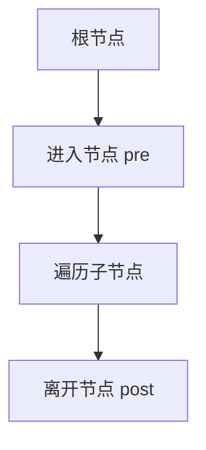
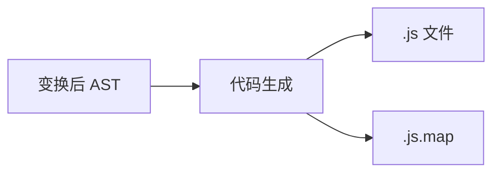

# AST 与遍历变换

**抽象语法树（AST）**剥离了括号与分号，只保留程序结构。Babel 插件、ESLint 规则、jscodeshift codemod、Vue/React 编译器 — 本质都是在 AST 上**遍历 + 改写**，再序列化回源码。

---

## AST 长什么样

```javascript
// 源码: const n = 1 + 2;
// 简化 ESTree 结构
{
  type: 'VariableDeclaration',
  kind: 'const',
  declarations: [{
    type: 'VariableDeclarator',
    id: { type: 'Identifier', name: 'n' },
    init: {
      type: 'BinaryExpression',
      operator: '+',
      left: { type: 'Literal', value: 1 },
      right: { type: 'Literal', value: 2 }
    }
  }]
}
```

| 节点类型 | 含义 |
|----------|------|
| `Program` | 根 |
| `FunctionDeclaration` | 函数声明 |
| `CallExpression` | 函数调用 |
| `ImportDeclaration` | ESM import |

在线查看：[astexplorer.net](https://astexplorer.net/) — 选 `@babel/parser` 对照插件输出。

---

## 遍历策略



| 方式 | 说明 | 用途 |
|------|------|------|
| 深度优先 DFS | 先子后兄弟 | Babel traverse 默认 |
| 访问者模式 | `Identifier(path)` 钩子 | 按类型注册回调 |
| 路径 Path 对象 | 含 parent、sibling、scope | `path.replaceWith` |

```javascript
// Babel 插件骨架
export default function () {
  return {
    visitor: {
      Identifier(path) {
        if (path.node.name === 'oldName') {
          path.node.name = 'newName';
        }
      }
    }
  };
}
```

---

## 常见变换模式

| 变换 | 例子 |
|------|------|
| 替换节点 | 箭头函数 → `function` |
| 插入节点 | 在函数体首行注入 `use strict` |
| 删除节点 | 去掉 `console.log`（生产插件） |
| 作用域感知重命名 | 避免闭包变量冲突 |

Vue 编译：`template` AST → `transform` 阶段加 `patchFlag`；React JSX → `JSXElement` → `CallExpression`。

```jsx
// 变换前
<div className="app">{title}</div>
// 变换后（React 17+ automatic runtime，概念）
_jsx("div", { className: "app", children: title })
```

---

## 生成代码与 Source Map

变换后需 **@babel/generator** 或 **magic-string** 打印源码，并附带 **source map** 映射行列，否则断点与报错行错位。



Vite 开发模块的 map 让 Chrome DevTools 能映射回 `.tsx` 原始行。

---

## Codemod 工程实践

| 工具 | 场景 |
|------|------|
| jscodeshift | 大规模 API 迁移（如 `ReactDOM.render` → `createRoot`） |
| ts-morph | 带类型信息的 TS AST 操作 |
| eslint ，fix | 规则允许的自动修复 |

大规模迁移流程：解析 → 单测快照 → 批量 transform → CI 跑类型与测试。

---

## 与 ESLint 的协作

ESLint 同样遍历 AST，但侧重**报告**而非改写（`--fix` 除外）。Babel 插件与 ESLint 规则需对齐解析器配置，否则同一源码 AST 节点类型不一致。

| 风险 | 后果 |
|------|------|
| 直接改 `path.node` 破坏父子链接 | 后续遍历崩溃 |
| 未生成 map | 生产报错行对不上 `.tsx` |

---

## Scope 与 Path API

Babel `path.scope` 可查询绑定、生成唯一 uid，避免重命名时撞名：

```javascript
visitor: {
  FunctionDeclaration(path) {
    const id = path.scope.generateUidIdentifier('ref');
    // 插入使用 id 的节点，保证不与兄弟/外层冲突
  }
}
```

| API | 用途 |
|-----|------|
| `path.traverse` | 子树二次遍历 |
| `path.replaceWithMultiple` | 一换多 |
| `path.insertBefore/After` | 兄弟节点插入 |
| `path.scope.getBinding('x')` | 查变量声明与引用 |

写 codemod 时优先 `path` 方法，少直接改 `node` 指针 — 否则 `parentPath` 与子节点列表可能不一致。

---

## 小结

AST 是前端工具链的「中间语言」；遍历 + 改写 + 生成构成 Babel 插件与框架编译核心。理解 Path、作用域与 source map，才能写对 codemod 并排查 HMR 行号偏移。

**易混点**：AST ≠ DOM 树；`path.node` 直接改可能破坏不变式，优先用 `path.replaceWith`；Babel 与 estree 扩展字段需与 ESLint 对齐。

核对：`@babel/plugin-transform-react-jsx` 把什么节点变成什么？为何改 AST 后必须生成 source map？
