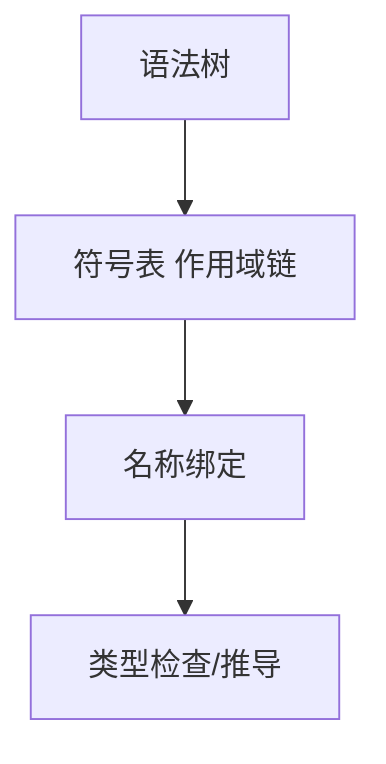
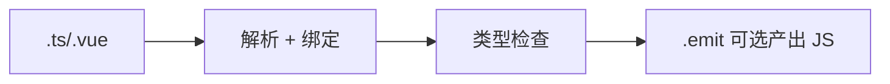
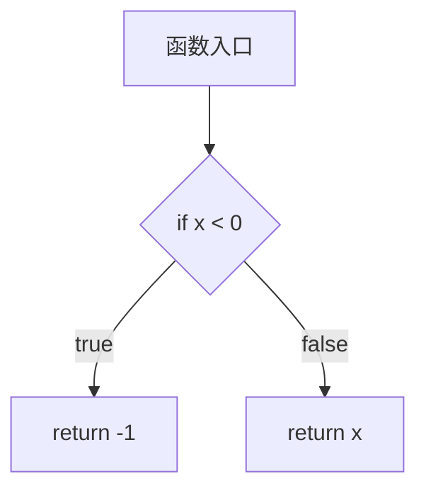
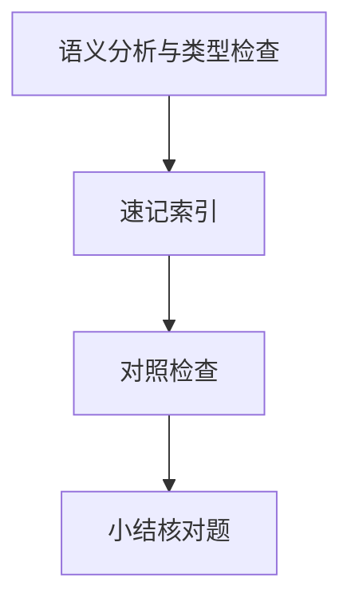

# 语义分析与类型检查

语法正确的程序仍可能「无意义」 — 未定义变量、类型不匹配、重复声明。**语义分析**在 AST 上建立符号表、绑定作用域并检查类型；TypeScript 的 `tsc`、Vue `script lang="ts"`、IDE 红线都发生在此层或其后。

---

## 语义分析做什么



| 任务 | 示例 |
|------|------|
| 名称解析 | `foo` 指向哪个声明 |
| 作用域规则 | 块级 `let` 不可重复声明 |
| 类型相容 | `number` 不能赋给 `string` |
| 控制流 | `return` 后不可达代码 |

Babel **默认不做**完整类型检查 — 只剥类型注解；类型安全靠 `tsc` 或 `vue-tsc`。

---

## 符号表与作用域

```javascript
const x = 1;
function outer() {
  const x = 2;
  function inner() {
    console.log(x); // 绑定到 outer 的 x，非全局
  }
}
```

| 结构 | 说明 |
|------|------|
| 符号表 | 标识符 → {种类, 类型, 声明位置} |
| 作用域栈 | 进入块 push，离开 pop |
| 闭包 | 内层引用外层符号，延长其生存期 |

与 03-作用域闭包与内存模型、基础 JS 03 对照阅读。

---

## 类型系统层次

| 分类 | JS | TS |
|------|----|----|
| 静态/动态 | 运行时才知道类型 | 编译期检查（擦除后仍是 JS） |
| 强/弱 | 弱（隐式转换多） | 可配置 `strict` |
| 推导 | 无 | `const x = 1` → `literal 1` |
| 结构化类型 | duck typing | 形状相容即 assignable |

```typescript
interface User { id: string }
const u: User = { id: '1' };        // OK：多余属性检查在字面量处更严
function f(x: { id: string }) {}
f(u);                                  // OK：结构相容
```

---

## TypeScript 检查管线



| 模式 | 命令 | 行为 |
|------|------|------|
| 仅检查 | `tsc ，noEmit` | CI 门禁 |
| 转译 | `tsc` / `esbuild` | 注解被擦除 |
| Vue | `vue-tsc` | SFC 三块联合检查 |

Vite 开发常用 **esbuild 转译 + 并行 vue-tsc** — 速度与安全分工。

---

## 与 Babel 的分工

| 能力 | Babel | tsc |
|------|-------|-----|
| 新语法降级 | ✅ preset-env | ✅ target/lib |
| 类型检查 | ❌ | ✅ |
| `enum` / `namespace` | 需插件或交给 tsc | ✅ |
| 装饰器 | 实验插件 | 阶段三对齐中 |

生产最佳实践：`vite build` 前 `vue-tsc ，noEmit` 或 `tsc -b`，避免仅靠 Babel 漏掉类型错误。

---

## 常见语义错误

| 错误 | 阶段 |
|------|------|
| `Cannot find name 'React'` | 绑定/全局类型 |
| `Type 'string' is not assignable to type 'number'` | 类型检查 |
| `Duplicate identifier` | 符号表 |
| ESLint `no-undef` | 轻量语义（无 TS 类型） |

```typescript
// 控制流窄化 — 语义 + 类型协作
function pad(n: string | number) {
  if (typeof n === 'string') return n.padStart(2, '0');
  return String(n).padStart(2, '0');
}
```

---

## 声明合并与模块语义

TS 中 `interface` 同名可合并；`namespace` 可与函数/类合并。这类规则超出纯语法，属于语义层符号表行为。ESM `import` 的绑定是只读 live binding — 也是语义分析结果，非词法层能判定。

---

## 控制流分析与可达性

```typescript
function example(x: number): number {
  if (x < 0) return -1;
  if (x === 0) return 0;
  return x;
  console.log('unreachable'); // TS 报错：不可达代码
}
```

| 分析 | 作用 |
|------|------|
| 可达性 | 删死代码、报 unreachable |
| 控制流窄化 | `typeof` / `in` 后缩类型 |
|  definite assignment | `strict` 下未赋值就用报错 |



React 组件里 `if (!data) return null` 之后的 JSX 分支，TS 会把 `data` 窄化为非空 — 与运行时行为一致，减少可选链冗余。

---

## 模块解析与 `paths` 别名

`import '@/components/Button'` 的 `@` 由 `tsconfig paths` 解析，属于语义/模块解析阶段：

| 配置 | 影响 |
|------|------|
| `baseUrl` + `paths` | IDE 与 `tsc` 一致 |
| Vite `resolve.alias` | 运行时打包路径，需与 tsconfig 对齐 |
| `moduleResolution: bundler` | 贴近现代打包器解析 `package.json exports` |

仅配 Vite alias 不配 `paths` 时，常见「dev 正常、`vue-tsc` 报找不到模块」。

---

## 语义错误

| 类型 | 例子 |
|------|------|
| 类型 | 字符串当函数调 |
| 作用域 | 未声明变量 |
| 控制流 | unreachable code |

TS 控制流分析收窄联合类型 — 语义信息服务 IDE。
## 控制流分析

TS 在 `if (x !== null)` 块内收窄 `x` — 语义分析 + 数据流。

`strictNullChecks` 把大量运行时 NPE 前移到编译期。
---

## 速记索引

| 小节 | 复习方式 |
|------|----------|
| 控制流分析与可达性 | 复述定义 + 举一个前端相关例子 |
| 模块解析与 `paths` 别名 | 复述定义 + 举一个前端相关例子 |
| 语义错误 | 复述定义 + 举一个前端相关例子 |
| 控制流分析 | 复述定义 + 举一个前端相关例子 |

## 对照检查

| 维度 | 自检 |
|------|------|
| 控制流分析与可达性 易错 | 对照上文「易混点」或表格中的对比项 |
| 模块解析与 `paths` 别名 易错 | 对照上文「易混点」或表格中的对比项 |
| 语义错误 易错 | 对照上文「易混点」或表格中的对比项 |
| 控制流分析 易错 | 对照上文「易混点」或表格中的对比项 |



本节目标：离开文档仍能解释 **语义分析与类型检查** 的核心机制，并能在浏览器、Node 或工程排障中指认对应现象。
## 小结

语义分析把「合法句子」变成「有意义的程序」：符号绑定 + 类型规则。前端栈里 Babel 管语法降级，TS/vue-tsc 管类型；二者缺一不可于严格工程。

**易混点**：语法通过 ≠ 类型通过；`any` 关闭检查不等于运行安全；`.d.ts` 只参与类型不参与运行时。

核对：为何 `tsc` 报错但 Vite dev 仍能跑？`strictNullChecks` 打开后 `null` 赋值为何失败？
