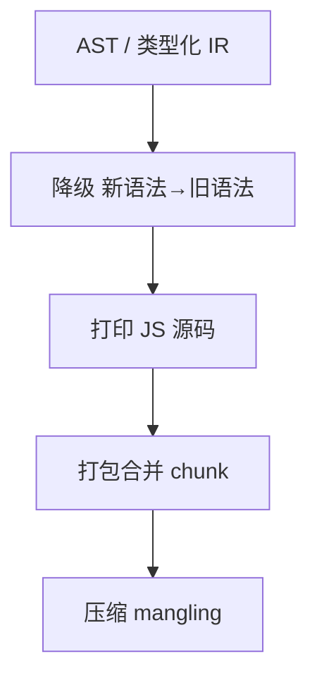
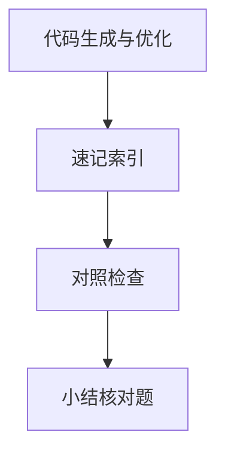

# 代码生成与优化

AST 与类型信息就绪后，编译器要产出可执行目标并尽量**更小、更快**。生产构建里的 tree-shaking、压缩、Scope hoisting，与 V8 TurboFan 的内联、逃逸分析 — 同属「代码生成 + 优化」谱系，层次不同。

---

## 代码生成路径



| 阶段 | 工具 | 产出 |
|------|------|------|
| 转译打印 | Babel、esbuild、SWC | 单文件 `.js` |
| 打包 | Rollup、webpack | chunk + 依赖图 |
| 压缩 | terser、esbuild minify | `.min.js` |

V8 侧：Ignition 生成**字节码**，TurboFan 把热点编译为**机器码** — 见 05-运行时与V8概览。

---

## 中间表示 IR

高级优化常在 **IR** 上进行，而非直接改 AST：

| IR 概念 | 作用 |
|---------|------|
| SSA | 每个变量只赋值一次，便于数据流分析 |
| 控制流图 CFG | 基本块 + 边，用于 DCE、内联 |
| 指令选择 | IR → 目标机指令 |

Babel 插件多在 AST 层；Rust/SWC、LLVM 管线更接近经典 IR 优化。esbuild 优化较轻，换速度。

---

## 前端常见优化

| 优化 | 机制 | 前提 |
|------|------|------|
| **Tree-shaking** | 标记未引用 export 并删除 | ESM `import/export` 静态结构 |
| **DCE** 死代码消除 | 不可达分支删除 | `if (false)`、纯副作用分析 |
| **Scope hoisting** | 合并模块到单作用域 | Rollup 特有，减闭包包装 |
| **常量折叠** | `1+2` → `3` | 编译期可求值 |
| **内联** | 小函数展开 | 减调用开销，可能增体积 |

```javascript
// 源码
import { used } from './lib';
console.log(used());

// tree-shaking 后 lib 中未引用 export 被剔除
```

`sideEffects: false` in `package.json` 提示打包器可激进摇树；标错会导致必要初始化被删。

---

## 压缩与命名

| 技术 | 效果 |
|------|------|
| Mangling | `longVariableName` → `a` |
| 删除空白/注释 | 体积 |
| 纯函数标注 | 利于进一步 DCE |

Source map 在压缩后仍映射到源码 — 生产排障依赖 `hidden-source-map` 上传监控平台。

---

## 开发与生产的优化权衡

| | 开发 (Vite) | 生产 |
|---|-------------|------|
| 目标 | 低延迟 HMR | 小体积、快执行 |
| 转译 | esbuild，少 pass | Rollup 多 pass + minify |
| 摇树 | 按请求单模块 | 全图分析 |
| 缓存 | 内存 + 浏览器 ESM | 文件名 hash |

---

## JIT 优化的启示

V8 **去优化（deopt）**：若后续类型与假设不符，回退字节码。对应前端：避免生产环境依赖「仅 dev 成立」的动态模式（如随意改对象形状），利于引擎内联与隐藏类稳定。

---

## Chunk 与代码分割

```javascript
// 动态 import 产生独立 async chunk
const mod = await import('./heavy-chart.js');
```

| 策略 | 编译器行为 |
|------|------------|
| 路由懒加载 | 按路由边界切 chunk |
| `manualChunks` | Rollup 自定义分包（vendor/ui） |
| Module Federation | 远程模块运行时加载 |

分割在**打包阶段**完成，与 V8 函数内联是不同粒度；二者共同影响首屏 JS 体积与后续解析成本。Chrome Coverage 可看未执行字节比例，指导进一步摇树或懒加载。

---

## CJS 与 ESM 对摇树的影响

```javascript
// ESM — 静态结构，可分析
import { a } from './mod';

// CJS — 运行时 require，难静态分析
const { a } = require('./mod');
```

Vite 预构建把依赖 CJS 转成 ESM， partly 为恢复摇树能力。自有代码应优先 `import`/`export`。

---

## Minify 与安全边界

| 假设 | 风险 |
|------|------|
| 纯函数可删 | 有副作用的「未引用」初始化被误删 |
| 合并声明 | 依赖 `Function.prototype.name` 的反射失效 |
| 极激进 mangle | 与 eval、某些框架约定冲突 |

生产启用 terser `compress.pure_funcs` 等选项前，应对关键路径跑 E2E。Source map 上传 Sentry 等平台时选 `hidden-source-map`，避免把源码 map 公开给终端用户。

Rollup 的 `manualChunks` 把 `vue`、`lodash` 拆成 vendor chunk，利于长期缓存 — 与 tree-shaking 互补：前者减重复下载，后者减单 chunk 体积。

| 指标 | 工具 |
|------|------|
| 包体积 | `rollup-plugin-visualizer` |
| 未用代码 | Chrome Coverage + 摇树 |
| 运行时 | Lighthouse TBT、Performance |

---

## Source Map 与多段生成

```
app.tsx  ──map──►  chunk.js  ──map──►  chunk.min.js
```

| 场景 | 建议 |
|------|------|
| 本地调试 | `sourcemap: true` |
| 生产监控 | `hidden-source-map` 上传 Sentry |
| 多插件变换 | 链式 map，避免断点落在转译后行 |

压缩不改变运行时语义，但堆栈行号依赖 map；漏传 map 时线上报错只能看到 `a.b is not a function` 在 `vendor-xxx.js:1`。

---

## 循环与内联边界

| 层级 | 不内联常见原因 |
|------|----------------|
| Rollup | 模块过大、保留副作用边界 |
| Terser | 依赖 `Function.name` |
| TurboFan | 多态调用点、函数体过长 |

热路径避免在循环内创建新闭包/新对象形状，构建层 DCE 与运行时 IC 才能同时受益。

---

## 优化层级

| 层级 | 例子 |
|------|------|
| IR | 常量折叠、DCE |
| 机器 | 寄存器分配 |
| 运行时 | JIT 内联 |

Tree-shaking 依赖 ES module 静态 `import/export` 分析 — 语义 + 打包器配合。
## 死代码消除

`if (false) {}`、未引用函数 — minifier 删除。Side effect 函数不能删。

`/* @__PURE__ */` 注释提示 rollup 可 DCE 纯函数调用。
---

## 速记索引

| 小节 | 复习方式 |
|------|----------|
| Source Map 与多段生成 | 复述定义 + 举一个前端相关例子 |
| 循环与内联边界 | 复述定义 + 举一个前端相关例子 |
| 优化层级 | 复述定义 + 举一个前端相关例子 |
| 死代码消除 | 复述定义 + 举一个前端相关例子 |

## 对照检查

| 维度 | 自检 |
|------|------|
| Source Map 与多段生成 易错 | 对照上文「易混点」或表格中的对比项 |
| 循环与内联边界 易错 | 对照上文「易混点」或表格中的对比项 |
| 优化层级 易错 | 对照上文「易混点」或表格中的对比项 |
| 死代码消除 易错 | 对照上文「易混点」或表格中的对比项 |



本节目标：离开文档仍能解释 **代码生成与优化** 的核心机制，并能在浏览器、Node 或工程排障中指认对应现象。
## 小结

代码生成把 IR/AST 变成可跑目标；优化在体积与速度间取舍。Rollup tree-shaking、terser 压缩对应构建层；TurboFan 对应运行时层 — 两层叠加决定线上性能。

**易混点**：摇树只对 ESM 静态导入可靠；`import()` 动态导入单独 chunk；压缩不改运行时语义但改堆栈可读性。

核对：为何 CJS `require` 难 tree-shake？`sideEffects: false` 标错会有什么现象？
